# 🧘 MonkMode: AI-Powered Self-Improvement Platform

MonkMode is a full-stack discipline, productivity, and self-improvement dashboard. It helps users track journals, tasks, habits, goals, gym progress, analytics, weekly reports, and AI-powered discipline insights from one focused web app.

## 🚀 Live Demo

Live demo link: [https://monkmode.debarghya.org](https://monkmode.debarghya.org)

## 🎯 Motivation

I was also a less disciplined student. I was not consistent, and I could not focus on one work for a long time. Over time, I realized how important discipline is for a student, not only for study, but also for building a better life.

That realization became the motivation behind MonkMode.

The name MonkMode is inspired by focus, self-control, mindfulness, and reducing distractions. The goal is to help students, learners, builders, and self-improvement focused users improve step by step.

## ✨ Features

- 🔐 Google authentication with Clerk.
- 🧪 Demo mode for exploring the dashboard without creating an account.
- 📊 Overview dashboard with daily cards, streaks, consistency score, monk level, and activity heatmaps.
- 📝 Journal module with mood tracking, daily reflection, custom fields, missed-day reasons, past entries, and journal analytics.
- ✅ Todo module with recurring tasks, categories, priorities, missed tasks, logs, upcoming schedule, and todo analysis.
- ⚡ Habit module with habit creation, completion tracking, monthly tracker, streaks, important habits, and habit analysis.
- 🎯 Goal module with goals, sub-goals, progress updates, deadlines, activity logs, and goal analysis.
- 💪 Gym module with workout plans, exercise progress, diet plans, supplements, macros, measurements, progress photos, and gym analytics.
- 📅 Weekly reports for journal, todo, habits, goals, and gym.
- 🤖 AI summaries for weekly reports.
- 🧠 AI Guru named Ming that uses user activity data to provide focused guidance.
- 🚦 Rate-limit toast handling for limited write and AI actions.

## 🏗️ Architecture

MonkMode uses a 3-tier client-server architecture. The application supports two separate flows: demo login for visitors and authenticated login for real users.

### 1. 3-Tier Client-Server Architecture

#### Demo Login Architecture

```text
React + Vite frontend
        |
        | Demo login click
        v
Client-side demo mode
        |
        | Set demo flag, load sample data, block real writes
        v
LocalStorage + bundled demo data
```

In demo mode, users can explore the product without creating an account. The app uses local demo state and sample data while restricting real create, edit, save, and upload actions.

#### Authenticated Login Architecture

```text
React + Vite frontend
        |
        | HTTP requests with Clerk auth token
        v
Express backend API
        |
        | Auth sync, chat routing, rate limiting
        v
MongoDB + Groq API + Arcjet
```

For authenticated users, Clerk manages Google login and session identity. The frontend Axios client attaches the Clerk token to protected API requests. The Express backend verifies the user, maps the Clerk identity to a MongoDB user, reads or writes user-scoped data, and optionally calls Groq for AI features.

### 2. System Architecture & Workflow Diagram

#### Demo Login Workflow Diagram

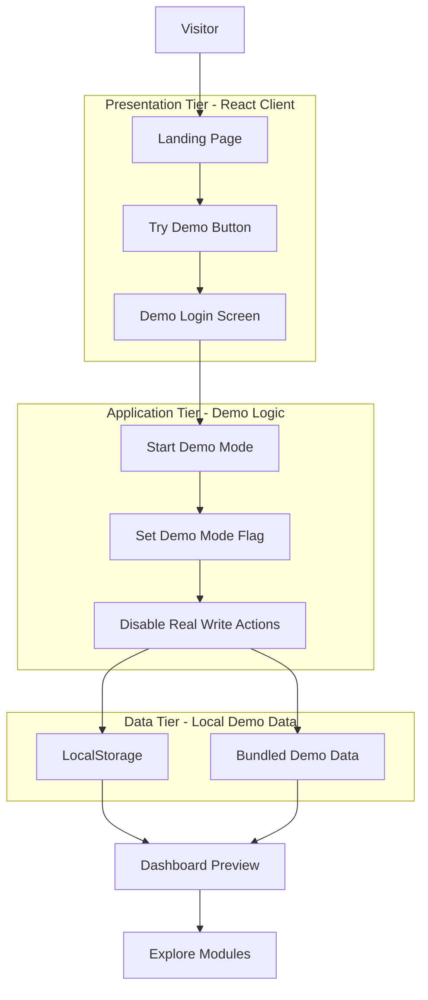

#### Authenticated Login Workflow Diagram

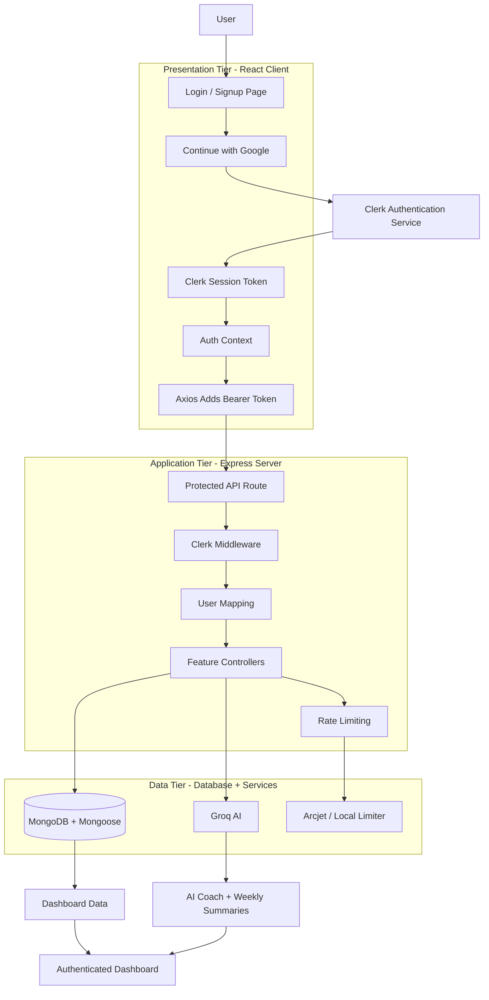

## 📁 Folder Structure

```text
monkmode/
├── client/                         # Frontend React application
│   ├── data/                       # Demo and dummy data
│   ├── public/                     # Public static files
│   ├── src/
│   │   ├── api/                    # Axios API client
│   │   ├── assets/                 # Images, logos, screenshots
│   │   │   ├── overview/
│   │   │   ├── journal/
│   │   │   ├── todo/
│   │   │   ├── habit/
│   │   │   ├── goal/
│   │   │   ├── gym/
│   │   │   ├── weeklyreport/
│   │   │   ├── analysis/
│   │   │   └── aiguru/
│   │   ├── components/             # Shared UI components
│   │   ├── context/                # Auth context and token provider
│   │   ├── dashboard/              # Main dashboard experience
│   │   │   ├── overview/
│   │   │   ├── journal/
│   │   │   ├── todo/
│   │   │   ├── habits/
│   │   │   ├── goal/
│   │   │   ├── gym/
│   │   │   ├── weeklyreport/
│   │   │   ├── analysis/
│   │   │   └── ai_guru/
│   │   ├── hooks/                  # Custom React hooks
│   │   ├── pages/
│   │   │   ├── authentication/     # Login, signup, SSO, protected route
│   │   │   └── landingpage/        # Landing, about, features, demo login
│   │   ├── utils/                  # Client utilities
│   │   ├── App.jsx                 # Client routing
│   │   └── main.jsx                # React entry point
│   ├── .env.example                # Frontend environment template
│   ├── package.json
│   ├── tailwind.config.js
│   ├── vite.config.js
│   └── vercel.json                 # SPA rewrite config
│
├── server/                         # Backend Express application
│   ├── controllers/                # Business logic for each module
│   ├── middleware/                 # Clerk auth and rate limiting
│   ├── models/                     # Mongoose schemas
│   ├── routes/                     # API route definitions
│   ├── scripts/                    # Utility, test, and backfill scripts
│   ├── tests/                      # Node test files
│   ├── utils/                      # Shared backend helpers
│   ├── .env.example                # Backend environment template
│   ├── package.json
│   └── server.js                   # Express app entry point
│
├── .gitignore
└── README.md
```

## 🗄️ Database Design

MonkMode uses MongoDB with Mongoose. Every real dashboard record is connected to a `User`, and most feature collections are scoped by `userId` so each authenticated user sees only their own journal, todo, habit, goal, gym, and report data.

### 1. Database Schema / Entity Relationship Diagram (ERD)

```mermaid
erDiagram
  USER ||--o{ JOURNAL : writes
  USER ||--o{ JOURNAL_MISSED_REASON : explains
  USER ||--o{ JOURNAL_WEEKLY_SUMMARY : receives

  USER ||--o{ TODO : creates
  USER ||--o{ TODO_LOG : tracks
  USER ||--o{ TODO_WEEKLY_SUMMARY : receives

  USER ||--o{ HABIT : builds
  HABIT ||--o{ HABIT_LOG : completed_by
  USER ||--o{ HABIT_WEEKLY_SUMMARY : receives

  USER ||--o{ GOAL : creates
  GOAL ||--o{ GOAL_PROGRESS_LOG : updated_by
  USER ||--o{ GOAL_WEEKLY_SUMMARY : receives

  USER ||--o{ WORKOUT_PLAN : owns
  USER ||--o{ WORKOUT_PLAN_LOG : tracks
  USER ||--o{ GYM_EXERCISE_PROGRESS : records
  USER ||--o{ GYM_MEASUREMENT : checks_in
  USER ||--o{ GYM_GALLERY_ENTRY : uploads
  USER ||--o{ GYM_DIET_PLAN : plans
  USER ||--o{ GYM_CUSTOM_EXERCISE : creates
  USER ||--o{ GYM_WEEKLY_SUMMARY : receives

  USER {
    ObjectId _id
    string clerkId
    string email
    string name
  }

  JOURNAL {
    ObjectId userId
    string dayKey
    string mood
    number energyLevel
    number overallRating
  }

  TODO {
    ObjectId userId
    string title
    string priority
    string repeatType
    array dayStates
  }

  HABIT {
    ObjectId userId
    string title
    string frequency
    number targetStreak
    boolean isImportant
  }

  GOAL {
    ObjectId userId
    string title
    number targetValue
    number currentValue
    array subgoals
  }

  WORKOUT_PLAN {
    ObjectId userId
    string title
    array days
    array exercises
    boolean isActive
  }

  GYM_EXERCISE_PROGRESS {
    ObjectId userId
    string date
    string exerciseId
    string exerciseName
    string weight
  }
```

### Main Collections

| Module | Collections | Stored Data |
| --- | --- | --- |
| Auth | `User` | Clerk ID, name, email, and custom journal field templates. |
| Journal | `Journal` | Daily journal entry, mood, wake/sleep time, energy, rating, wins, mistakes, gratitude, achievements, distractions, custom fields, and day key. |
| Journal Reports | `JournalMissedReason`, `JournalWeeklySummary` | Reasons for missed journal days and cached weekly AI summaries. |
| Todo | `Todo`, `TodoLog`, `TodoWeeklySummary` | Task details, recurring rules, priority, category, per-day status, activity logs, and weekly summaries. |
| Habits | `Habit`, `HabitLog`, `HabitWeeklySummary` | Habit setup, frequency, repeat rules, streak target, completion logs, archive state, and weekly summaries. |
| Goals | `Goal`, `GoalProgressLog`, `GoalWeeklySummary` | Goal details, sub-goals, progress values, deadlines, important flag, activity logs, and weekly summaries. |
| Gym Plans | `Workout`, `WorkoutPlan`, `WorkoutPlanLog` | Workout entries, reusable workout plans, active plans, exercise lists, and workout-plan activity logs. |
| Gym Progress | `GymExerciseProgress`, `GymMeasurement`, `GymGalleryEntry` | Exercise progress, body measurements, check-in dates, and progress photo entries. |
| Gym Nutrition | `GymDietPlan`, `GymCustomExercise`, `GymWeeklySummary` | Diet plans, macros, supplements, custom exercise library, and weekly gym AI summaries. |

### Data Integrity & Indexing

- `User.clerkId` and `User.email` are unique so real users can be mapped safely after Clerk login.
- `Journal` uses a unique `{ userId, dayKey }` index to allow only one journal entry per user per day.
- `GymMeasurement` uses a unique `{ userId, checkInDate }` index to prevent duplicate measurement check-ins.
- `GymExerciseProgress` uses a unique `{ userId, date, exerciseId }` index for one progress record per exercise per day.
- Weekly AI summary collections use unique `{ userId, weekStart }` indexes to cache one summary per user per week.
- Logs and progress collections include indexes on user/date fields for faster dashboard, heatmap, and analytics queries.
- Temporary logs use TTL indexes so old activity records can expire automatically.

## 🖼️ Screenshots

Screenshots are stored in `client/src/assets` and are used by the landing feature gallery.

| Module | Screenshot |
| --- | --- |
| Landing Page | 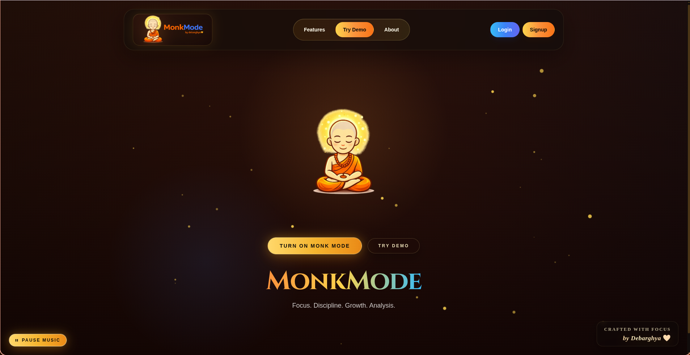 |
| Overview | 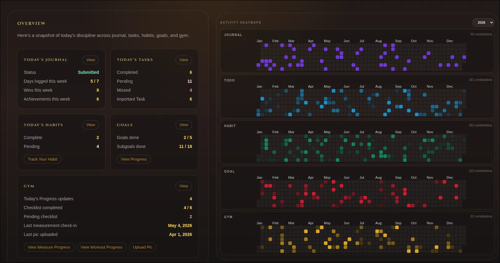 |
| Journal | 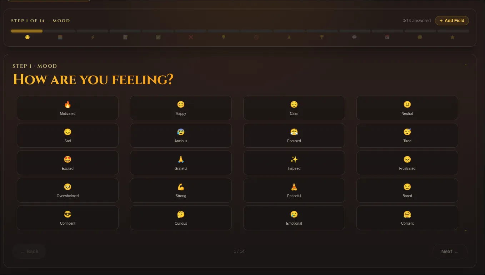 |
| Todo | 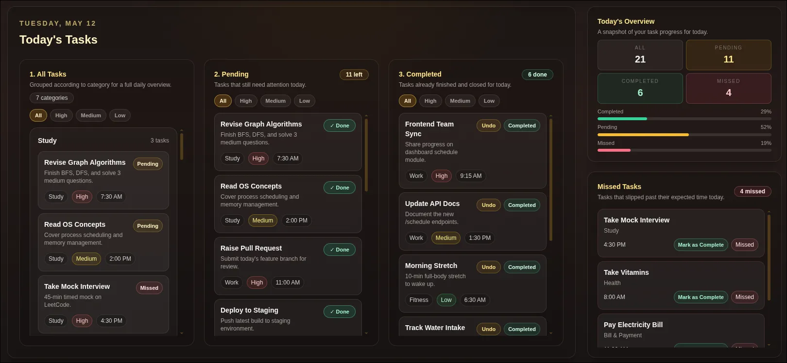 |
| Habits | 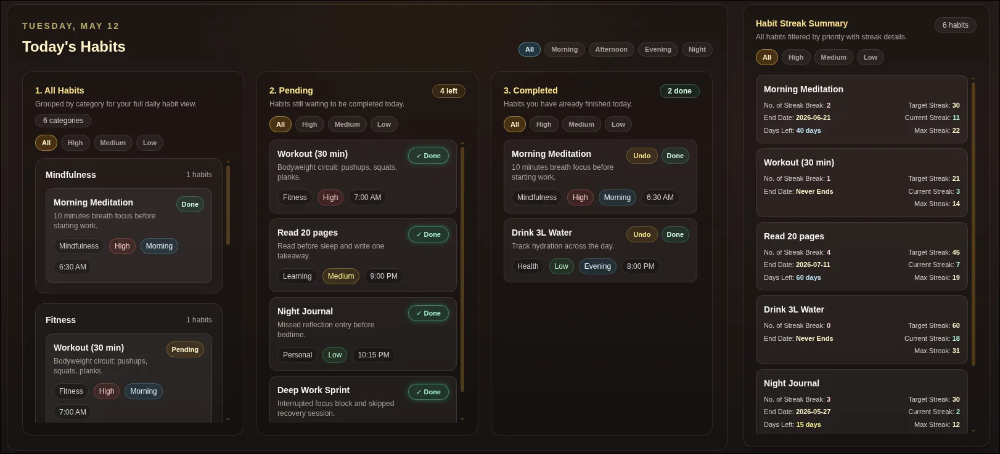 |
| Habit Tracker | 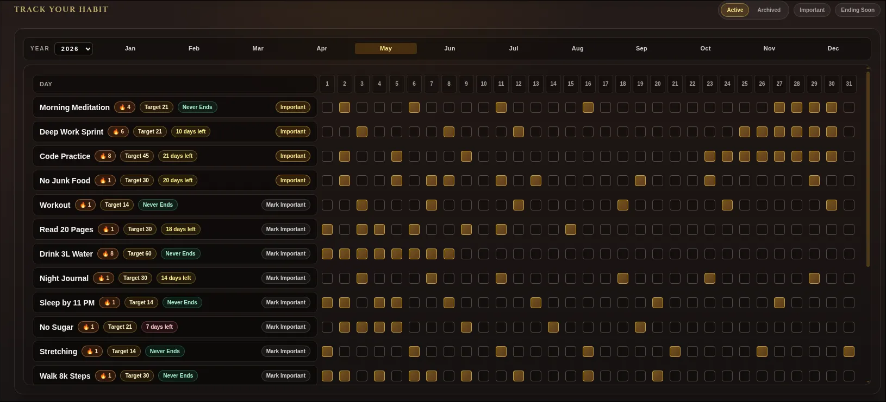 |
| Goals | 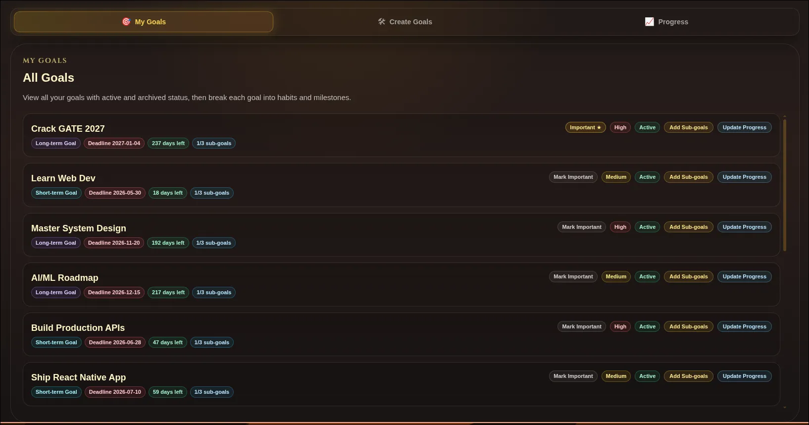 |
| Goal Progress | 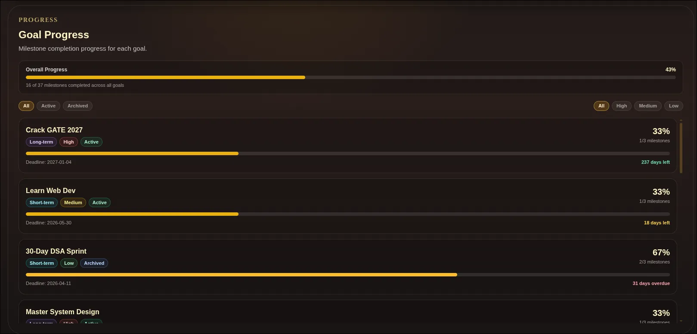 |
| Gym | 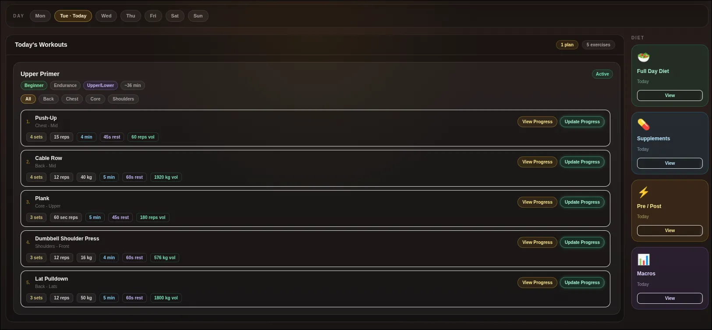 |
| Gym Workout Builder | 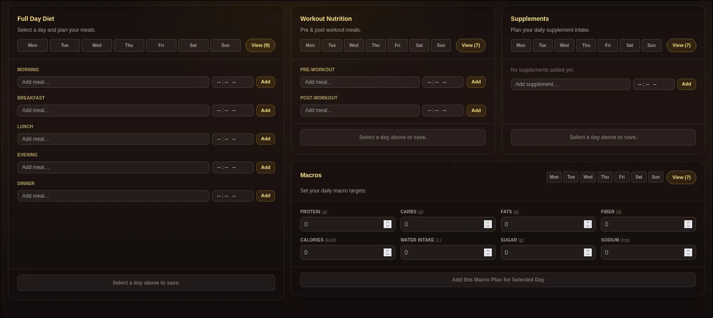 |
| Gym Measurements | 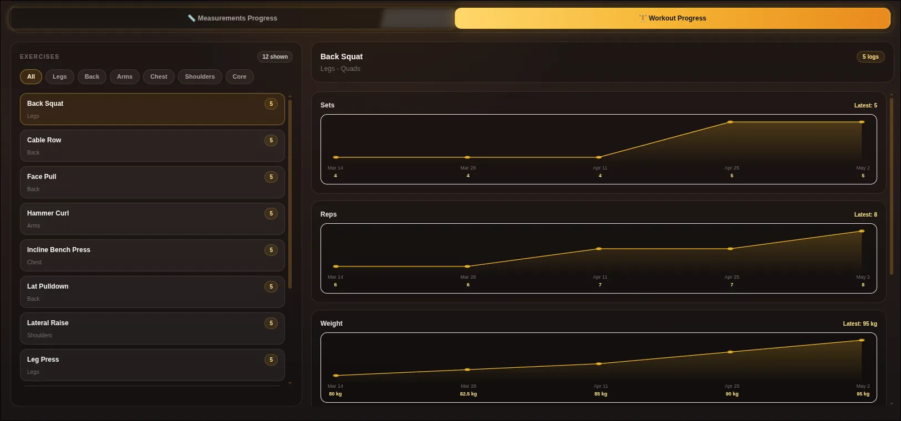 |
| Gym Progress Photos | 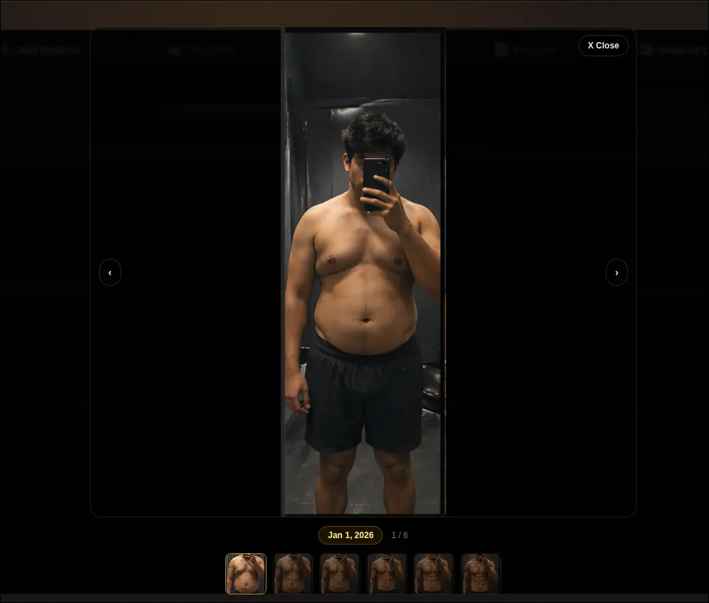 |
| Weekly Report |  |
| Weekly Report Detail | 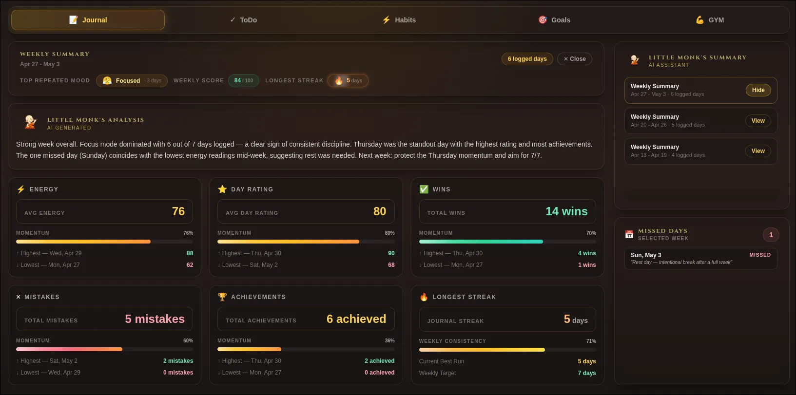 |
| Analysis | 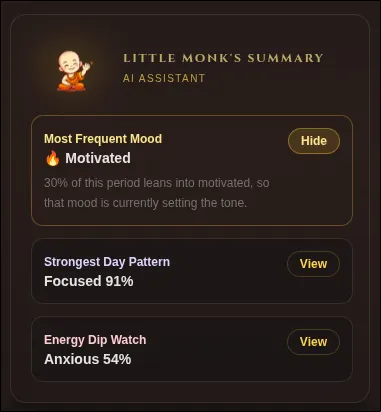 |
| Analysis Detail | 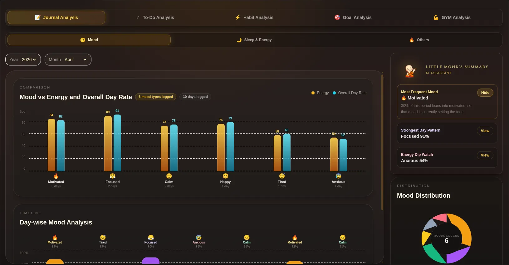 |
| AI Guru |  |
| AI Guru Chat | 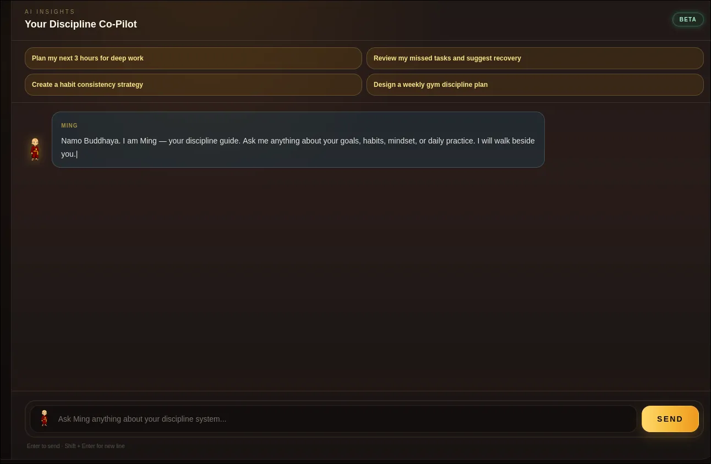 |

## 🛠️ Tech Stack

### Frontend

- React
- Vite
- Tailwind CSS
- React Router
- Axios
- Framer Motion
- Clerk React
- React Calendar Heatmap
- Three.js and Vanta

### Backend

- Node.js
- Express
- MongoDB
- Mongoose
- Clerk Express
- Groq SDK
- Arcjet
- dotenv
- CORS

## ⚙️ Installation

Clone the repository:

```bash
git clone https://github.com/debarghya131/MonkMode.git
cd MonkMode
```

Install frontend dependencies:

```bash
cd client
npm install
```

Install backend dependencies:

```bash
cd ../server
npm install
```

Create environment files:

```bash
cp client/.env.example client/.env
cp server/.env.example server/.env
```

Run the backend:

```bash
cd server
npm run dev
```

Run the frontend in another terminal:

```bash
cd client
npm run dev
```

Default local URLs:

- Frontend: `http://localhost:5173`
- Backend: `http://localhost:5000`

## 🔐 Environment Variables

### Client

```env
VITE_CLERK_PUBLISHABLE_KEY=pk_test_or_pk_live_key
VITE_API_URL=http://localhost:5000/api
```

### Server

```env
NODE_ENV=development
PORT=5000
MONGO_URI=mongodb_connection_string
API_KEY=groq_api_key
CLERK_SECRET_KEY=clerk_secret_key
CLERK_PUBLISHABLE_KEY=clerk_publishable_key
CORS_ORIGINS=http://localhost:5173
APP_TIMEZONE=Asia/Kolkata
AI_TIMEOUT_MS=15000
ARCJET_KEY=optional_arcjet_key
ARCJET_MODE=LIVE
```

The backend also supports configurable rate-limit variables for AI chat, weekly AI summaries, journal saves, todo writes, habit writes, goal writes, and gym-related writes. See `server/.env.example` for the full list.

## 🧩 Challenges Faced

- Designing one dashboard that connects journal, todo, habits, goals, gym, analytics, and weekly reports without mixing data boundaries.
- Handling recurring todos and habits across different days, time changes, and missed states.
- Keeping heatmap and streak logic consistent across modules.
- Moving authentication to Clerk while keeping existing user data mapped by email.
- Creating demo mode without allowing real writes.
- Generating AI summaries while controlling cost and abuse risk.
- Managing large feature pages with many visual states and screenshots.
- Handling timezone-sensitive day boundaries.

## ✅ Solutions Implemented

- Split the backend into route, controller, model, middleware, and utility layers.
- Used `userId` on user-owned documents to isolate each user's data.
- Added activity logs for todos, habits, goals, and workout plans.
- Added weekly summary collections to cache AI-generated summaries.
- Used Clerk middleware on protected backend routes.
- Added an Axios token provider that attaches Clerk tokens automatically.
- Added route-level rate limiters with Arcjet support and a local fallback.
- Added demo-mode state in localStorage and demo datasets in the client.
- Added lazy-loaded React routes to reduce the initial bundle pressure.
- Added Mongoose indexes and TTL indexes for faster queries and temporary log cleanup.

## 🧪 Testing

Run the backend goal utility test:

```bash
cd server
npm run test:goals
```

Run a production frontend build:

```bash
cd client
npm run build
```

Current verified checks:

- `npm run test:goals` passed.
- `npm run build` passed.

## ⚡ Optimization

- React route-level lazy loading with `Suspense`.
- Vite production builds.
- Mongoose indexes for frequent user/date queries.
- Cached AI weekly summaries to avoid repeated generation.
- `Promise.all` used for parallel backend data fetching.
- Local UI state and memoized derived data in heavy dashboard screens.
- WebP assets for dashboard screenshots and visual content.
- TTL indexes for temporary logs and cleanup.

## 🛡️ Security

- Clerk handles authentication and user identity.
- Protected API routes require a valid Clerk-authenticated user.
- Backend maps Clerk users to MongoDB users by Clerk ID or normalized email.
- CORS allowlist is configurable by environment.
- Environment files are ignored by Git.
- API requests attach bearer tokens through an Axios interceptor.
- Mongoose schemas validate enums, lengths, dates, and time formats.
- Rate limiters protect AI, write-heavy, and upload-related routes.
- Arcjet can be enabled in production, with local rate limiting as fallback.

## 🔮 Future Improvements

- Add a deployed live demo link.
- Add CI/CD workflow for lint, build, and tests.
- Expand automated tests for controllers, routes, and frontend flows.
- Add API documentation.
- Add a dedicated screenshot section with more polished preview images.
- Move uploaded images to cloud object storage.
- Add export options for reports and analytics.
- Add more accessibility and keyboard navigation checks.
- Add stronger validation and sanitization for rich user inputs.

## 📚 Learnings

- Building a modular full-stack dashboard with React and Express.
- Designing MongoDB schemas for activity tracking and analytics.
- Integrating Clerk authentication into both frontend and backend.
- Creating AI-assisted summaries from real user activity data.
- Handling rate limits for public portfolio-style apps.
- Building demo mode without exposing real write behavior.
- Improving performance through lazy loading, indexes, caching, and parallel queries.

## 👨‍💻 Author Details

**Debarghya Bandyopadhyay**

- Computer Science engineering student and developer from Kolkata.

### Be My Friend

I always like to make new friends. Follow me on:

[](https://www.linkedin.com/in/debarghya-bandyopadhyay-953b02400?utm_source=share_via&utm_content=profile&utm_medium=member_android)

[](https://x.com/debarghya131)

[](https://github.com/debarghya131)

[](https://portfolio.debarghya.org)

[](mailto:debarghyabandyopadhyay191@gmail.com)
