## 🧘 MonkMode: AI-Powered Self-Improvement Platform

MonkMode is a full-stack discipline, productivity, and self-improvement dashboard. It helps users track journals, tasks, habits, goals, gym progress, analytics, weekly reports, and AI-powered discipline insights from one focused web app.

## 🚀 Live Demo

Please click the **Try Demo** button first to explore the dashboard without creating an account.

<p>
  <a href="https://monkmode.debarghya.org/demo-login"></a> 👈 Click Here
</p>

Live demo link: [https://monkmode.debarghya.org](https://monkmode.debarghya.org)

## 🎯 Motivation

I was also a less disciplined student. I was not consistent, and I could not focus on one work for a long time. Over time, I realized how important discipline is for a student, not only for study, but also for building a better life.

That realization became the motivation behind MonkMode.

The name MonkMode is inspired by focus, self-control, mindfulness, and reducing distractions. The goal is to help students, learners, builders, and self-improvement focused users improve step by step.

## ✨ Features

- 🔐 Google authentication with Clerk.
- 🧪 Demo mode for exploring the dashboard without creating an account.
- 📊 Overview dashboard with daily cards, streaks, consistency score, monk level, and activity heatmaps.
- 📝 Journal module with mood tracking, daily reflection, custom fields, missed-day reasons, past entries, and journal analytics.
- ✅ Todo module with recurring tasks, categories, priorities, missed tasks, logs, upcoming schedule, and todo analysis.
- ⚡ Habit module with habit creation, completion tracking, monthly tracker, streaks, important habits, and habit analysis.
- 🎯 Goal module with goals, sub-goals, progress updates, deadlines, activity logs, and goal analysis.
- 💪 Gym module with workout plans, exercise progress, diet plans, supplements, macros, measurements, progress photos, and gym analytics.
- 📅 Weekly reports for journal, todo, habits, goals, and gym.
- 🤖 AI summaries for weekly reports.
- 🧠 AI Guru named Ming that uses user activity data to provide focused guidance.
- 🚦 Rate-limit toast handling for limited write and AI actions.

## 🏗️ Architecture

MonkMode uses a 3-tier client-server architecture. The React frontend communicates with the Express API, which handles authentication, business logic, database access, AI features, and rate limiting.

### System Architecture

```text
React + Vite frontend
        |
        | HTTP requests with Clerk auth token
        v
Express backend API
        |
        | Auth sync, chat routing, rate limiting
        v
MongoDB + Groq API + Arcjet
```

For authenticated users, Clerk manages Google login and session identity. The frontend Axios client attaches the Clerk token to protected API requests. The Express backend verifies the user, maps the Clerk identity to a MongoDB user, reads or writes user-scoped data, and optionally calls Groq for AI features.

### System Workflow

The workflow below represents the complete application in one diagram. Demo sessions use bundled client data and block persistent writes, while authenticated sessions send Clerk-authorized requests through the Express API.

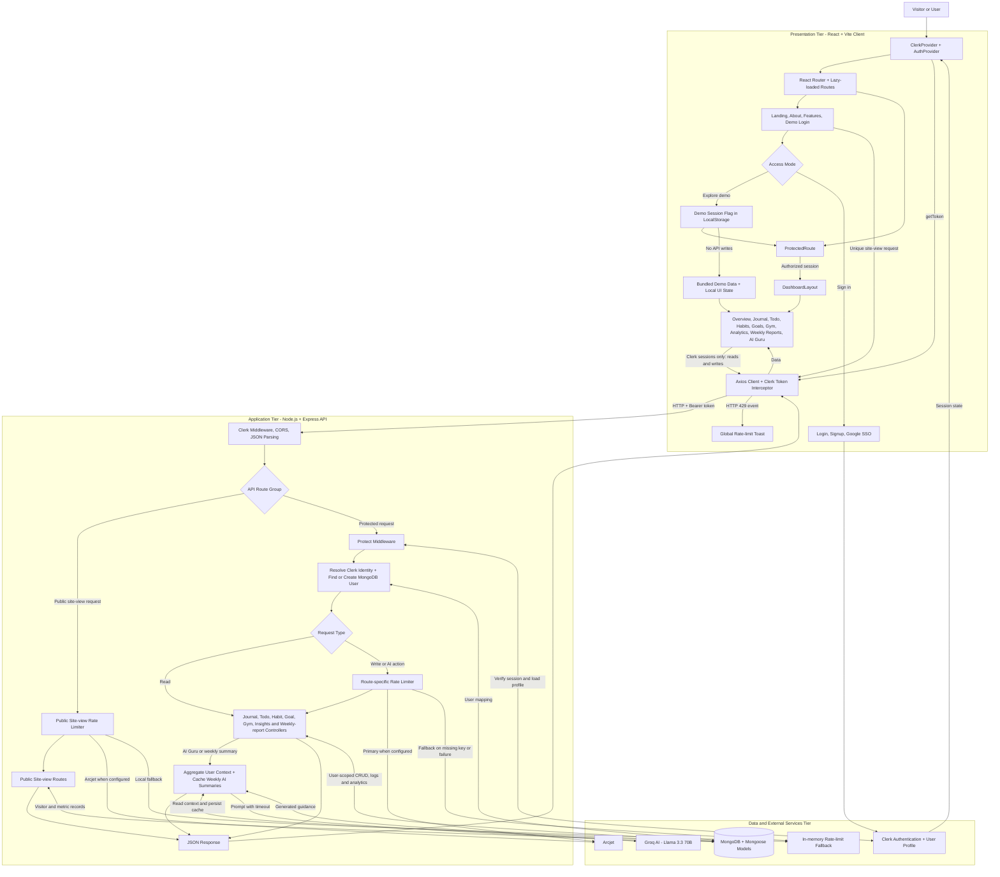
```mermaid
flowchart TD
  U[Visitor or User]

  subgraph Client["Presentation Tier - React + Vite Client"]
    APP[ClerkProvider + AuthProvider]
    ROUTER[React Router + Lazy-loaded Routes]
    PUBLIC[Landing, About, Features, Demo Login]
    ACCESS{Access Mode}
    CLERK_UI[Login, Signup, Google SSO]
    DEMO[Demo Session Flag in LocalStorage]
    GUARD[ProtectedRoute]
    DASH[DashboardLayout]
    MODULES[Overview, Journal, Todo, Habits, Goals, Gym, Analytics, Weekly Reports, AI Guru]
    DEMO_DATA[Bundled Demo Data + Local UI State]
    AXIOS[Axios Client + Clerk Token Interceptor]
    TOAST[Global Rate-limit Toast]

    APP --> ROUTER
    ROUTER --> PUBLIC
    ROUTER --> GUARD
    PUBLIC --> ACCESS
    ACCESS -->|Explore demo| DEMO
    ACCESS -->|Sign in| CLERK_UI
    DEMO --> GUARD
    GUARD -->|Authorized session| DASH
    DASH --> MODULES
    DEMO -->|No API writes| DEMO_DATA
    DEMO_DATA --> MODULES
    MODULES -->|Clerk sessions only: reads and writes| AXIOS
  end

  subgraph Server["Application Tier - Node.js + Express API"]
    EXPRESS[Clerk Middleware, CORS, JSON Parsing]
    ROUTES{API Route Group}
    SITE_LIMITER[Public Site-view Rate Limiter]
    PUBLIC_API[Public Site-view Routes]
    PROTECT[Protect Middleware]
    USER_SYNC[Resolve Clerk Identity + Find or Create MongoDB User]
    REQUEST_TYPE{Request Type}
    LIMITER[Route-specific Rate Limiter]
    CONTROLLERS[Journal, Todo, Habit, Goal, Gym, Insights and Weekly-report Controllers]
    AI_FLOW[Aggregate User Context + Cache Weekly AI Summaries]
    RESPONSE[JSON Response]

    EXPRESS --> ROUTES
    ROUTES -->|Public site-view request| SITE_LIMITER
    SITE_LIMITER --> PUBLIC_API
    ROUTES -->|Protected request| PROTECT
    PROTECT --> USER_SYNC
    USER_SYNC --> REQUEST_TYPE
    REQUEST_TYPE -->|Read| CONTROLLERS
    REQUEST_TYPE -->|Write or AI action| LIMITER
    LIMITER --> CONTROLLERS
    CONTROLLERS -->|AI Guru or weekly summary| AI_FLOW
    PUBLIC_API --> RESPONSE
    CONTROLLERS --> RESPONSE
    AI_FLOW --> RESPONSE
  end

  subgraph Data["Data and External Services Tier"]
    CLERK[Clerk Authentication + User Profile]
    MONGO[(MongoDB + Mongoose Models)]
    ARCJET[Arcjet]
    LOCAL_LIMIT[In-memory Rate-limit Fallback]
    GROQ[Groq AI - Llama 3.3 70B]
  end

  U --> APP
  CLERK_UI --> CLERK
  CLERK -->|Session state| APP
  APP -->|getToken| AXIOS
  PUBLIC -->|Unique site-view request| AXIOS
  AXIOS -->|HTTP + Bearer token| EXPRESS
  PROTECT <-->|Verify session and load profile| CLERK
  USER_SYNC <-->|User mapping| MONGO
  PUBLIC_API <-->|Visitor and metric records| MONGO
  SITE_LIMITER -->|Arcjet when configured| ARCJET
  SITE_LIMITER -->|Local fallback| LOCAL_LIMIT
  LIMITER -->|Primary when configured| ARCJET
  LIMITER -->|Fallback on missing key or failure| LOCAL_LIMIT
  CONTROLLERS <-->|User-scoped CRUD, logs and analytics| MONGO
  AI_FLOW <-->|Read context and persist cache| MONGO
  AI_FLOW -->|Prompt with timeout| GROQ
  GROQ -->|Generated guidance| AI_FLOW
  RESPONSE --> AXIOS
  AXIOS -->|Data| MODULES
  AXIOS -->|HTTP 429 event| TOAST
```

### Data Flow Diagram (DFD)

The DFD is separated into levels so the full project can be understood without compressing every feature into one unreadable diagram. Rectangles represent people or interfaces, rounded nodes represent processes, cylinders represent data stores, and labeled arrows show the data being transferred.

#### Level 0 — System Context

This level shows MonkMode as one system and the external actors and services with which it exchanges data.

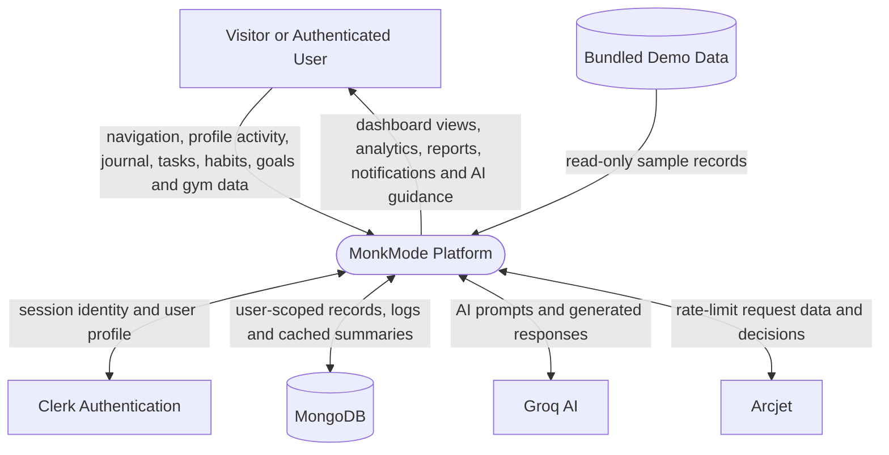
```mermaid
flowchart TD
  USER[Visitor or Authenticated User]
  SYSTEM([MonkMode Platform])
  CLERK[Clerk Authentication]
  GROQ[Groq AI]
  ARCJET[Arcjet]
  MONGO[(MongoDB)]
  DEMO[(Bundled Demo Data)]

  USER -->|navigation, profile activity, journal, tasks, habits, goals and gym data| SYSTEM
  SYSTEM -->|dashboard views, analytics, reports, notifications and AI guidance| USER
  SYSTEM <-->|session identity and user profile| CLERK
  SYSTEM <-->|user-scoped records, logs and cached summaries| MONGO
  SYSTEM <-->|AI prompts and generated responses| GROQ
  SYSTEM <-->|rate-limit request data and decisions| ARCJET
  DEMO -->|read-only sample records| SYSTEM
```

#### Level 1 — Access, Authentication and Request Flow

This level explains how a visitor reaches the dashboard and how a real API request is authenticated, limited, processed, and returned.

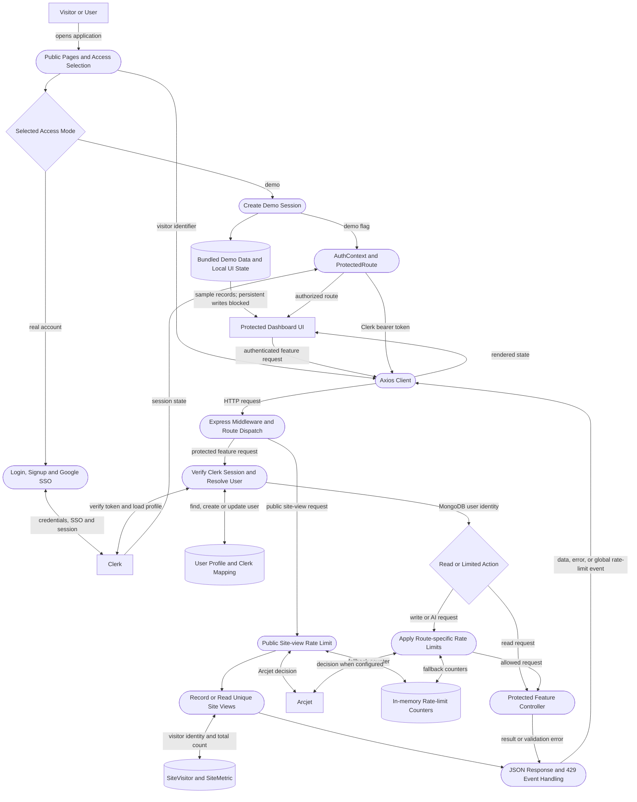
```mermaid
flowchart TD
  USER[Visitor or User]
  ENTRY([Public Pages and Access Selection])
  MODE{Selected Access Mode}
  DEMO_SESSION([Create Demo Session])
  DEMO_STORE[(Bundled Demo Data and Local UI State)]
  CLERK_UI([Login, Signup and Google SSO])
  CLERK[Clerk]
  AUTH([AuthContext and ProtectedRoute])
  DASH[Protected Dashboard UI]
  AXIOS([Axios Client])
  API([Express Middleware and Route Dispatch])
  SITE_LIMIT([Public Site-view Rate Limit])
  SITE_PROCESS([Record or Read Unique Site Views])
  SITE_STORE[(SiteVisitor and SiteMetric)]
  RESOLVE([Verify Clerk Session and Resolve User])
  USER_STORE[(User Profile and Clerk Mapping)]
  REQUEST_TYPE{Read or Limited Action}
  LIMIT([Apply Route-specific Rate Limits])
  ARCJET[Arcjet]
  LOCAL_STORE[(In-memory Rate-limit Counters)]
  FEATURE([Protected Feature Controller])
  RESPONSE([JSON Response and 429 Event Handling])

  USER -->|opens application| ENTRY
  ENTRY --> MODE
  MODE -->|demo| DEMO_SESSION
  DEMO_SESSION -->|demo flag| AUTH
  DEMO_SESSION --> DEMO_STORE
  DEMO_STORE -->|sample records; persistent writes blocked| DASH
  MODE -->|real account| CLERK_UI
  CLERK_UI <-->|credentials, SSO and session| CLERK
  CLERK -->|session state| AUTH
  AUTH -->|authorized route| DASH

  ENTRY -->|visitor identifier| AXIOS
  DASH -->|authenticated feature request| AXIOS
  AUTH -->|Clerk bearer token| AXIOS
  AXIOS -->|HTTP request| API

  API -->|public site-view request| SITE_LIMIT
  SITE_LIMIT <-->|Arcjet decision| ARCJET
  SITE_LIMIT <-->|fallback counter| LOCAL_STORE
  SITE_LIMIT --> SITE_PROCESS
  SITE_PROCESS <-->|visitor identity and total count| SITE_STORE
  SITE_PROCESS --> RESPONSE

  API -->|protected feature request| RESOLVE
  RESOLVE <-->|verify token and load profile| CLERK
  RESOLVE <-->|find, create or update user| USER_STORE
  RESOLVE -->|MongoDB user identity| REQUEST_TYPE
  REQUEST_TYPE -->|read request| FEATURE
  REQUEST_TYPE -->|write or AI request| LIMIT
  LIMIT <-->|decision when configured| ARCJET
  LIMIT <-->|fallback counters| LOCAL_STORE
  LIMIT -->|allowed request| FEATURE
  FEATURE -->|result or validation error| RESPONSE
  RESPONSE -->|data, error, or global rate-limit event| AXIOS
  AXIOS -->|rendered state| DASH
```

#### Level 1 — Feature Data Ownership

Each feature controller owns a focused set of collections. All persistent queries are scoped to the MongoDB user resolved by the authentication middleware.

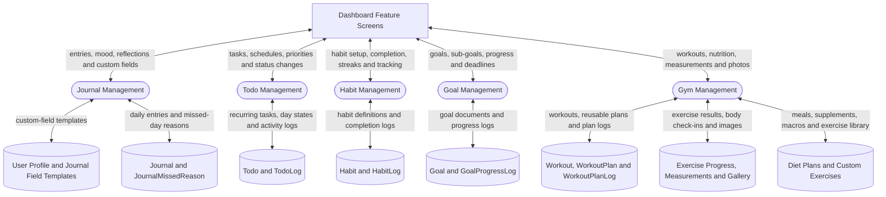
```mermaid
flowchart TD
  DASH[Dashboard Feature Screens]

  JOURNAL([Journal Management])
  TODO([Todo Management])
  HABIT([Habit Management])
  GOAL([Goal Management])
  GYM([Gym Management])

  USER_STORE[(User Profile and Journal Field Templates)]
  JOURNAL_STORE[(Journal and JournalMissedReason)]
  TODO_STORE[(Todo and TodoLog)]
  HABIT_STORE[(Habit and HabitLog)]
  GOAL_STORE[(Goal and GoalProgressLog)]
  GYM_STORE[(Workout, WorkoutPlan and WorkoutPlanLog)]
  GYM_PROGRESS_STORE[(Exercise Progress, Measurements and Gallery)]
  GYM_NUTRITION_STORE[(Diet Plans and Custom Exercises)]

  DASH <-->|entries, mood, reflections and custom fields| JOURNAL
  JOURNAL <-->|custom-field templates| USER_STORE
  JOURNAL <-->|daily entries and missed-day reasons| JOURNAL_STORE

  DASH <-->|tasks, schedules, priorities and status changes| TODO
  TODO <-->|recurring tasks, day states and activity logs| TODO_STORE

  DASH <-->|habit setup, completion, streaks and tracking| HABIT
  HABIT <-->|habit definitions and completion logs| HABIT_STORE

  DASH <-->|goals, sub-goals, progress and deadlines| GOAL
  GOAL <-->|goal documents and progress logs| GOAL_STORE

  DASH <-->|workouts, nutrition, measurements and photos| GYM
  GYM <-->|workouts, reusable plans and plan logs| GYM_STORE
  GYM <-->|exercise results, body check-ins and images| GYM_PROGRESS_STORE
  GYM <-->|meals, supplements, macros and exercise library| GYM_NUTRITION_STORE
```

#### Level 1 — Analytics, Weekly Reports and AI

Analytics and AI features do not own the primary activity data. They aggregate the feature stores, calculate derived values, and return read models or generated guidance.

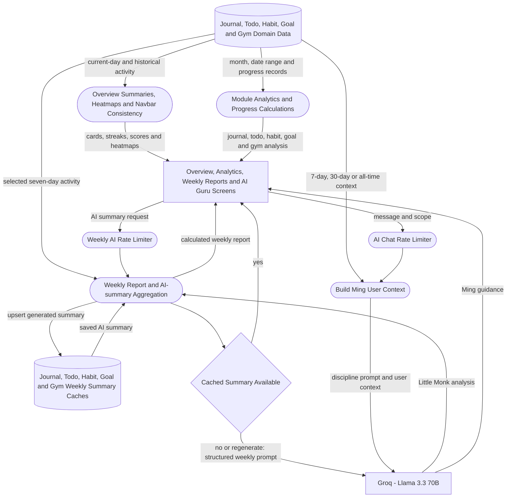
```mermaid
flowchart TD
  DASH[Overview, Analytics, Weekly Reports and AI Guru Screens]
  DOMAIN_STORE[(Journal, Todo, Habit, Goal and Gym Domain Data)]
  SUMMARY_STORE[(Journal, Todo, Habit, Goal and Gym Weekly Summary Caches)]

  OVERVIEW([Overview Summaries, Heatmaps and Navbar Consistency])
  ANALYTICS([Module Analytics and Progress Calculations])
  WEEKLY([Weekly Report and AI-summary Aggregation])
  CACHE{Cached Summary Available}
  WEEKLY_LIMIT([Weekly AI Rate Limiter])
  MING_CONTEXT([Build Ming User Context])
  MING_LIMIT([AI Chat Rate Limiter])
  GROQ[Groq - Llama 3.3 70B]

  DOMAIN_STORE -->|current-day and historical activity| OVERVIEW
  OVERVIEW -->|cards, streaks, scores and heatmaps| DASH

  DOMAIN_STORE -->|month, date range and progress records| ANALYTICS
  ANALYTICS -->|journal, todo, habit, goal and gym analysis| DASH

  DOMAIN_STORE -->|selected seven-day activity| WEEKLY
  SUMMARY_STORE -->|saved AI summary| WEEKLY
  WEEKLY -->|calculated weekly report| DASH
  DASH -->|AI summary request| WEEKLY_LIMIT
  WEEKLY_LIMIT --> WEEKLY
  WEEKLY --> CACHE
  CACHE -->|yes| DASH
  CACHE -->|no or regenerate: structured weekly prompt| GROQ
  GROQ -->|Little Monk analysis| WEEKLY
  WEEKLY -->|upsert generated summary| SUMMARY_STORE

  DOMAIN_STORE -->|7-day, 30-day or all-time context| MING_CONTEXT
  DASH -->|message and scope| MING_LIMIT
  MING_LIMIT --> MING_CONTEXT
  MING_CONTEXT -->|discipline prompt and user context| GROQ
  GROQ -->|Ming guidance| DASH
```

#### Data Flow Summary

| Flow | Primary Input | Processing | Main Output |
| --- | --- | --- | --- |
| Demo | Demo session flag | Load bundled data and disable persistent writes | Read-only dashboard experience |
| Authentication | Clerk session token | Verify identity and map it to a MongoDB user | User-scoped API access |
| Journal | Reflections, mood, ratings, and custom fields | Validate, save, summarize, and analyze entries | Journal history, heatmaps, and weekly insight |
| Todo | Task definitions and daily status changes | Apply recurrence, track state, and create logs | Today, schedule, upcoming, and performance views |
| Habits | Habit rules and completion events | Track completions, streaks, consistency, and history | Daily habits, tracker, heatmap, and analysis |
| Goals | Goals, sub-goals, deadlines, and progress | Store progress changes and activity history | Goal cards, logs, risk state, and analysis |
| Gym | Workouts, diet, measurements, progress, and photos | Manage plans and calculate exercise/body trends | Daily gym views, progress charts, gallery, and reports |
| Analytics | Historical feature records | Aggregate by date, category, status, streak, and progress | Overview cards, heatmaps, and detailed analytics |
| Weekly Reports | Seven-day feature activity | Calculate weekly metrics and load or generate AI summaries | Journal, todo, habit, goal, and gym reports |
| AI Guru | User message, scope, and cross-module activity | Build context, apply AI limit, and call Groq | Personalized Ming guidance |
| Site Views | Anonymous visitor identifier | Deduplicate visitor and increment persistent count | Public site-view total |

## 📋 Feature List

### Overview Section Feature List

```text
Overview
├── Daily Summary
│   ├── Today’s Journal
│   ├── Today’s Tasks
│   ├── Today’s Habits
│   ├── Goals
│   └── Gym
│
└── Activity Heatmaps
    ├── Year filter
    ├── Journal activity
    ├── To-Do activity
    ├── Habit activity
    ├── Goal activity
    └── Gym activity
```

### Journal Section Feature List

```text
Journal
├── Today’s Entry
│   ├── Consistency summary
│   ├── 14-step guided journal
│   │   ├── Mood
│   │   ├── Wake-up time
│   │   ├── Energy level
│   │   ├── Daily summary
│   │   ├── Wins
│   │   ├── Mistakes
│   │   ├── Insight
│   │   ├── Distractions
│   │   ├── Gratitude
│   │   ├── Achievements
│   │   ├── Affirmation
│   │   ├── Tomorrow’s plan
│   │   ├── Sleep time
│   │   └── Daily rating
│   ├── Custom journal fields
│   ├── Step progress tracking
│   └── Submit, view, and edit today’s entry
│
├── Missed Days
│   ├── Weekly missed-day summary
│   └── Add or edit missed-day reasons
│
└── Past Entries
    ├── Previous journal entry cards
    ├── Mood and daily-stat preview
    └── Full journal entry details
```

### To-Do Section Feature List

```text
To-Do
├── Today
│   ├── Today’s Overview
│   ├── All Tasks
│   ├── Pending Tasks
│   ├── Completed Tasks
│   └── Missed Tasks
│
├── Upcoming
│   ├── Tomorrow
│   ├── Day-wise task selection
│   ├── Priority filtering
│   └── Upcoming task details
│
├── Schedule
│   ├── Create Task
│   ├── All Tasks
│   ├── Calendar
│   └── Task Logs
│
└── Important
    ├── Important Categories
    └── User-Created Tasks
```

### Habits Section Feature List

```text
Habits
├── Today
│   ├── Consistency summary
│   ├── Time-of-day filtering
│   ├── All Habits
│   ├── Pending Habits
│   ├── Completed Habits
│   └── Habit Streak Summary
│
├── Create Habit
│   ├── New Habit
│   │   ├── Habit name and purpose
│   │   ├── Target streak
│   │   ├── Time of day
│   │   ├── Category and priority
│   │   └── Repeat schedule and duration
│   ├── All Habits
│   │   ├── Active Habits
│   │   └── Archived Habits
│   ├── Calendar
│   └── Habit Logs
│
└── Track Your Habit
    ├── Active and archived filtering
    ├── Important and ending-soon filtering
    ├── Year and month selection
    ├── Day-wise completion history
    ├── Current and target streaks
    └── Important habit management
```

### Goals Section Feature List

```text
Goals
├── My Goals
│   ├── Active and archived goal cards
│   ├── Goal type, priority, and deadline details
│   ├── Important goal management
│   ├── Add Sub-goals
│   │   ├── Sub-goal title and deadline
│   │   └── Create a supporting habit
│   └── Update Progress
│       ├── Pending Sub-goals
│       ├── Completed Sub-goals
│       ├── Mark as completed or reopen
│       └── Delete Sub-goals
│
├── Create Goals
│   ├── New Goal
│   │   ├── Goal title and motivation
│   │   ├── Short-term or long-term type
│   │   ├── Start date and deadline
│   │   └── Priority level
│   ├── All Goals
│   │   ├── Active Goals
│   │   └── Archived Goals
│   └── Goal Logs
│
└── Progress
    ├── Overall milestone progress
    ├── Status filtering
    ├── Priority filtering
    ├── Goal-wise completion percentage
    ├── Completed milestone totals
    └── Deadline and remaining-day status
```

### Gym Section Feature List

```text
Gym
├── Today
│   ├── Day-wise workout selection
│   ├── Today’s workout plans and exercises
│   ├── Exercise completion and progress updates
│   ├── Sets, reps, weight, duration, and rest tracking
│   ├── Exercise progress history
│   └── Daily diet and workout nutrition preview
│
├── Add Workout
│   ├── Create Workout Plan
│   │   ├── Goal type and workout split
│   │   ├── Exercise selection and configuration
│   │   ├── Training days and plan duration
│   │   ├── Difficulty level
│   │   └── Automatic estimated workout time
│   ├── All Workouts
│   │   ├── Active and archived plans
│   │   ├── Edit, copy, archive, and delete actions
│   │   └── Workout details and exercise list
│   └── Workout Logs
│
├── Diet Chart
│   ├── Full-Day Diet
│   │   ├── Day-wise meal planning
│   │   └── Custom meal sections and timings
│   ├── Workout Nutrition
│   │   ├── Pre-workout meals
│   │   └── Post-workout meals
│   ├── Supplements
│   ├── Daily Macro Targets
│   └── Saved plan management and day-wise copying
│
├── Measurements
│   ├── Add Body Measurements
│   ├── Body Weight, Upper Body, Arms, and Lower Body groups
│   ├── Saved Measurements
│   ├── Check-In History
│   └── Measurement update comparison
│
├── Progress
│   ├── Measurements Progress
│   │   ├── Body-group and metric filtering
│   │   ├── Measurement trend chart
│   │   └── Check-in updates and value changes
│   └── Workout Progress
│       ├── Exercise and body-group filtering
│       ├── Exercise performance trends
│       └── Sets, reps, weight, volume, and duration history
│
├── Workout Library
│   ├── Body-group and muscle-section filtering
│   ├── Searchable exercise collection
│   ├── Exercise details
│   └── User-created exercises
│
└── Gallery
    ├── Dated progress-photo uploads
    ├── Photo and check-in summary
    ├── Check-in-based photo gallery
    ├── Full-screen photo preview
    └── Progress-photo deletion
```

## 📁 Folder Structure

```text
monkmode/
├── client/                              # React + Vite frontend
│   ├── data/                            # Demo datasets for every dashboard module
│   │   ├── DummyData.jsx
│   │   ├── JournalDummyData.jsx
│   │   ├── ToDoDummyData.jsx
│   │   ├── HabitDummyData.jsx
│   │   ├── GoalDummyData.jsx
│   │   └── GymDummyData.jsx
│   ├── public/                          # Static assets served without bundling
│   │   ├── meditation.mp3
│   │   └── try-demo-button.svg
│   ├── src/
│   │   ├── api/
│   │   │   └── axios.js                 # API client, Clerk token, and 429 interceptor
│   │   ├── assets/                      # Logos, artwork, and feature screenshots
│   │   │   ├── aiguru/
│   │   │   ├── analysis/
│   │   │   ├── goal/
│   │   │   ├── gym/
│   │   │   ├── habit/
│   │   │   ├── journal/
│   │   │   ├── overview/
│   │   │   ├── todo/
│   │   │   └── weeklyreport/
│   │   ├── components/                  # Shared dashboard form and feedback UI
│   │   │   ├── DashboardDateTimeInput.jsx
│   │   │   ├── DashboardSelect.jsx
│   │   │   └── GlobalRateLimitToast.jsx
│   │   ├── context/
│   │   │   └── AuthContext.jsx          # Clerk, guest, and demo session state
│   │   ├── hooks/
│   │   │   ├── useAuth.js
│   │   │   └── useMobileLowMotion.js    # Mobile performance preference
│   │   ├── dashboard/
│   │   │   ├── DashboardLayout.jsx      # Shared protected dashboard shell
│   │   │   ├── Navbar.jsx
│   │   │   ├── Sidebar.jsx
│   │   │   ├── WelcomePopup.jsx
│   │   │   ├── overview/                # Summary cards and activity heatmap
│   │   │   ├── journal/                 # Daily journal and history sidebar
│   │   │   ├── todo/                    # Today, important, schedule, and upcoming tasks
│   │   │   ├── habits/                  # Habit creation, today view, and tracking
│   │   │   ├── goal/                    # Goals, sub-goals, and progress updates
│   │   │   ├── gym/                     # Workouts, diet, progress, measurements, and gallery
│   │   │   ├── weeklyreport/            # Journal, todo, habit, goal, and gym reports
│   │   │   ├── analysis/
│   │   │   │   ├── journalanalysis/
│   │   │   │   ├── todoanalysis/
│   │   │   │   ├── habitanalysis/
│   │   │   │   ├── goalanalysis/
│   │   │   │   └── gymanalysis/
│   │   │   └── ai_guru/
│   │   │       └── AIGuru.jsx            # Ming AI assistant interface
│   │   ├── pages/
│   │   │   ├── authentication/          # Login, signup, SSO callback, and route guard
│   │   │   └── landingpage/             # Landing, about, features, and demo entry
│   │   ├── utils/
│   │   │   └── formatDate.js
│   │   ├── App.jsx                      # Lazy-loaded route definitions
│   │   ├── index.css                    # Global and responsive styles
│   │   └── main.jsx                     # Clerk and React application bootstrap
│   ├── .env.example                     # Frontend environment template
│   ├── eslint.config.js
│   ├── package.json
│   ├── postcss.config.js
│   ├── tailwind.config.js
│   ├── vite.config.js
│   └── vercel.json                      # SPA rewrite configuration
│
├── server/                              # Node.js + Express backend
│   ├── controllers/
│   │   ├── journalController.js         # Journal CRUD, summaries, and analytics
│   │   ├── todoController.js            # Todo CRUD, logs, and analytics
│   │   ├── habitController.js           # Habit tracking and streak analysis
│   │   ├── goalController.js            # Goals, sub-goals, and progress logs
│   │   ├── gymController.js             # Workout, nutrition, progress, and gallery APIs
│   │   ├── insightsController.js        # Cross-module dashboard insights
│   │   ├── weeklyReportController.js    # Weekly aggregation and AI summary caching
│   │   ├── aiGuruController.js          # Ming context aggregation and Groq chat
│   │   ├── siteViewController.js        # Unique visitor counter
│   │   └── authController.js            # Retired legacy auth endpoints
│   ├── middleware/
│   │   ├── authMiddleware.js            # Clerk verification and MongoDB user mapping
│   │   └── rateLimit.js                 # Arcjet with in-memory fallback
│   ├── models/                          # User-scoped Mongoose schemas
│   │   ├── User.js
│   │   ├── Journal*.js                  # Journal entries, missed days, weekly summaries
│   │   ├── Todo*.js                     # Todos, logs, and weekly summaries
│   │   ├── Habit*.js                    # Habits, logs, and weekly summaries
│   │   ├── Goal*.js                     # Goals, progress logs, and weekly summaries
│   │   ├── Gym*.js                      # Gym progress, diet, gallery, and reports
│   │   ├── Workout*.js                  # Workouts, plans, and activity logs
│   │   └── Site*.js                     # Site metrics and unique visitors
│   ├── routes/                          # Express routes grouped by feature
│   │   ├── journalRoutes.js
│   │   ├── todoRoutes.js
│   │   ├── habitRoutes.js
│   │   ├── goalRoutes.js
│   │   ├── gymRoutes.js
│   │   ├── insightsRoutes.js
│   │   ├── weeklyReportRoutes.js
│   │   ├── siteViewRoutes.js
│   │   └── authRoutes.js
│   ├── scripts/                         # Seed, verification, and backfill utilities
│   ├── tests/
│   │   └── goalActivityUtils.test.js
│   ├── utils/
│   │   ├── goalActivityUtils.js
│   │   └── streakUtils.js
│   ├── .env.example                     # Backend environment template
│   ├── package.json
│   └── server.js                        # Middleware, routes, MongoDB, and server startup
│
├── .gitignore
└── README.md
```

## 🗄️ Database Design

MonkMode uses MongoDB with Mongoose. Every real dashboard record is connected to a `User`, and most feature collections are scoped by `userId` so each authenticated user sees only their own journal, todo, habit, goal, gym, and report data.

### Database Schema / Entity Relationship Diagrams (ERD)

The schema is divided by domain so every relationship remains readable on desktop and mobile. `User` is repeated as the ownership root in each relevant diagram, but it represents the same MongoDB collection.

#### Identity and Journal

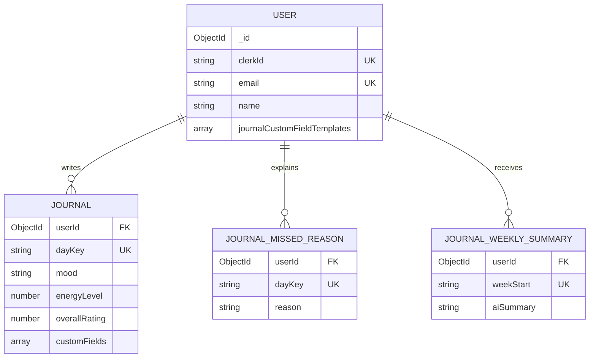
```mermaid
erDiagram
  USER ||--o{ JOURNAL : writes
  USER ||--o{ JOURNAL_MISSED_REASON : explains
  USER ||--o{ JOURNAL_WEEKLY_SUMMARY : receives

  USER {
    ObjectId _id
    string clerkId UK
    string email UK
    string name
    array journalCustomFieldTemplates
  }
  JOURNAL {
    ObjectId userId FK
    string dayKey UK
    string mood
    number energyLevel
    number overallRating
    array customFields
  }
  JOURNAL_MISSED_REASON {
    ObjectId userId FK
    string dayKey UK
    string reason
  }
  JOURNAL_WEEKLY_SUMMARY {
    ObjectId userId FK
    string weekStart UK
    string aiSummary
  }
```

#### Todo

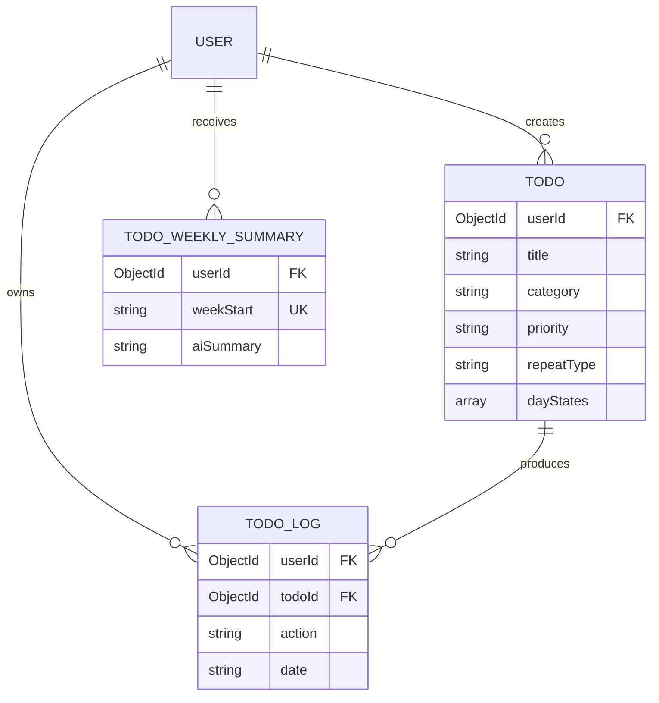
```mermaid
erDiagram
  USER ||--o{ TODO : creates
  USER ||--o{ TODO_LOG : owns
  TODO ||--o{ TODO_LOG : produces
  USER ||--o{ TODO_WEEKLY_SUMMARY : receives

  TODO {
    ObjectId userId FK
    string title
    string category
    string priority
    string repeatType
    array dayStates
  }
  TODO_LOG {
    ObjectId userId FK
    ObjectId todoId FK
    string action
    string date
  }
  TODO_WEEKLY_SUMMARY {
    ObjectId userId FK
    string weekStart UK
    string aiSummary
  }
```

#### Habits

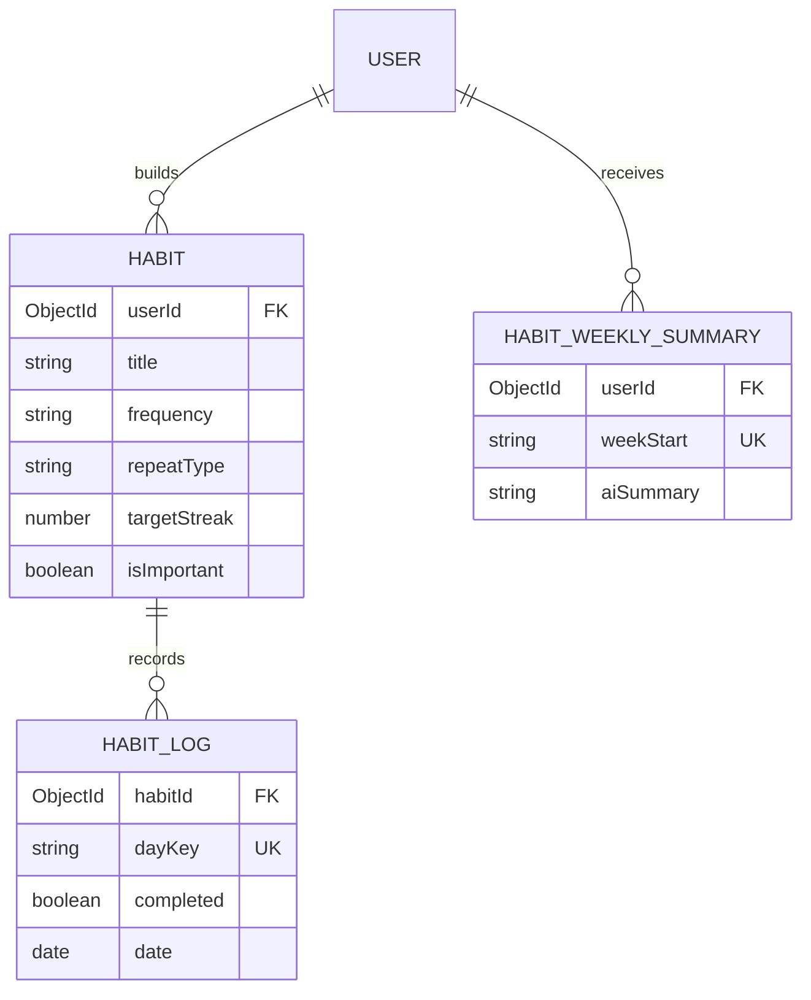
```mermaid
erDiagram
  USER ||--o{ HABIT : builds
  HABIT ||--o{ HABIT_LOG : records
  USER ||--o{ HABIT_WEEKLY_SUMMARY : receives

  HABIT {
    ObjectId userId FK
    string title
    string frequency
    string repeatType
    number targetStreak
    boolean isImportant
  }
  HABIT_LOG {
    ObjectId habitId FK
    string dayKey UK
    boolean completed
    date date
  }
  HABIT_WEEKLY_SUMMARY {
    ObjectId userId FK
    string weekStart UK
    string aiSummary
  }
```

#### Goals

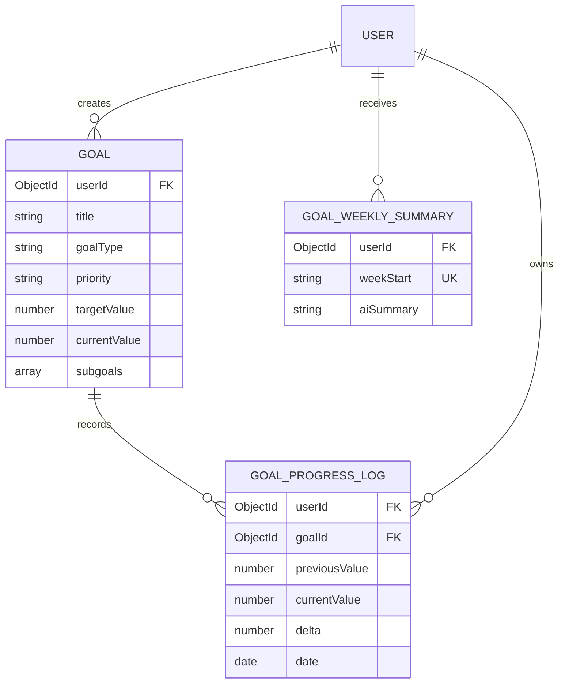
```mermaid
erDiagram
  USER ||--o{ GOAL : creates
  GOAL ||--o{ GOAL_PROGRESS_LOG : records
  USER ||--o{ GOAL_PROGRESS_LOG : owns
  USER ||--o{ GOAL_WEEKLY_SUMMARY : receives

  GOAL {
    ObjectId userId FK
    string title
    string goalType
    string priority
    number targetValue
    number currentValue
    array subgoals
  }
  GOAL_PROGRESS_LOG {
    ObjectId userId FK
    ObjectId goalId FK
    number previousValue
    number currentValue
    number delta
    date date
  }
  GOAL_WEEKLY_SUMMARY {
    ObjectId userId FK
    string weekStart UK
    string aiSummary
  }
```

#### Gym Planning and Nutrition

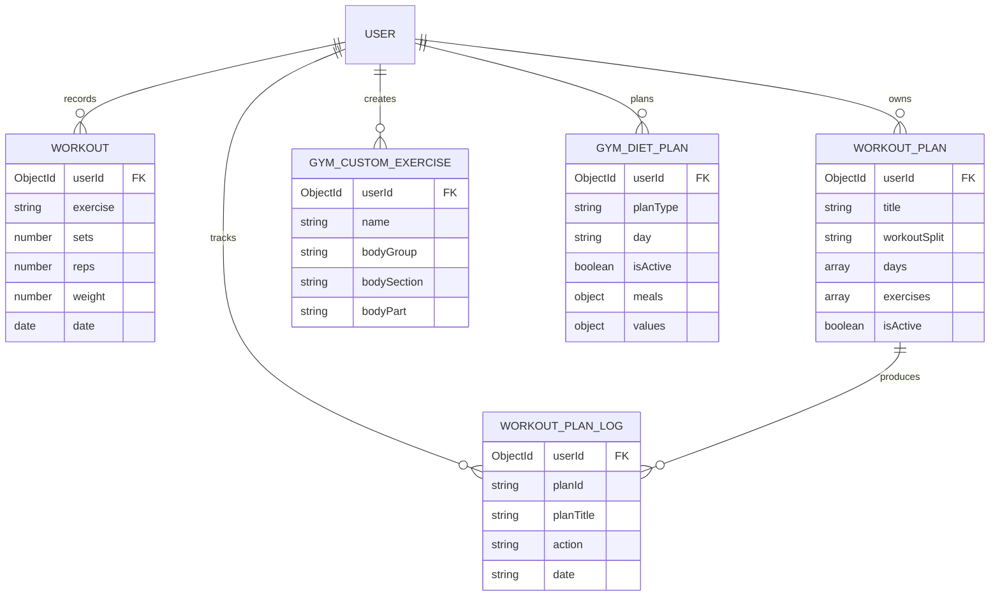
```mermaid
erDiagram
  USER ||--o{ WORKOUT : records
  USER ||--o{ WORKOUT_PLAN : owns
  USER ||--o{ WORKOUT_PLAN_LOG : tracks
  WORKOUT_PLAN ||--o{ WORKOUT_PLAN_LOG : produces
  USER ||--o{ GYM_CUSTOM_EXERCISE : creates
  USER ||--o{ GYM_DIET_PLAN : plans

  WORKOUT {
    ObjectId userId FK
    string exercise
    number sets
    number reps
    number weight
    date date
  }
  WORKOUT_PLAN {
    ObjectId userId FK
    string title
    string workoutSplit
    array days
    array exercises
    boolean isActive
  }
  WORKOUT_PLAN_LOG {
    ObjectId userId FK
    string planId
    string planTitle
    string action
    string date
  }
  GYM_CUSTOM_EXERCISE {
    ObjectId userId FK
    string name
    string bodyGroup
    string bodySection
    string bodyPart
  }
  GYM_DIET_PLAN {
    ObjectId userId FK
    string planType
    string day
    boolean isActive
    object meals
    object values
  }
```

#### Gym Progress and Reports

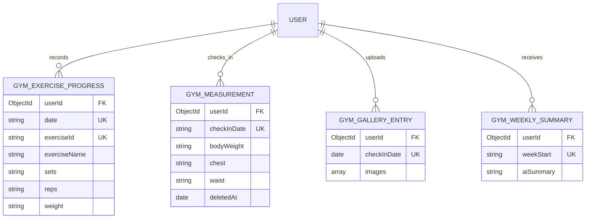
```mermaid
erDiagram
  USER ||--o{ GYM_EXERCISE_PROGRESS : records
  USER ||--o{ GYM_MEASUREMENT : checks_in
  USER ||--o{ GYM_GALLERY_ENTRY : uploads
  USER ||--o{ GYM_WEEKLY_SUMMARY : receives

  GYM_EXERCISE_PROGRESS {
    ObjectId userId FK
    string date UK
    string exerciseId UK
    string exerciseName
    string sets
    string reps
    string weight
  }
  GYM_MEASUREMENT {
    ObjectId userId FK
    string checkInDate UK
    string bodyWeight
    string chest
    string waist
    date deletedAt
  }
  GYM_GALLERY_ENTRY {
    ObjectId userId FK
    date checkInDate UK
    array images
  }
  GYM_WEEKLY_SUMMARY {
    ObjectId userId FK
    string weekStart UK
    string aiSummary
  }
```

#### Public Site Metrics

`SiteVisitor` and `SiteMetric` are independent collections without a stored foreign key. A newly accepted unique visitor increments the total site-view metric.

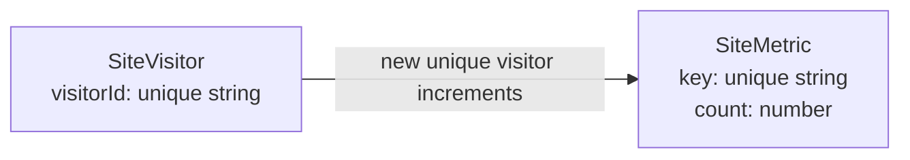
```mermaid
flowchart LR
  V["SiteVisitor<br/>visitorId: unique string"] -->|new unique visitor increments| M["SiteMetric<br/>key: unique string<br/>count: number"]
```

### Main Collections

| Module | Collections | Stored Data |
| --- | --- | --- |
| Auth | `User` | Clerk ID, name, email, and custom journal field templates. |
| Journal | `Journal` | Daily journal entry, mood, wake/sleep time, energy, rating, wins, mistakes, gratitude, achievements, distractions, custom fields, and day key. |
| Journal Reports | `JournalMissedReason`, `JournalWeeklySummary` | Reasons for missed journal days and cached weekly AI summaries. |
| Todo | `Todo`, `TodoLog`, `TodoWeeklySummary` | Task details, recurring rules, priority, category, per-day status, activity logs, and weekly summaries. |
| Habits | `Habit`, `HabitLog`, `HabitWeeklySummary` | Habit setup, frequency, repeat rules, streak target, completion logs, archive state, and weekly summaries. |
| Goals | `Goal`, `GoalProgressLog`, `GoalWeeklySummary` | Goal details, sub-goals, progress values, deadlines, important flag, activity logs, and weekly summaries. |
| Gym Plans | `Workout`, `WorkoutPlan`, `WorkoutPlanLog` | Workout entries, reusable workout plans, active plans, exercise lists, and workout-plan activity logs. |
| Gym Progress | `GymExerciseProgress`, `GymMeasurement`, `GymGalleryEntry` | Exercise progress, body measurements, check-in dates, and progress photo entries. |
| Gym Nutrition | `GymDietPlan`, `GymCustomExercise`, `GymWeeklySummary` | Diet plans, macros, supplements, custom exercise library, and weekly gym AI summaries. |
| Site Metrics | `SiteVisitor`, `SiteMetric` | Unique visitor identifiers and the persistent total site-view counter. |

### Data Integrity & Indexing

- `User.clerkId` and `User.email` are unique so real users can be mapped safely after Clerk login.
- `Journal` uses a unique `{ userId, dayKey }` index to allow only one journal entry per user per day.
- `GymMeasurement` uses a unique `{ userId, checkInDate }` index to prevent duplicate measurement check-ins.
- `GymExerciseProgress` uses a unique `{ userId, date, exerciseId }` index for one progress record per exercise per day.
- Weekly AI summary collections use unique `{ userId, weekStart }` indexes to cache one summary per user per week.
- Logs and progress collections include indexes on user/date fields for faster dashboard, heatmap, and analytics queries.
- Temporary logs use TTL indexes so old activity records can expire automatically.

## 🖼️ Screenshots

Screenshots are stored in `client/src/assets` and are used by the landing feature gallery.

| Module | Screenshot |
| --- | --- |
| Landing Page | 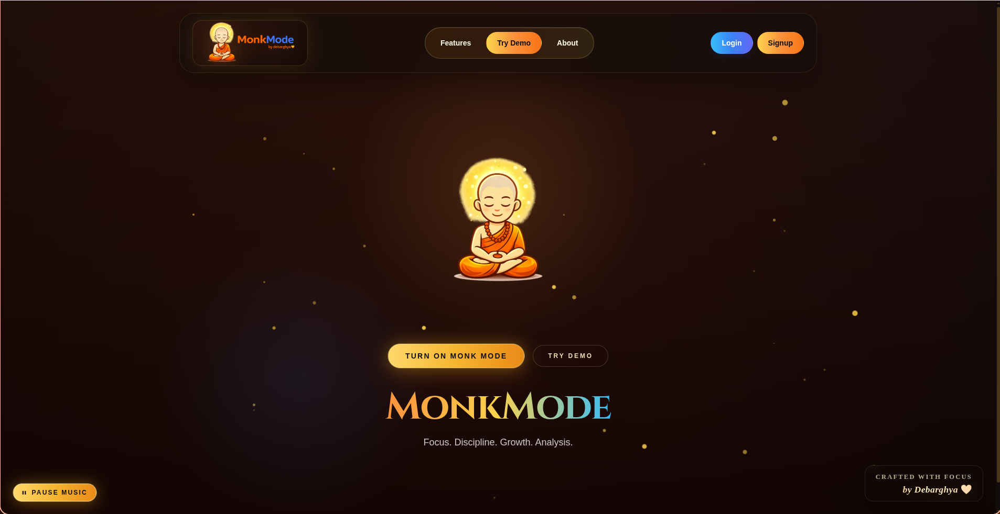 |
| Overview | 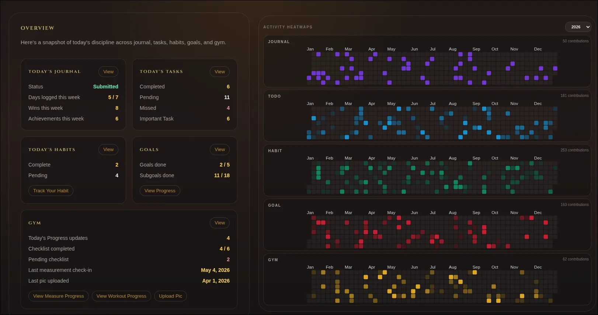 |
| Journal | 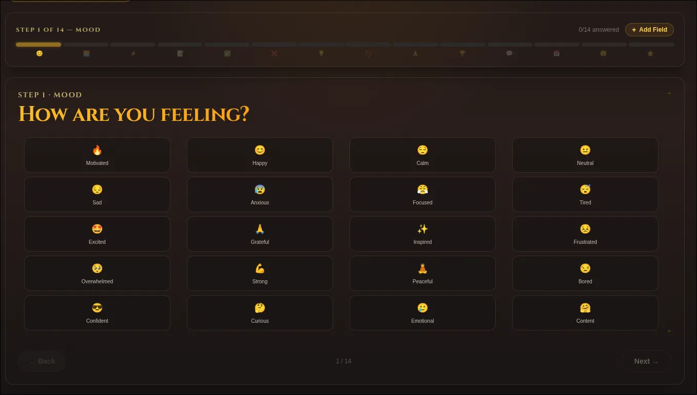 |
| Todo | 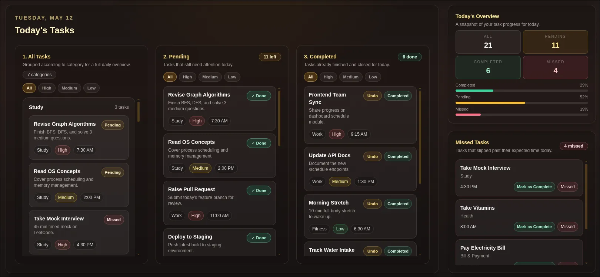 |
| Habits | 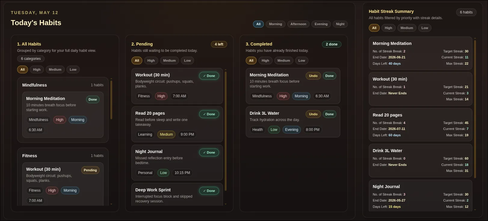 |
| Habit Tracker | 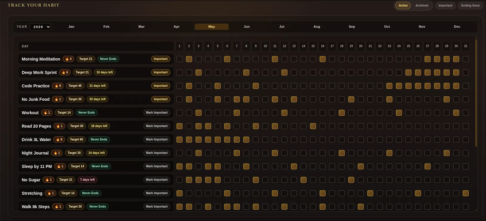 |
| Goals | 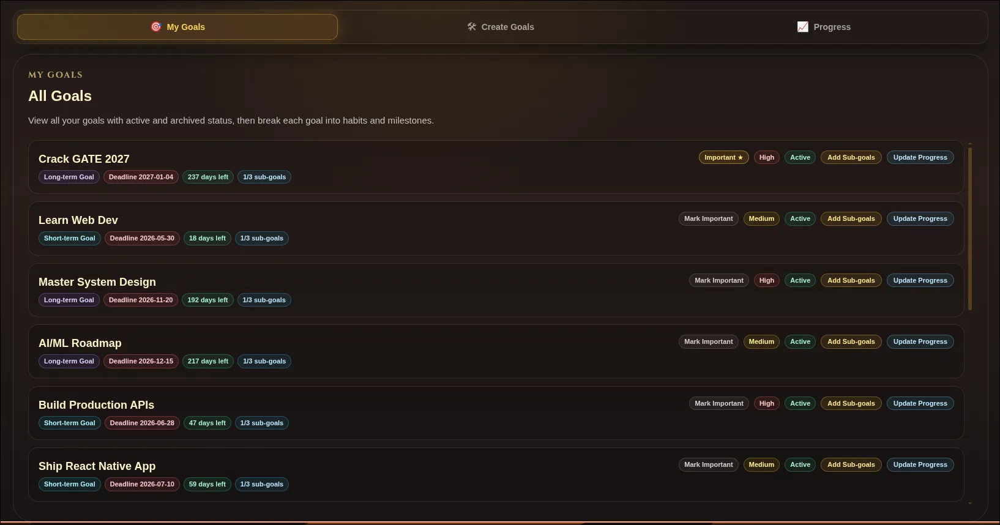 |
| Goal Progress | 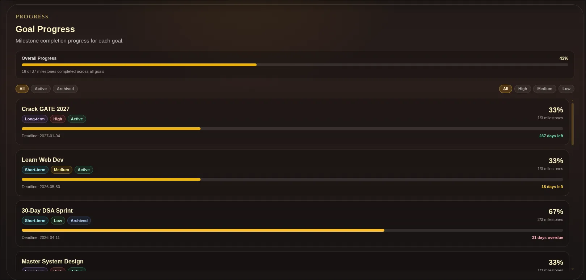 |
| Gym | 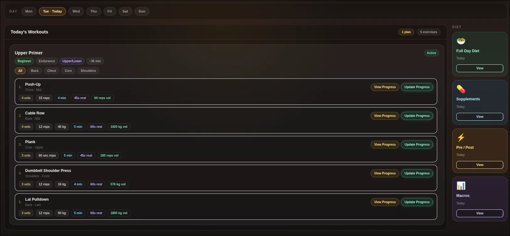 |
| Gym Workout Builder | 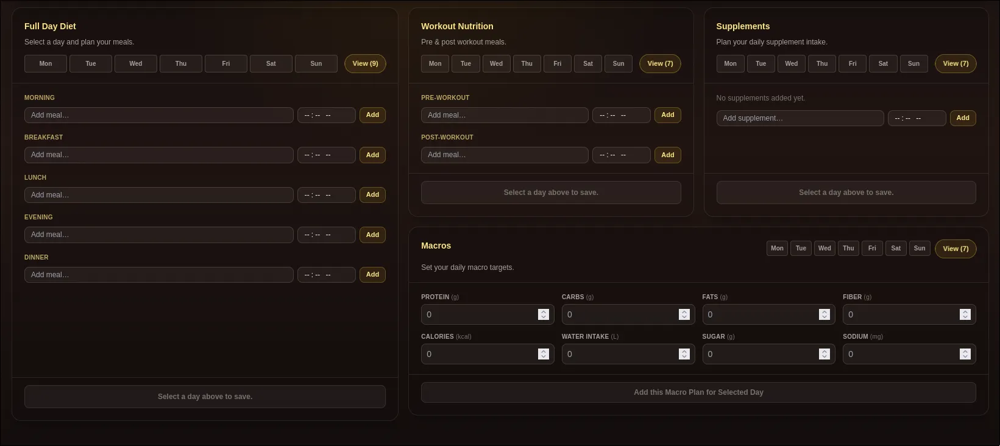 |
| Gym Measurements | 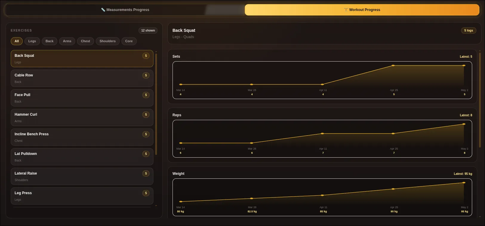 |
| Gym Progress Photos | 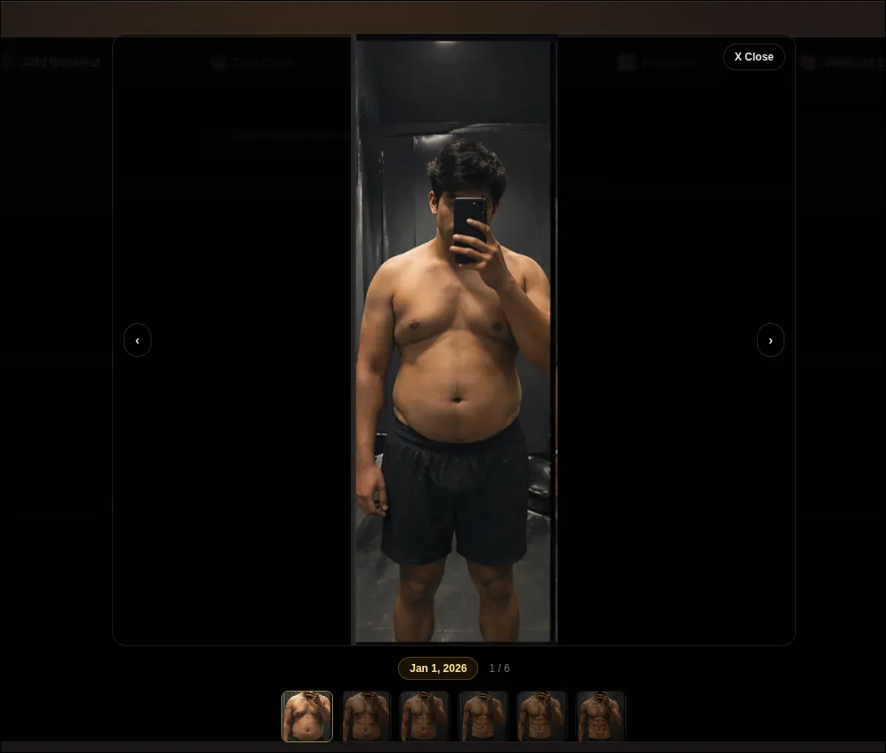 |
| Weekly Report |  |
| Weekly Report Detail | 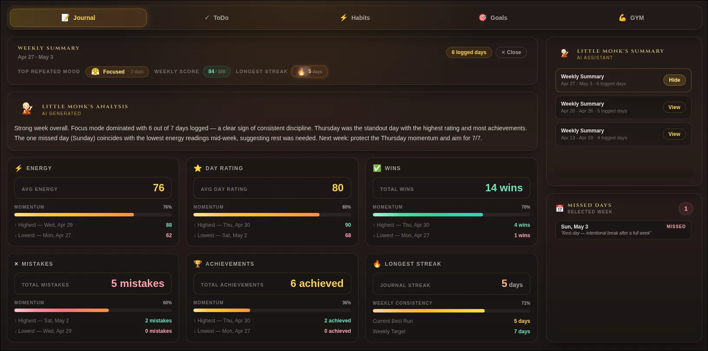 |
| Analysis | 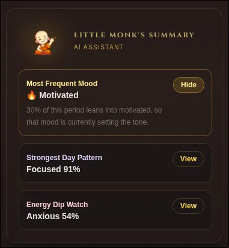 |
| Analysis Detail | 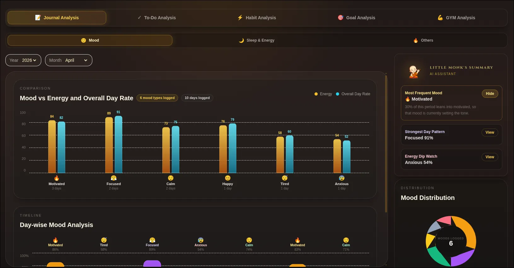 |
| AI Guru |  |
| AI Guru Chat | 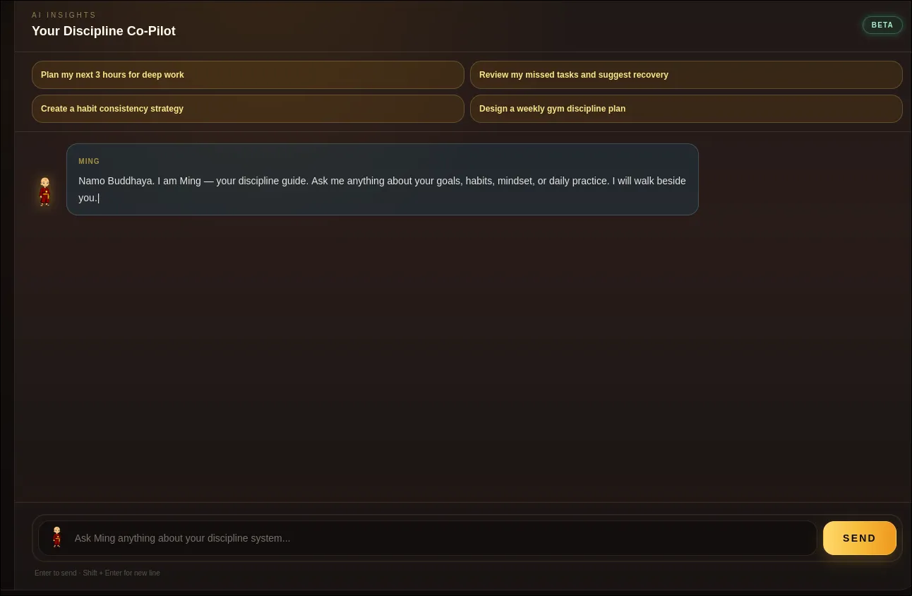 |

## 🛠️ Tech Stack

| Layer | Technologies | Purpose |
| --- | --- | --- |
| Frontend | React, Vite, React Router | Single-page dashboard, routing, and client app build pipeline |
| Styling & UI | Tailwind CSS, Framer Motion, Fontsource | Responsive layouts, motion, and custom typography |
| Data & API Client | Axios, Clerk React | Authenticated API requests and frontend session handling |
| Visualizations | React Calendar Heatmap, Three.js, Vanta | Activity heatmaps and interactive landing visuals |
| Backend | Node.js, Express | REST API, feature routing, middleware, and server runtime |
| Database | MongoDB, Mongoose | User-scoped persistence, schemas, relationships, and indexes |
| Authentication | Clerk React, Clerk Express | Google login, protected routes, token verification, and user sync |
| AI & Rate Limiting | Groq SDK, Arcjet | AI summaries, AI Guru responses, and write/AI action protection |
| Backend Utilities | dotenv, CORS | Environment configuration and cross-origin API access |

### Development Tools

- ESLint for frontend linting.
- Nodemon for backend development reloads.
- Vercel SPA rewrite config for frontend deployment.

## ⚙️ Installation

Clone the repository:

```bash
git clone https://github.com/debarghya131/MonkMode.git
cd MonkMode
```

Install frontend dependencies:

```bash
cd client
npm install
```

Install backend dependencies:

```bash
cd ../server
npm install
```

Create environment files:

```bash
cp client/.env.example client/.env
cp server/.env.example server/.env
```

Run the backend:

```bash
cd server
npm run dev
```

Run the frontend in another terminal:

```bash
cd client
npm run dev
```

Default local URLs:

- Frontend: `http://localhost:5173`
- Backend: `http://localhost:5000`

## 🔐 Environment Variables

### Client

```env
VITE_CLERK_PUBLISHABLE_KEY=pk_test_or_pk_live_key
VITE_API_URL=http://localhost:5000/api
```

### Server

```env
NODE_ENV=development
PORT=5000
MONGO_URI=mongodb_connection_string
API_KEY=groq_api_key
CLERK_SECRET_KEY=clerk_secret_key
CLERK_PUBLISHABLE_KEY=clerk_publishable_key
CORS_ORIGINS=http://localhost:5173
APP_TIMEZONE=Asia/Kolkata
AI_TIMEOUT_MS=15000
ARCJET_KEY=optional_arcjet_key
ARCJET_MODE=LIVE
```

The backend also supports configurable rate-limit variables for AI chat, weekly AI summaries, journal saves, todo writes, habit writes, goal writes, and gym-related writes. See `server/.env.example` for the full list.

### Local and deployed database separation

The same cluster can hold both databases. Every backend connection explicitly
selects its database, overriding any database path in `MONGO_URI`:

| Backend environment | Database | Purpose |
| --- | --- | --- |
| `development` (default) or `test` | `test` | Localhost activity and development data |
| `production` | `MonkMode` | Live deployed users |

`npm run dev` forces development mode. On your **deployed backend**, set
`NODE_ENV=production`, keep `MONGO_URI` in the hosting provider's secret settings,
and use `npm start` (or `npm run start:production`). Production needs its own
Clerk live keys and production `CORS_ORIGINS`. Build the deployed client with
`VITE_API_URL=https://your-backend-domain/api`; localhost should use
`VITE_API_URL=http://localhost:5000/api`. Database selection happens on the
backend, not from the browser's hostname.

Optional `MONGO_DB_NAME` must match the selected database exactly; conflicting
values fail startup rather than silently mixing records. `MonkMode` is the exact
database name, not `monkmode`. Unsupported `NODE_ENV` values also fail startup.
Use separate database users restricted to the appropriate database where possible.

To make the empty live database appear in Compass before deployment, from
`server/` run:

```bash
NODE_ENV=production npm run db:init
NODE_ENV=production npm run db:init -- --apply
```

This creates only an empty `users` collection if absent. The normal backend
startup initializes model indexes and other collections. Existing `test` records
stay in `test`: nothing is copied, moved, or deleted. The new live database starts
empty; any previously deployed records in `test` will not appear in `MonkMode`
without a separately planned data migration. Refresh your Compass connection to
see the databases after initialization.

Retention migration and goal backfill commands use the same environment mapping.
Prefix them with `NODE_ENV=production` only when deliberately maintaining live
data; otherwise they target `test`. Development seed/diagnostic scripts refuse
production. `npm test` uses stubs and does not connect to either database.

### Dashboard correctness and existing-database upgrade

Demo mode uses sample data only and does not call protected dashboard APIs. For
signed-in users, Monk Streak is calculated from saved journal, on-time task and
scheduled habit completion histories. Yesterday's streak remains visible while
today is unfinished; a genuinely missed day breaks it. All backend calendars use
`APP_TIMEZONE` (default `Asia/Kolkata`), independent of the hosting machine's zone.

Habit completions, goal progress, todo activity and workout-plan logs no longer
expire. Existing databases may still contain their old 30-day TTL indexes:
changing schemas alone does **not** remove them. From
`server/`, inspect the migration first, then explicitly apply it:

```bash
npm run migrate:activity-retention
npm run migrate:activity-retention -- --apply
```

The migration removes only the four listed activity-history TTL indexes and
recreates only their non-expiring date indexes. Soft-deleted measurement cleanup is unchanged.
It never deletes records. Already expired records cannot be recovered by this
migration; restoration requires an existing database backup. Goal completion and
progress-update events are retained beyond the recent 200-entry activity feed.
To reconstruct missing events for still-completed subgoals with a saved completion
timestamp, the existing `npm run backfill:goal-heatmap` command is available. It
cannot reconstruct deleted subgoals or unknown historical completion timestamps.

Normal tracking defaults are 1,000 daily writes each for habits, todos and goals,
100 for journal saves/custom fields, and 200 for exercise progress and workout/diet
updates. AI and photo-upload limits remain restricted. Explicit deployment
environment values override these defaults; replace old portfolio quota values
with the values in `server/.env.example` if unrestricted daily tracking is desired.
Configuration is loaded before routes and formatters initialize.

Run backend regressions from `server/` with `npm test`; frontend checks from
`client/` are `npm run lint` and `npm run build`. Regression tests use isolated
model stubs and never connect to a database or call paid APIs.

## 🧩 Challenges Faced

- Designing one dashboard that connects journal, todo, habits, goals, gym, analytics, and weekly reports without mixing data boundaries.
- Handling recurring todos and habits across different days, time changes, and missed states.
- Keeping heatmap and streak logic consistent across modules.
- Moving authentication to Clerk while keeping existing user data mapped by email.
- Creating demo mode without allowing real writes.
- Generating AI summaries while controlling cost and abuse risk.
- Managing large feature pages with many visual states and screenshots.
- Handling timezone-sensitive day boundaries.

## ✅ Solutions Implemented

- Split the backend into route, controller, model, middleware, and utility layers.
- Used `userId` on user-owned documents to isolate each user's data.
- Added activity logs for todos, habits, goals, and workout plans.
- Added weekly summary collections to cache AI-generated summaries.
- Used Clerk middleware on protected backend routes.
- Added an Axios token provider that attaches Clerk tokens automatically.
- Added route-level rate limiters with Arcjet support and a local fallback.
- Added demo-mode state in localStorage and demo datasets in the client.
- Added lazy-loaded React routes to reduce the initial bundle pressure.
- Added Mongoose indexes and TTL indexes for faster queries and temporary log cleanup.

## 🧪 Testing

Run the backend goal utility test:

```bash
cd server
npm run test:goals
```

Run a production frontend build:

```bash
cd client
npm run build
```

Current verified checks:

- `npm run test:goals` passed.
- `npm run build` passed.

## ⚡ Optimization

- React route-level lazy loading with `Suspense`.
- Vite production builds.
- Mongoose indexes for frequent user/date queries.
- Cached AI weekly summaries to avoid repeated generation.
- `Promise.all` used for parallel backend data fetching.
- Local UI state and memoized derived data in heavy dashboard screens.
- WebP assets for dashboard screenshots and visual content.
- TTL indexes for temporary logs and cleanup.

## 🛡️ Security

- Clerk handles authentication and user identity.
- Protected API routes require a valid Clerk-authenticated user.
- Backend maps Clerk users to MongoDB users by Clerk ID or normalized email.
- CORS allowlist is configurable by environment.
- Environment files are ignored by Git.
- API requests attach bearer tokens through an Axios interceptor.
- Mongoose schemas validate enums, lengths, dates, and time formats.
- Rate limiters protect AI, write-heavy, and upload-related routes.
- Arcjet can be enabled in production, with local rate limiting as fallback.

## 🔮 Future Improvements

- Add a deployed live demo link.
- Add CI/CD workflow for lint, build, and tests.
- Expand automated tests for controllers, routes, and frontend flows.
- Add API documentation.
- Add a dedicated screenshot section with more polished preview images.
- Move uploaded images to cloud object storage.
- Add export options for reports and analytics.
- Add more accessibility and keyboard navigation checks.
- Add stronger validation and sanitization for rich user inputs.

## 📚 Learnings

- Building a modular full-stack dashboard with React and Express.
- Designing MongoDB schemas for activity tracking and analytics.
- Integrating Clerk authentication into both frontend and backend.
- Creating AI-assisted summaries from real user activity data.
- Handling rate limits for public portfolio-style apps.
- Building demo mode without exposing real write behavior.
- Improving performance through lazy loading, indexes, caching, and parallel queries.

## 👨‍💻 Author Details

<p align="left">
  
</p>

**Debarghya Bandyopadhyay**

- Computer Science engineering student and developer from Kolkata.

### Be My Friend

I always like to make new friends. Follow me on:

[](https://portfolio.debarghya.org)

[](https://www.linkedin.com/in/debarghya-bandyopadhyay-953b02400?utm_source=share_via&utm_content=profile&utm_medium=member_android)

[](https://x.com/debarghya131)

[](https://github.com/debarghya131)

[](mailto:debarghyabandyopadhyay191@gmail.com)
