## 🧘 MonkMode: AI-Powered Self-Improvement Platform

MonkMode is a full-stack discipline, productivity, and self-improvement dashboard. It helps users track journals, tasks, habits, goals, gym progress, analytics, weekly reports, and AI-powered discipline insights from one focused web app.

## 🚀 Live Demo

Please click the **Try Demo** button first to explore the dashboard without creating an account.

<p>
  <a href="https://monkmode.debarghya.org/demo-login"></a> 👈 Click Here
</p>

Live demo link: [https://monkmode.debarghya.org](https://monkmode.debarghya.org)

## 🎯 Motivation

I was also a less disciplined student. I was not consistent, and I could not focus on one work for a long time. Over time, I realized how important discipline is for a student, not only for study, but also for building a better life.

That realization became the motivation behind MonkMode.

The name MonkMode is inspired by focus, self-control, mindfulness, and reducing distractions. The goal is to help students, learners, builders, and self-improvement focused users improve step by step.

## ✨ Features

- 🔐 Google authentication with Clerk.
- 🧪 Demo mode for exploring the dashboard without creating an account.
- 📊 Overview dashboard with daily cards, streaks, consistency score, monk level, and activity heatmaps.
- 📝 Journal module with mood tracking, daily reflection, custom fields, missed-day reasons, past entries, and journal analytics.
- ✅ Todo module with recurring tasks, categories, priorities, missed tasks, logs, upcoming schedule, and todo analysis.
- ⚡ Habit module with habit creation, completion tracking, monthly tracker, streaks, important habits, and habit analysis.
- 🎯 Goal module with goals, sub-goals, progress updates, deadlines, activity logs, and goal analysis.
- 💪 Gym module with workout plans, exercise progress, diet plans, supplements, macros, measurements, progress photos, and gym analytics.
- 📅 Weekly reports for journal, todo, habits, goals, and gym.
- 🤖 AI summaries for weekly reports.
- 🧠 AI Guru named Ming that uses user activity data to provide focused guidance.
- 🚦 Rate-limit toast handling for limited write and AI actions.

## 🏗️ Architecture

MonkMode uses a 3-tier client-server architecture. The React frontend communicates with the Express API, which handles authentication, business logic, database access, AI features, and rate limiting.

### System Architecture

```text
React + Vite frontend
        |
        | HTTP requests with Clerk auth token
        v
Express backend API
        |
        | Auth sync, chat routing, rate limiting
        v
MongoDB + Groq API + Arcjet
```

For authenticated users, Clerk manages Google login and session identity. The frontend Axios client attaches the Clerk token to protected API requests. The Express backend verifies the user, maps the Clerk identity to a MongoDB user, reads or writes user-scoped data, and optionally calls Groq for AI features.

### System Workflow

The workflow below represents the complete application in one diagram. Demo sessions use bundled client data and block persistent writes, while authenticated sessions send Clerk-authorized requests through the Express API.

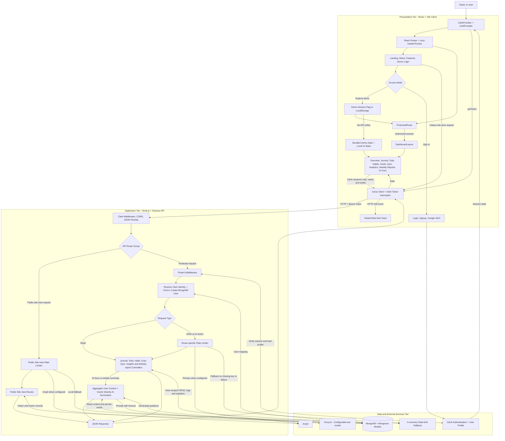
```mermaid
flowchart TD
  U[Visitor or User]

  subgraph Client["Presentation Tier - React + Vite Client"]
    APP[ClerkProvider + AuthProvider]
    ROUTER[React Router + Lazy-loaded Routes]
    PUBLIC[Landing, About, Features, Demo Login]
    ACCESS{Access Mode}
    CLERK_UI[Login, Signup, Google SSO]
    DEMO[Demo Session Flag in LocalStorage]
    GUARD[ProtectedRoute]
    DASH[DashboardLayout]
    MODULES[Overview, Journal, Todo, Habits, Goals, Gym, Analytics, Weekly Reports, AI Guru]
    DEMO_DATA[Bundled Demo Data + Local UI State]
    AXIOS[Axios Client + Clerk Token Interceptor]
    TOAST[Global Rate-limit Toast]

    APP --> ROUTER
    ROUTER --> PUBLIC
    ROUTER --> GUARD
    PUBLIC --> ACCESS
    ACCESS -->|Explore demo| DEMO
    ACCESS -->|Sign in| CLERK_UI
    DEMO --> GUARD
    GUARD -->|Authorized session| DASH
    DASH --> MODULES
    DEMO -->|No API writes| DEMO_DATA
    DEMO_DATA --> MODULES
    MODULES -->|Clerk sessions only: reads and writes| AXIOS
  end

  subgraph Server["Application Tier - Node.js + Express API"]
    EXPRESS[Clerk Middleware, CORS, JSON Parsing]
    ROUTES{API Route Group}
    SITE_LIMITER[Public Site-view Rate Limiter]
    PUBLIC_API[Public Site-view Routes]
    PROTECT[Protect Middleware]
    USER_SYNC[Resolve Clerk Identity + Find or Create MongoDB User]
    REQUEST_TYPE{Request Type}
    LIMITER[Route-specific Rate Limiter]
    CONTROLLERS[Journal, Todo, Habit, Goal, Gym, Insights and Weekly-report Controllers]
    AI_FLOW[Aggregate User Context + Cache Weekly AI Summaries]
    RESPONSE[JSON Response]

    EXPRESS --> ROUTES
    ROUTES -->|Public site-view request| SITE_LIMITER
    SITE_LIMITER --> PUBLIC_API
    ROUTES -->|Protected request| PROTECT
    PROTECT --> USER_SYNC
    USER_SYNC --> REQUEST_TYPE
    REQUEST_TYPE -->|Read| CONTROLLERS
    REQUEST_TYPE -->|Write or AI action| LIMITER
    LIMITER --> CONTROLLERS
    CONTROLLERS -->|AI Guru or weekly summary| AI_FLOW
    PUBLIC_API --> RESPONSE
    CONTROLLERS --> RESPONSE
    AI_FLOW --> RESPONSE
  end

  subgraph Data["Data and External Services Tier"]
    CLERK[Clerk Authentication + User Profile]
    MONGO[(MongoDB + Mongoose Models)]
    ARCJET[Arcjet]
    LOCAL_LIMIT[In-memory Rate-limit Fallback]
    GROQ[Groq AI - Configurable text model]
  end

  U --> APP
  CLERK_UI --> CLERK
  CLERK -->|Session state| APP
  APP -->|getToken| AXIOS
  PUBLIC -->|Unique site-view request| AXIOS
  AXIOS -->|HTTP + Bearer token| EXPRESS
  PROTECT <-->|Verify session and load profile| CLERK
  USER_SYNC <-->|User mapping| MONGO
  PUBLIC_API <-->|Visitor and metric records| MONGO
  SITE_LIMITER -->|Arcjet when configured| ARCJET
  SITE_LIMITER -->|Local fallback| LOCAL_LIMIT
  LIMITER -->|Primary when configured| ARCJET
  LIMITER -->|Fallback on missing key or failure| LOCAL_LIMIT
  CONTROLLERS <-->|User-scoped CRUD, logs and analytics| MONGO
  AI_FLOW <-->|Read context and persist cache| MONGO
  AI_FLOW -->|Prompt with timeout| GROQ
  GROQ -->|Generated guidance| AI_FLOW
  RESPONSE --> AXIOS
  AXIOS -->|Data| MODULES
  AXIOS -->|HTTP 429 event| TOAST
```

### Data Flow Diagram (DFD)

The DFD is separated into levels so the full project can be understood without compressing every feature into one unreadable diagram. Rectangles represent people or interfaces, rounded nodes represent processes, cylinders represent data stores, and labeled arrows show the data being transferred.

#### Level 0 — System Context

This level shows MonkMode as one system and the external actors and services with which it exchanges data.

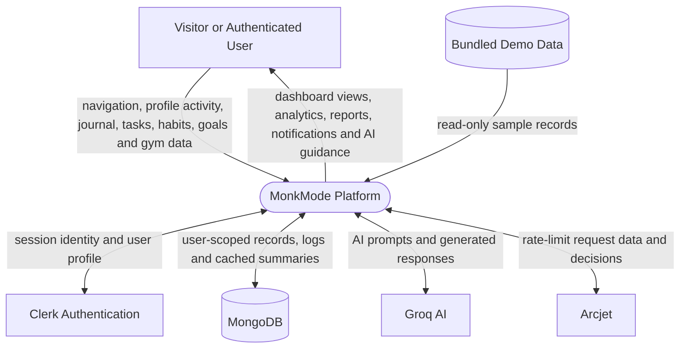
```mermaid
flowchart TD
  USER[Visitor or Authenticated User]
  SYSTEM([MonkMode Platform])
  CLERK[Clerk Authentication]
  GROQ[Groq AI]
  ARCJET[Arcjet]
  MONGO[(MongoDB)]
  DEMO[(Bundled Demo Data)]

  USER -->|navigation, profile activity, journal, tasks, habits, goals and gym data| SYSTEM
  SYSTEM -->|dashboard views, analytics, reports, notifications and AI guidance| USER
  SYSTEM <-->|session identity and user profile| CLERK
  SYSTEM <-->|user-scoped records, logs and cached summaries| MONGO
  SYSTEM <-->|AI prompts and generated responses| GROQ
  SYSTEM <-->|rate-limit request data and decisions| ARCJET
  DEMO -->|read-only sample records| SYSTEM
```

#### Level 1 — Access, Authentication and Request Flow

This level explains how a visitor reaches the dashboard and how a real API request is authenticated, limited, processed, and returned.

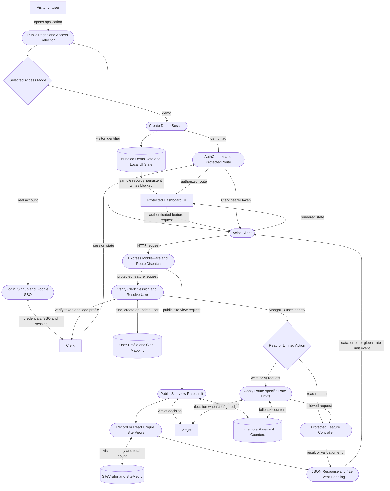
```mermaid
flowchart TD
  USER[Visitor or User]
  ENTRY([Public Pages and Access Selection])
  MODE{Selected Access Mode}
  DEMO_SESSION([Create Demo Session])
  DEMO_STORE[(Bundled Demo Data and Local UI State)]
  CLERK_UI([Login, Signup and Google SSO])
  CLERK[Clerk]
  AUTH([AuthContext and ProtectedRoute])
  DASH[Protected Dashboard UI]
  AXIOS([Axios Client])
  API([Express Middleware and Route Dispatch])
  SITE_LIMIT([Public Site-view Rate Limit])
  SITE_PROCESS([Record or Read Unique Site Views])
  SITE_STORE[(SiteVisitor and SiteMetric)]
  RESOLVE([Verify Clerk Session and Resolve User])
  USER_STORE[(User Profile and Clerk Mapping)]
  REQUEST_TYPE{Read or Limited Action}
  LIMIT([Apply Route-specific Rate Limits])
  ARCJET[Arcjet]
  LOCAL_STORE[(In-memory Rate-limit Counters)]
  FEATURE([Protected Feature Controller])
  RESPONSE([JSON Response and 429 Event Handling])

  USER -->|opens application| ENTRY
  ENTRY --> MODE
  MODE -->|demo| DEMO_SESSION
  DEMO_SESSION -->|demo flag| AUTH
  DEMO_SESSION --> DEMO_STORE
  DEMO_STORE -->|sample records; persistent writes blocked| DASH
  MODE -->|real account| CLERK_UI
  CLERK_UI <-->|credentials, SSO and session| CLERK
  CLERK -->|session state| AUTH
  AUTH -->|authorized route| DASH

  ENTRY -->|visitor identifier| AXIOS
  DASH -->|authenticated feature request| AXIOS
  AUTH -->|Clerk bearer token| AXIOS
  AXIOS -->|HTTP request| API

  API -->|public site-view request| SITE_LIMIT
  SITE_LIMIT <-->|Arcjet decision| ARCJET
  SITE_LIMIT <-->|fallback counter| LOCAL_STORE
  SITE_LIMIT --> SITE_PROCESS
  SITE_PROCESS <-->|visitor identity and total count| SITE_STORE
  SITE_PROCESS --> RESPONSE

  API -->|protected feature request| RESOLVE
  RESOLVE <-->|verify token and load profile| CLERK
  RESOLVE <-->|find, create or update user| USER_STORE
  RESOLVE -->|MongoDB user identity| REQUEST_TYPE
  REQUEST_TYPE -->|read request| FEATURE
  REQUEST_TYPE -->|write or AI request| LIMIT
  LIMIT <-->|decision when configured| ARCJET
  LIMIT <-->|fallback counters| LOCAL_STORE
  LIMIT -->|allowed request| FEATURE
  FEATURE -->|result or validation error| RESPONSE
  RESPONSE -->|data, error, or global rate-limit event| AXIOS
  AXIOS -->|rendered state| DASH
```

#### Level 1 — Feature Data Ownership

Each feature controller owns a focused set of collections. All persistent queries are scoped to the MongoDB user resolved by the authentication middleware.

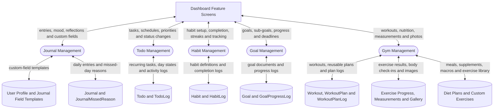
```mermaid
flowchart TD
  DASH[Dashboard Feature Screens]

  JOURNAL([Journal Management])
  TODO([Todo Management])
  HABIT([Habit Management])
  GOAL([Goal Management])
  GYM([Gym Management])

  USER_STORE[(User Profile and Journal Field Templates)]
  JOURNAL_STORE[(Journal and JournalMissedReason)]
  TODO_STORE[(Todo and TodoLog)]
  HABIT_STORE[(Habit and HabitLog)]
  GOAL_STORE[(Goal and GoalProgressLog)]
  GYM_STORE[(Workout, WorkoutPlan and WorkoutPlanLog)]
  GYM_PROGRESS_STORE[(Exercise Progress, Measurements and Gallery)]
  GYM_NUTRITION_STORE[(Diet Plans and Custom Exercises)]

  DASH <-->|entries, mood, reflections and custom fields| JOURNAL
  JOURNAL <-->|custom-field templates| USER_STORE
  JOURNAL <-->|daily entries and missed-day reasons| JOURNAL_STORE

  DASH <-->|tasks, schedules, priorities and status changes| TODO
  TODO <-->|recurring tasks, day states and activity logs| TODO_STORE

  DASH <-->|habit setup, completion, streaks and tracking| HABIT
  HABIT <-->|habit definitions and completion logs| HABIT_STORE

  DASH <-->|goals, sub-goals, progress and deadlines| GOAL
  GOAL <-->|goal documents and progress logs| GOAL_STORE

  DASH <-->|workouts, nutrition, measurements and photos| GYM
  GYM <-->|workouts, reusable plans and plan logs| GYM_STORE
  GYM <-->|exercise results, body check-ins and images| GYM_PROGRESS_STORE
  GYM <-->|meals, supplements, macros and exercise library| GYM_NUTRITION_STORE
```

#### Level 1 — Analytics, Weekly Reports and AI

Analytics and AI features do not own the primary activity data. They aggregate the feature stores, calculate derived values, and return read models or generated guidance.

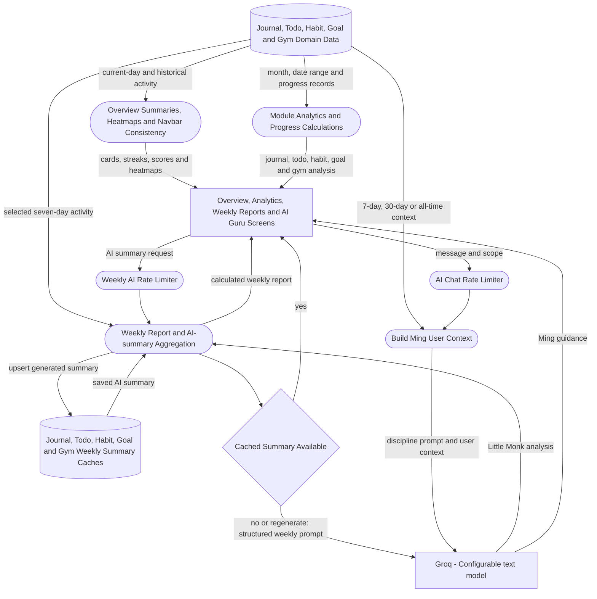
```mermaid
flowchart TD
  DASH[Overview, Analytics, Weekly Reports and AI Guru Screens]
  DOMAIN_STORE[(Journal, Todo, Habit, Goal and Gym Domain Data)]
  SUMMARY_STORE[(Journal, Todo, Habit, Goal and Gym Weekly Summary Caches)]

  OVERVIEW([Overview Summaries, Heatmaps and Navbar Consistency])
  ANALYTICS([Module Analytics and Progress Calculations])
  WEEKLY([Weekly Report and AI-summary Aggregation])
  CACHE{Cached Summary Available}
  WEEKLY_LIMIT([Weekly AI Rate Limiter])
  MING_CONTEXT([Build Ming User Context])
  MING_LIMIT([AI Chat Rate Limiter])
  GROQ[Groq - Configurable text model]

  DOMAIN_STORE -->|current-day and historical activity| OVERVIEW
  OVERVIEW -->|cards, streaks, scores and heatmaps| DASH

  DOMAIN_STORE -->|month, date range and progress records| ANALYTICS
  ANALYTICS -->|journal, todo, habit, goal and gym analysis| DASH

  DOMAIN_STORE -->|selected seven-day activity| WEEKLY
  SUMMARY_STORE -->|saved AI summary| WEEKLY
  WEEKLY -->|calculated weekly report| DASH
  DASH -->|AI summary request| WEEKLY_LIMIT
  WEEKLY_LIMIT --> WEEKLY
  WEEKLY --> CACHE
  CACHE -->|yes| DASH
  CACHE -->|no or regenerate: structured weekly prompt| GROQ
  GROQ -->|Little Monk analysis| WEEKLY
  WEEKLY -->|upsert generated summary| SUMMARY_STORE

  DOMAIN_STORE -->|7-day, 30-day or all-time context| MING_CONTEXT
  DASH -->|message and scope| MING_LIMIT
  MING_LIMIT --> MING_CONTEXT
  MING_CONTEXT -->|discipline prompt and user context| GROQ
  GROQ -->|Ming guidance| DASH
```

#### Data Flow Summary

| Flow | Primary Input | Processing | Main Output |
| --- | --- | --- | --- |
| Demo | Demo session flag | Load bundled data and disable persistent writes | Read-only dashboard experience |
| Authentication | Clerk session token | Verify identity and map it to a MongoDB user | User-scoped API access |
| Journal | Reflections, mood, ratings, and custom fields | Validate, save, summarize, and analyze entries | Journal history, heatmaps, and weekly insight |
| Todo | Task definitions and daily status changes | Apply recurrence, track state, and create logs | Today, schedule, upcoming, and performance views |
| Habits | Habit rules and completion events | Track completions, streaks, consistency, and history | Daily habits, tracker, heatmap, and analysis |
| Goals | Goals, sub-goals, deadlines, and progress | Store progress changes and activity history | Goal cards, logs, risk state, and analysis |
| Gym | Workouts, diet, measurements, progress, and photos | Manage plans and calculate exercise/body trends | Daily gym views, progress charts, gallery, and reports |
| Analytics | Historical feature records | Aggregate by date, category, status, streak, and progress | Overview cards, heatmaps, and detailed analytics |
| Weekly Reports | Seven-day feature activity | Calculate weekly metrics and load or generate AI summaries | Journal, todo, habit, goal, and gym reports |
| AI Guru | User message, scope, and cross-module activity | Build context, apply AI limit, and call Groq | Personalized Ming guidance |
| Site Views | Anonymous visitor identifier | Deduplicate visitor and increment persistent count | Public site-view total |

## 📋 Feature List

### Overview Section Feature List

```text
Overview
├── Daily Summary
│   ├── Today’s Journal
│   ├── Today’s Tasks
│   ├── Today’s Habits
│   ├── Goals
│   └── Gym
│
└── Activity Heatmaps
    ├── Year filter
    ├── Journal activity
    ├── To-Do activity
    ├── Habit activity
    ├── Goal activity
    └── Gym activity
```

### Journal Section Feature List

```text
Journal
├── Today’s Entry
│   ├── Consistency summary
│   ├── 14-step guided journal
│   │   ├── Mood
│   │   ├── Wake-up time
│   │   ├── Energy level
│   │   ├── Daily summary
│   │   ├── Wins
│   │   ├── Mistakes
│   │   ├── Insight
│   │   ├── Distractions
│   │   ├── Gratitude
│   │   ├── Achievements
│   │   ├── Affirmation
│   │   ├── Tomorrow’s plan
│   │   ├── Sleep time
│   │   └── Daily rating
│   ├── Custom journal fields
│   ├── Step progress tracking
│   └── Submit, view, and edit today’s entry
│
├── Missed Days
│   ├── Weekly missed-day summary
│   └── Add or edit missed-day reasons
│
└── Past Entries
    ├── Previous journal entry cards
    ├── Mood and daily-stat preview
    └── Full journal entry details
```

### To-Do Section Feature List

```text
To-Do
├── Today
│   ├── Today’s Overview
│   ├── All Tasks
│   ├── Pending Tasks
│   ├── Completed Tasks
│   └── Missed Tasks
│
├── Upcoming
│   ├── Tomorrow
│   ├── Day-wise task selection
│   ├── Priority filtering
│   └── Upcoming task details
│
├── Schedule
│   ├── Create Task
│   ├── All Tasks
│   ├── Calendar
│   └── Task Logs
│
└── Important
    ├── Important Categories
    └── User-Created Tasks
```

### Habits Section Feature List

```text
Habits
├── Today
│   ├── Consistency summary
│   ├── Time-of-day filtering
│   ├── All Habits
│   ├── Pending Habits
│   ├── Completed Habits
│   └── Habit Streak Summary
│
├── Create Habit
│   ├── New Habit
│   │   ├── Habit name and purpose
│   │   ├── Target streak
│   │   ├── Time of day
│   │   ├── Category and priority
│   │   └── Repeat schedule and duration
│   ├── All Habits
│   │   ├── Active Habits
│   │   └── Archived Habits
│   ├── Calendar
│   └── Habit Logs
│
└── Track Your Habit
    ├── Active and archived filtering
    ├── Important and ending-soon filtering
    ├── Year and month selection
    ├── Day-wise completion history
    ├── Current and target streaks
    └── Important habit management
```

### Goals Section Feature List

```text
Goals
├── My Goals
│   ├── Active and archived goal cards
│   ├── Goal type, priority, and deadline details
│   ├── Important goal management
│   ├── Add Sub-goals
│   │   ├── Sub-goal title and deadline
│   │   └── Create a supporting habit
│   └── Update Progress
│       ├── Pending Sub-goals
│       ├── Completed Sub-goals
│       ├── Mark as completed or reopen
│       └── Delete Sub-goals
│
├── Create Goals
│   ├── New Goal
│   │   ├── Goal title and motivation
│   │   ├── Short-term or long-term type
│   │   ├── Start date and deadline
│   │   └── Priority level
│   ├── All Goals
│   │   ├── Active Goals
│   │   └── Archived Goals
│   └── Goal Logs
│
└── Progress
    ├── Overall milestone progress
    ├── Status filtering
    ├── Priority filtering
    ├── Goal-wise completion percentage
    ├── Completed milestone totals
    └── Deadline and remaining-day status
```

### Gym Section Feature List

```text
Gym
├── Today
│   ├── Day-wise workout selection
│   ├── Today’s workout plans and exercises
│   ├── Exercise completion and progress updates
│   ├── Sets, reps, weight, duration, and rest tracking
│   ├── Exercise progress history
│   └── Daily diet and workout nutrition preview
│
├── Add Workout
│   ├── Create Workout Plan
│   │   ├── Goal type and workout split
│   │   ├── Exercise selection and configuration
│   │   ├── Training days and plan duration
│   │   ├── Difficulty level
│   │   └── Automatic estimated workout time
│   ├── All Workouts
│   │   ├── Active and archived plans
│   │   ├── Edit, copy, archive, and delete actions
│   │   └── Workout details and exercise list
│   └── Workout Logs
│
├── Diet Chart
│   ├── Full-Day Diet
│   │   ├── Day-wise meal planning
│   │   └── Custom meal sections and timings
│   ├── Workout Nutrition
│   │   ├── Pre-workout meals
│   │   └── Post-workout meals
│   ├── Supplements
│   ├── Daily Macro Targets
│   └── Saved plan management and day-wise copying
│
├── Measurements
│   ├── Add Body Measurements
│   ├── Body Weight, Upper Body, Arms, and Lower Body groups
│   ├── Saved Measurements
│   ├── Check-In History
│   └── Measurement update comparison
│
├── Progress
│   ├── Measurements Progress
│   │   ├── Body-group and metric filtering
│   │   ├── Measurement trend chart
│   │   └── Check-in updates and value changes
│   └── Workout Progress
│       ├── Exercise and body-group filtering
│       ├── Exercise performance trends
│       └── Sets, reps, weight, volume, and duration history
│
├── Workout Library
│   ├── Body-group and muscle-section filtering
│   ├── Searchable exercise collection
│   ├── Exercise details
│   └── User-created exercises
│
└── Gallery
    ├── Dated progress-photo uploads
    ├── Photo and check-in summary
    ├── Check-in-based photo gallery
    ├── Full-screen photo preview
    └── Progress-photo deletion
```

## 📁 Folder Structure

```text
monkmode/
├── client/                              # React + Vite frontend
│   ├── data/                            # Demo datasets for every dashboard module
│   │   ├── DummyData.jsx
│   │   ├── JournalDummyData.jsx
│   │   ├── ToDoDummyData.jsx
│   │   ├── HabitDummyData.jsx
│   │   ├── GoalDummyData.jsx
│   │   └── GymDummyData.jsx
│   ├── public/                          # Static assets served without bundling
│   │   ├── meditation.mp3
│   │   └── try-demo-button.svg
│   ├── src/
│   │   ├── api/
│   │   │   └── axios.js                 # API client, Clerk token, and 429 interceptor
│   │   ├── assets/                      # Logos, artwork, and feature screenshots
│   │   │   ├── aiguru/
│   │   │   ├── analysis/
│   │   │   ├── goal/
│   │   │   ├── gym/
│   │   │   ├── habit/
│   │   │   ├── journal/
│   │   │   ├── overview/
│   │   │   ├── todo/
│   │   │   └── weeklyreport/
│   │   ├── components/                  # Shared dashboard form and feedback UI
│   │   │   ├── DashboardDateTimeInput.jsx
│   │   │   ├── DashboardSelect.jsx
│   │   │   └── GlobalRateLimitToast.jsx
│   │   ├── context/
│   │   │   └── AuthContext.jsx          # Clerk, guest, and demo session state
│   │   ├── hooks/
│   │   │   ├── useAuth.js
│   │   │   └── useMobileLowMotion.js    # Mobile performance preference
│   │   ├── dashboard/
│   │   │   ├── DashboardLayout.jsx      # Shared protected dashboard shell
│   │   │   ├── Navbar.jsx
│   │   │   ├── Sidebar.jsx
│   │   │   ├── WelcomePopup.jsx
│   │   │   ├── overview/                # Summary cards and activity heatmap
│   │   │   ├── journal/                 # Daily journal and history sidebar
│   │   │   ├── todo/                    # Today, important, schedule, and upcoming tasks
│   │   │   ├── habits/                  # Habit creation, today view, and tracking
│   │   │   ├── goal/                    # Goals, sub-goals, and progress updates
│   │   │   ├── gym/                     # Workouts, diet, progress, measurements, and gallery
│   │   │   ├── weeklyreport/            # Journal, todo, habit, goal, and gym reports
│   │   │   ├── analysis/
│   │   │   │   ├── journalanalysis/
│   │   │   │   ├── todoanalysis/
│   │   │   │   ├── habitanalysis/
│   │   │   │   ├── goalanalysis/
│   │   │   │   └── gymanalysis/
│   │   │   └── ai_guru/
│   │   │       └── AIGuru.jsx            # Ming AI assistant interface
│   │   ├── pages/
│   │   │   ├── authentication/          # Login, signup, SSO callback, and route guard
│   │   │   └── landingpage/             # Landing, about, features, and demo entry
│   │   ├── utils/
│   │   │   └── formatDate.js
│   │   ├── App.jsx                      # Lazy-loaded route definitions
│   │   ├── index.css                    # Global and responsive styles
│   │   └── main.jsx                     # Clerk and React application bootstrap
│   ├── .env.example                     # Frontend environment template
│   ├── eslint.config.js
│   ├── package.json
│   ├── postcss.config.js
│   ├── tailwind.config.js
│   ├── vite.config.js
│   └── vercel.json                      # SPA rewrite configuration
│
├── server/                              # Node.js + Express backend
│   ├── controllers/
│   │   ├── journalController.js         # Journal CRUD, summaries, and analytics
│   │   ├── todoController.js            # Todo CRUD, logs, and analytics
│   │   ├── habitController.js           # Habit tracking and streak analysis
│   │   ├── goalController.js            # Goals, sub-goals, and progress logs
│   │   ├── gymController.js             # Workout, nutrition, progress, and gallery APIs
│   │   ├── insightsController.js        # Cross-module dashboard insights
│   │   ├── weeklyReportController.js    # Weekly aggregation and AI summary caching
│   │   ├── aiGuruController.js          # Ming context aggregation and Groq chat
│   │   ├── siteViewController.js        # Unique visitor counter
│   │   └── authController.js            # Retired legacy auth endpoints
│   ├── middleware/
│   │   ├── authMiddleware.js            # Clerk verification and MongoDB user mapping
│   │   └── rateLimit.js                 # Arcjet with in-memory fallback
│   ├── models/                          # User-scoped Mongoose schemas
│   │   ├── User.js
│   │   ├── Journal*.js                  # Journal entries, missed days, weekly summaries
│   │   ├── Todo*.js                     # Todos, logs, and weekly summaries
│   │   ├── Habit*.js                    # Habits, logs, and weekly summaries
│   │   ├── Goal*.js                     # Goals, progress logs, and weekly summaries
│   │   ├── Gym*.js                      # Gym progress, diet, gallery, and reports
│   │   ├── Workout*.js                  # Workouts, plans, and activity logs
│   │   └── Site*.js                     # Site metrics and unique visitors
│   ├── routes/                          # Express routes grouped by feature
│   │   ├── journalRoutes.js
│   │   ├── todoRoutes.js
│   │   ├── habitRoutes.js
│   │   ├── goalRoutes.js
│   │   ├── gymRoutes.js
│   │   ├── insightsRoutes.js
│   │   ├── weeklyReportRoutes.js
│   │   ├── siteViewRoutes.js
│   │   └── authRoutes.js
│   ├── scripts/                         # Seed, verification, and backfill utilities
│   ├── tests/
│   │   └── goalActivityUtils.test.js
│   ├── utils/
│   │   ├── goalActivityUtils.js
│   │   └── streakUtils.js
│   ├── .env.example                     # Backend environment template
│   ├── package.json
│   └── server.js                        # Middleware, routes, MongoDB, and server startup
│
├── .gitignore
└── README.md
```

## 🗄️ Database Design

MonkMode uses MongoDB with Mongoose. Every real dashboard record is connected to a `User`, and most feature collections are scoped by `userId` so each authenticated user sees only their own journal, todo, habit, goal, gym, and report data.

### Database Schema / Entity Relationship Diagrams (ERD)

The schema is divided by domain so every relationship remains readable on desktop and mobile. `User` is repeated as the ownership root in each relevant diagram, but it represents the same MongoDB collection.

#### Identity and Journal

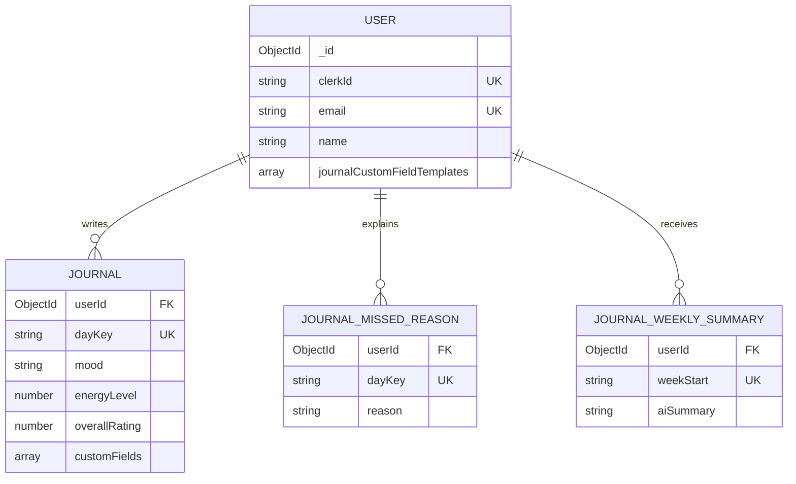
```mermaid
erDiagram
  USER ||--o{ JOURNAL : writes
  USER ||--o{ JOURNAL_MISSED_REASON : explains
  USER ||--o{ JOURNAL_WEEKLY_SUMMARY : receives

  USER {
    ObjectId _id
    string clerkId UK
    string email UK
    string name
    array journalCustomFieldTemplates
  }
  JOURNAL {
    ObjectId userId FK
    string dayKey UK
    string mood
    number energyLevel
    number overallRating
    array customFields
  }
  JOURNAL_MISSED_REASON {
    ObjectId userId FK
    string dayKey UK
    string reason
  }
  JOURNAL_WEEKLY_SUMMARY {
    ObjectId userId FK
    string weekStart UK
    string aiSummary
  }
```

#### Todo

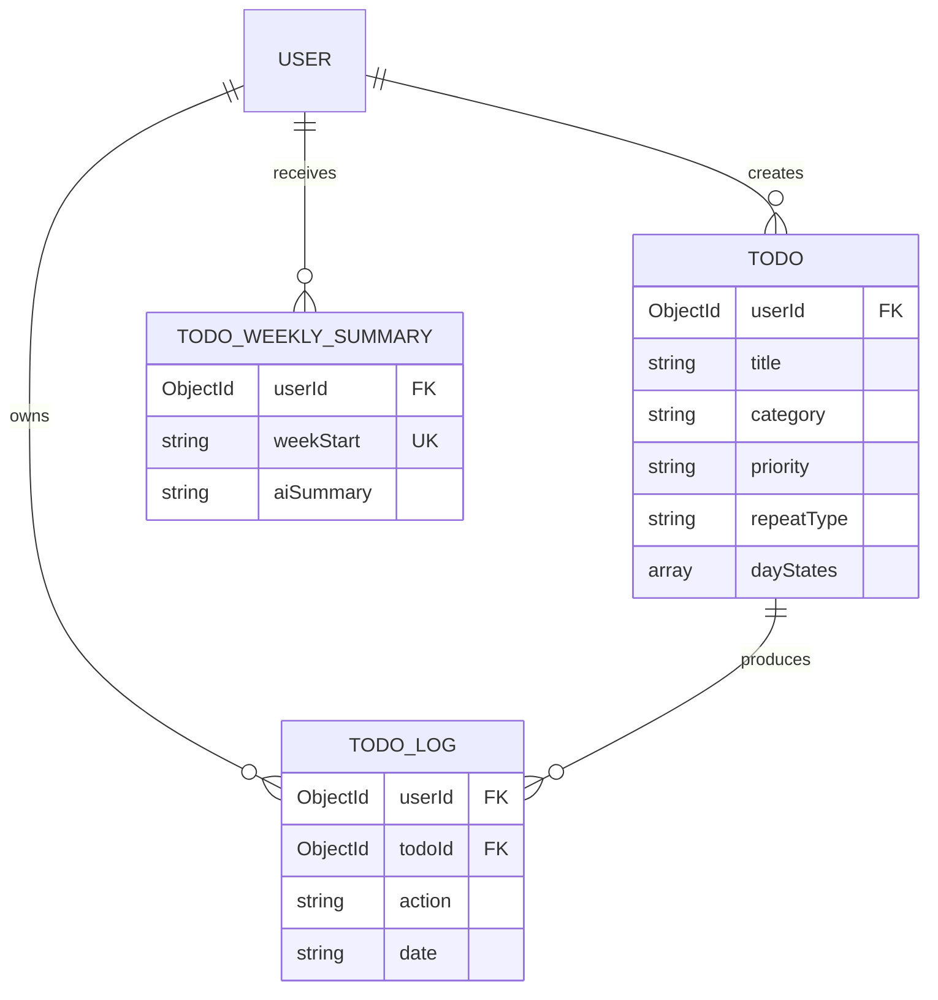
```mermaid
erDiagram
  USER ||--o{ TODO : creates
  USER ||--o{ TODO_LOG : owns
  TODO ||--o{ TODO_LOG : produces
  USER ||--o{ TODO_WEEKLY_SUMMARY : receives

  TODO {
    ObjectId userId FK
    string title
    string category
    string priority
    string repeatType
    array dayStates
  }
  TODO_LOG {
    ObjectId userId FK
    ObjectId todoId FK
    string action
    string date
  }
  TODO_WEEKLY_SUMMARY {
    ObjectId userId FK
    string weekStart UK
    string aiSummary
  }
```

#### Habits

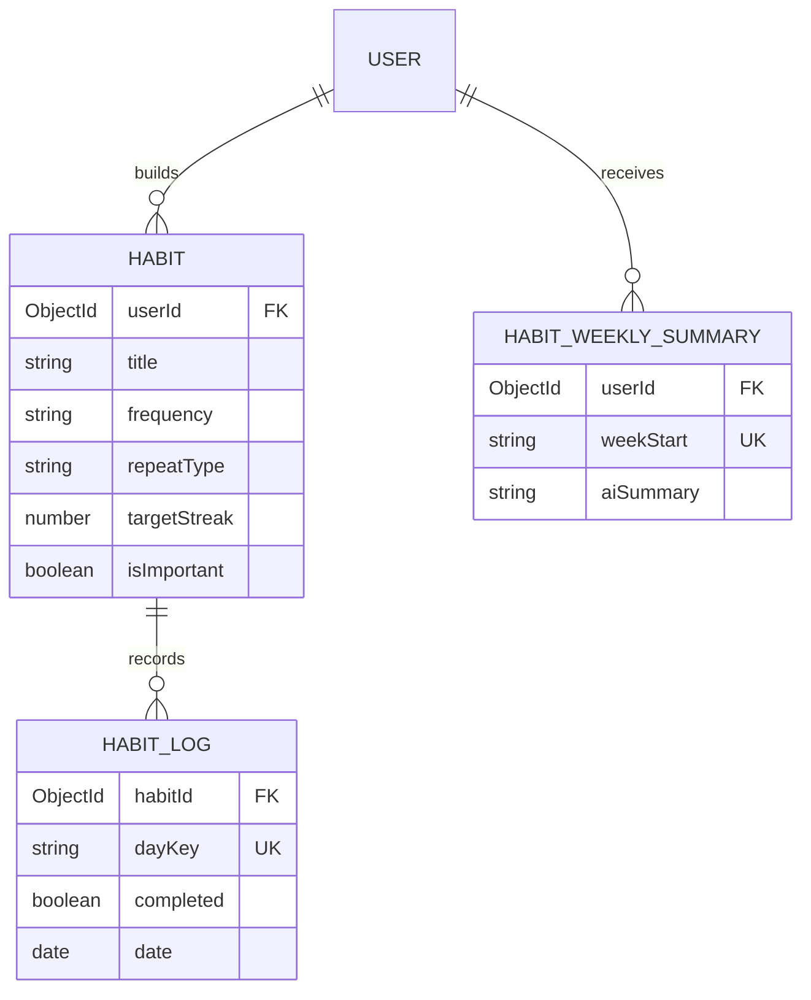
```mermaid
erDiagram
  USER ||--o{ HABIT : builds
  HABIT ||--o{ HABIT_LOG : records
  USER ||--o{ HABIT_WEEKLY_SUMMARY : receives

  HABIT {
    ObjectId userId FK
    string title
    string frequency
    string repeatType
    number targetStreak
    boolean isImportant
  }
  HABIT_LOG {
    ObjectId habitId FK
    string dayKey UK
    boolean completed
    date date
  }
  HABIT_WEEKLY_SUMMARY {
    ObjectId userId FK
    string weekStart UK
    string aiSummary
  }
```

#### Goals

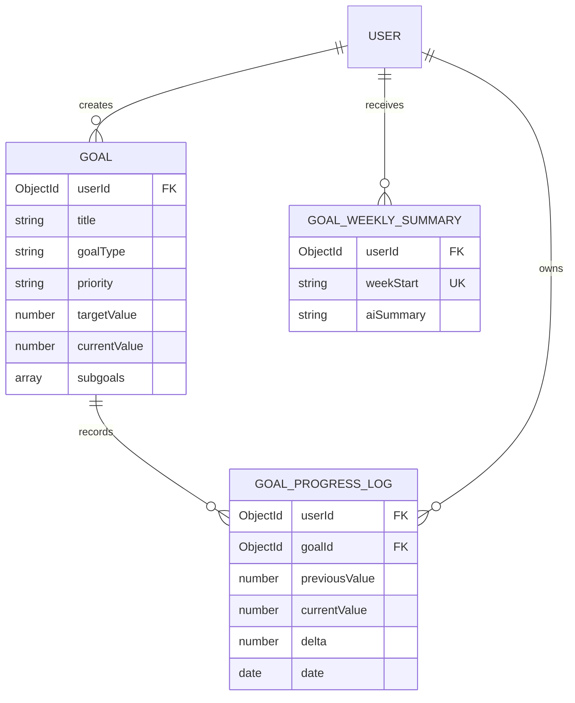
```mermaid
erDiagram
  USER ||--o{ GOAL : creates
  GOAL ||--o{ GOAL_PROGRESS_LOG : records
  USER ||--o{ GOAL_PROGRESS_LOG : owns
  USER ||--o{ GOAL_WEEKLY_SUMMARY : receives

  GOAL {
    ObjectId userId FK
    string title
    string goalType
    string priority
    number targetValue
    number currentValue
    array subgoals
  }
  GOAL_PROGRESS_LOG {
    ObjectId userId FK
    ObjectId goalId FK
    number previousValue
    number currentValue
    number delta
    date date
  }
  GOAL_WEEKLY_SUMMARY {
    ObjectId userId FK
    string weekStart UK
    string aiSummary
  }
```

#### Gym Planning and Nutrition

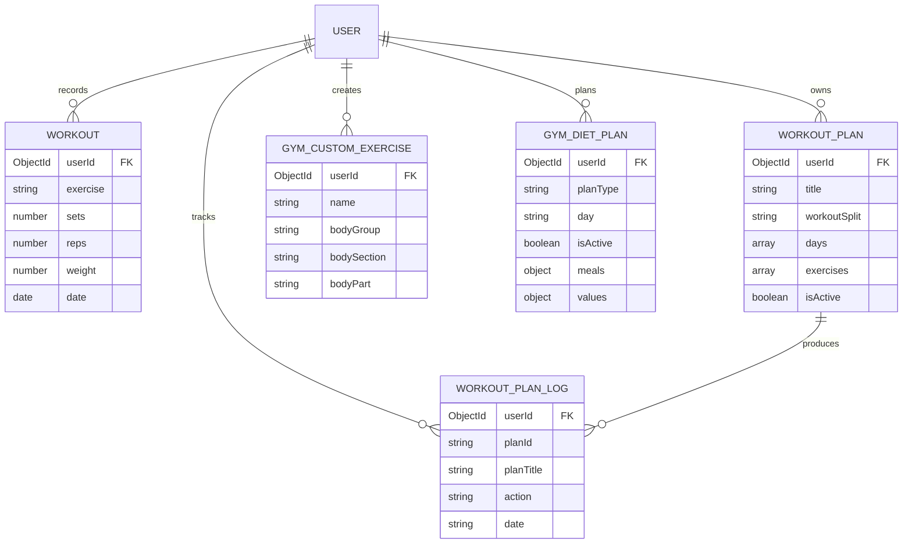
```mermaid
erDiagram
  USER ||--o{ WORKOUT : records
  USER ||--o{ WORKOUT_PLAN : owns
  USER ||--o{ WORKOUT_PLAN_LOG : tracks
  WORKOUT_PLAN ||--o{ WORKOUT_PLAN_LOG : produces
  USER ||--o{ GYM_CUSTOM_EXERCISE : creates
  USER ||--o{ GYM_DIET_PLAN : plans

  WORKOUT {
    ObjectId userId FK
    string exercise
    number sets
    number reps
    number weight
    date date
  }
  WORKOUT_PLAN {
    ObjectId userId FK
    string title
    string workoutSplit
    array days
    array exercises
    boolean isActive
  }
  WORKOUT_PLAN_LOG {
    ObjectId userId FK
    string planId
    string planTitle
    string action
    string date
  }
  GYM_CUSTOM_EXERCISE {
    ObjectId userId FK
    string name
    string bodyGroup
    string bodySection
    string bodyPart
  }
  GYM_DIET_PLAN {
    ObjectId userId FK
    string planType
    string day
    boolean isActive
    object meals
    object values
  }
```

#### Gym Progress and Reports

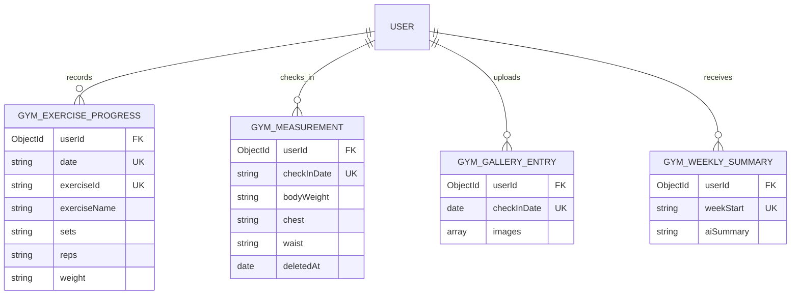
```mermaid
erDiagram
  USER ||--o{ GYM_EXERCISE_PROGRESS : records
  USER ||--o{ GYM_MEASUREMENT : checks_in
  USER ||--o{ GYM_GALLERY_ENTRY : uploads
  USER ||--o{ GYM_WEEKLY_SUMMARY : receives

  GYM_EXERCISE_PROGRESS {
    ObjectId userId FK
    string date UK
    string exerciseId UK
    string exerciseName
    string sets
    string reps
    string weight
  }
  GYM_MEASUREMENT {
    ObjectId userId FK
    string checkInDate UK
    string bodyWeight
    string chest
    string waist
    date deletedAt
  }
  GYM_GALLERY_ENTRY {
    ObjectId userId FK
    date checkInDate UK
    array images
  }
  GYM_WEEKLY_SUMMARY {
    ObjectId userId FK
    string weekStart UK
    string aiSummary
  }
```

#### Public Site Metrics

`SiteVisitor` and `SiteMetric` are independent collections without a stored foreign key. A newly accepted unique visitor increments the total site-view metric.

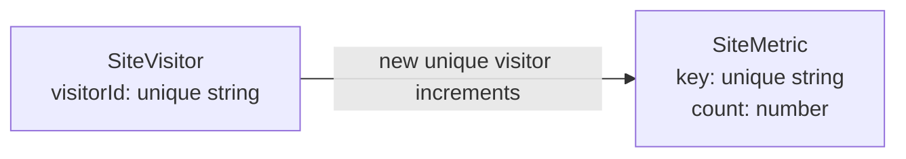
```mermaid
flowchart LR
  V["SiteVisitor<br/>visitorId: unique string"] -->|new unique visitor increments| M["SiteMetric<br/>key: unique string<br/>count: number"]
```

### Main Collections

| Module | Collections | Stored Data |
| --- | --- | --- |
| Auth | `User` | Clerk ID, name, email, and custom journal field templates. |
| Journal | `Journal` | Daily journal entry, mood, wake/sleep time, energy, rating, wins, mistakes, gratitude, achievements, distractions, custom fields, and day key. |
| Journal Reports | `JournalMissedReason`, `JournalWeeklySummary` | Reasons for missed journal days and cached weekly AI summaries. |
| Todo | `Todo`, `TodoLog`, `TodoWeeklySummary` | Task details, recurring rules, priority, category, per-day status, activity logs, and weekly summaries. |
| Habits | `Habit`, `HabitLog`, `HabitWeeklySummary` | Habit setup, frequency, repeat rules, streak target, completion logs, archive state, and weekly summaries. |
| Goals | `Goal`, `GoalProgressLog`, `GoalWeeklySummary` | Goal details, sub-goals, progress values, deadlines, important flag, activity logs, and weekly summaries. |
| Gym Plans | `Workout`, `WorkoutPlan`, `WorkoutPlanLog` | Workout entries, reusable workout plans, active plans, exercise lists, and workout-plan activity logs. |
| Gym Progress | `GymExerciseProgress`, `GymMeasurement`, `GymGalleryEntry` | Exercise progress, body measurements, check-in dates, and progress photo entries. |
| Gym Nutrition | `GymDietPlan`, `GymCustomExercise`, `GymWeeklySummary` | Diet plans, macros, supplements, custom exercise library, and weekly gym AI summaries. |
| Site Metrics | `SiteVisitor`, `SiteMetric` | Unique visitor identifiers and the persistent total site-view counter. |

### Data Integrity & Indexing

- `User.clerkId` and `User.email` are unique so real users can be mapped safely after Clerk login.
- `Journal` uses a unique `{ userId, dayKey }` index to allow only one journal entry per user per day.
- `GymMeasurement` uses a unique `{ userId, checkInDate }` index to prevent duplicate measurement check-ins.
- `GymExerciseProgress` uses a unique `{ userId, date, exerciseId }` index for one progress record per exercise per day.
- Weekly AI summary collections use unique `{ userId, weekStart }` indexes to cache one summary per user per week.
- Logs and progress collections include indexes on user/date fields for faster dashboard, heatmap, and analytics queries.
- Temporary logs use TTL indexes so old activity records can expire automatically.

## 🖼️ Screenshots

Screenshots are stored in `client/src/assets` and are used by the landing feature gallery.

| Module | Screenshot |
| --- | --- |
| Landing Page | 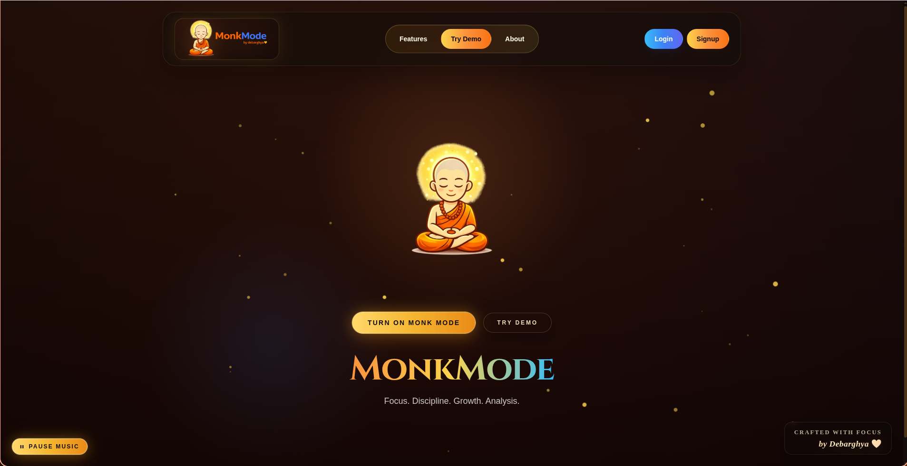 |
| Overview | 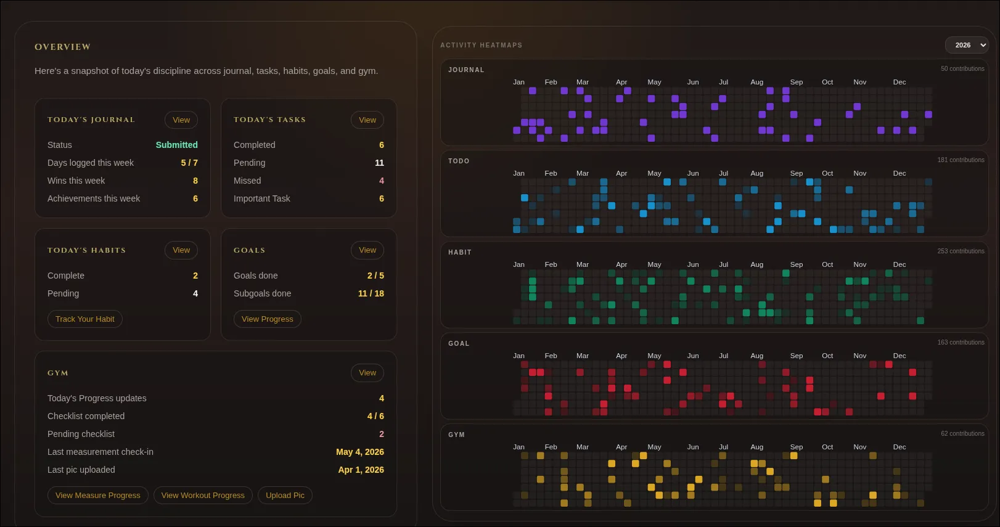 |
| Journal | 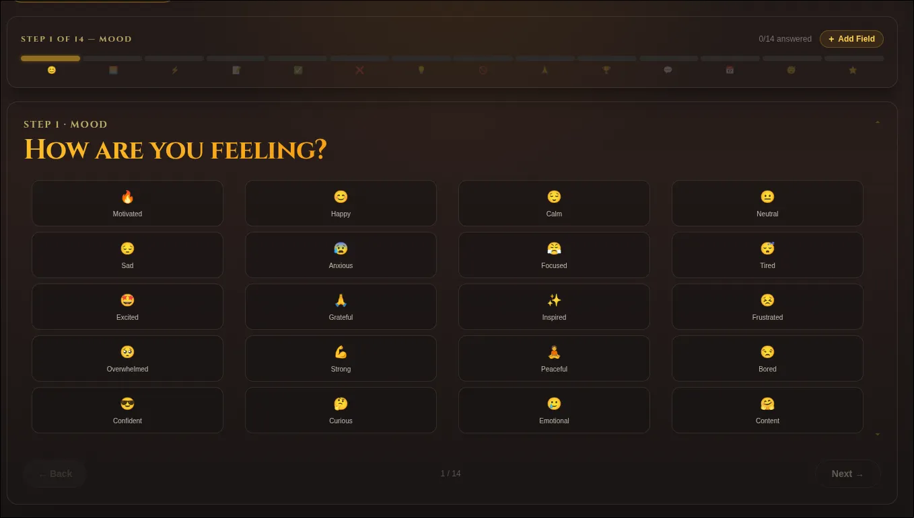 |
| Todo | 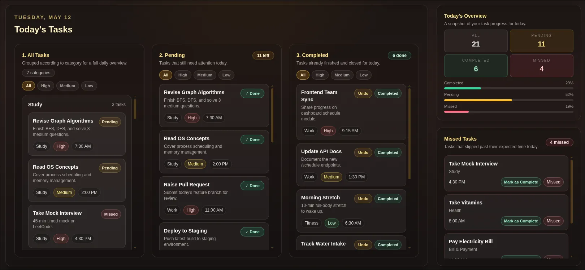 |
| Habits | 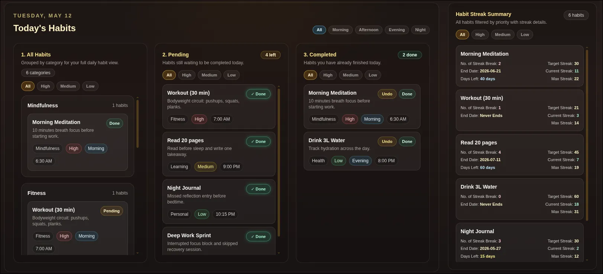 |
| Habit Tracker | 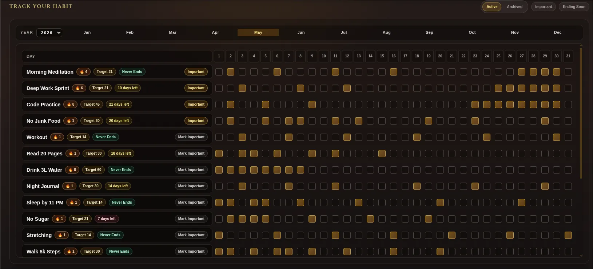 |
| Goals | 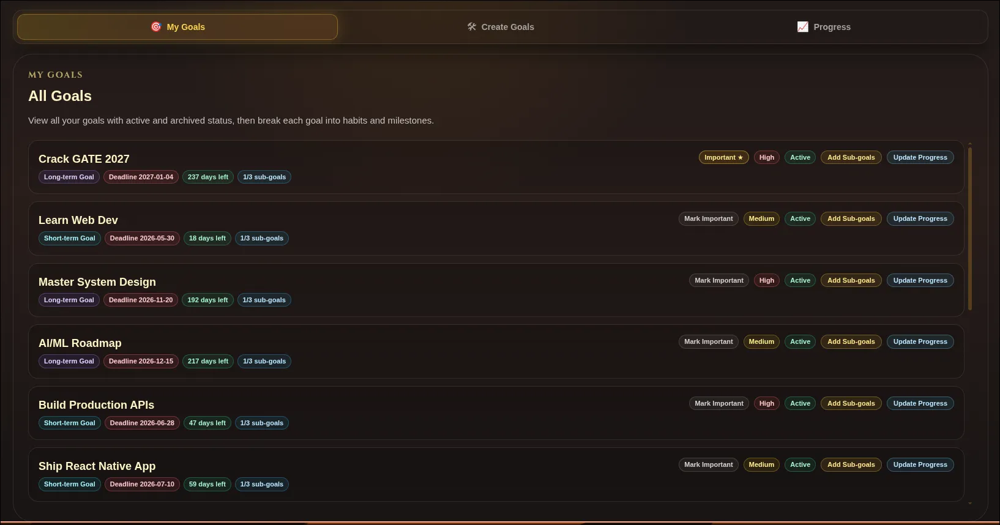 |
| Goal Progress | 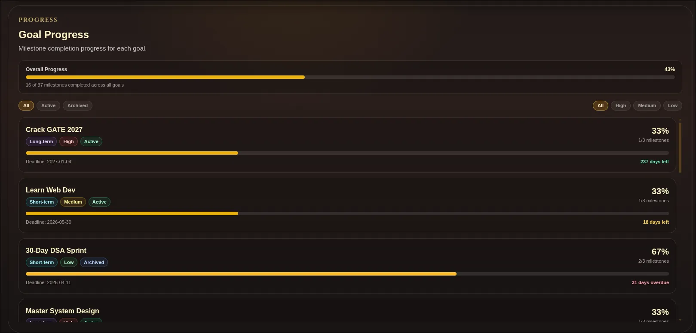 |
| Gym | 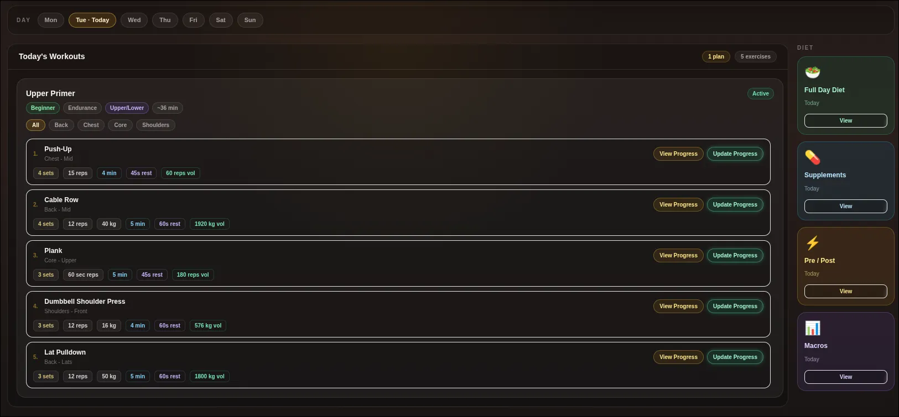 |
| Gym Workout Builder | 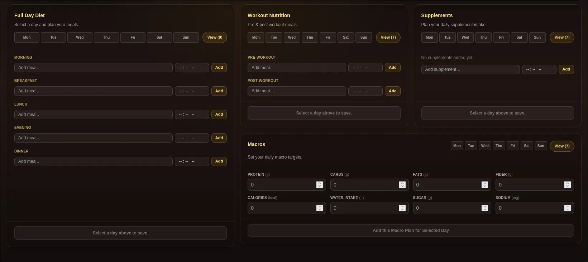 |
| Gym Measurements | 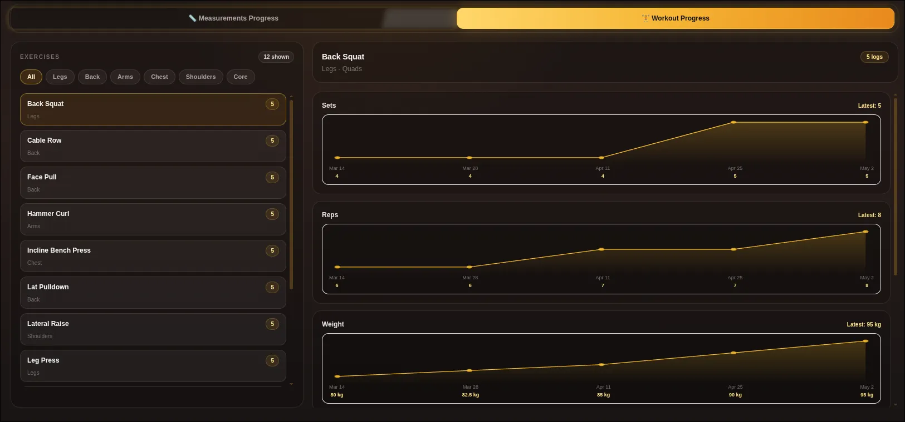 |
| Gym Progress Photos |  |
| Weekly Report |  |
| Weekly Report Detail | 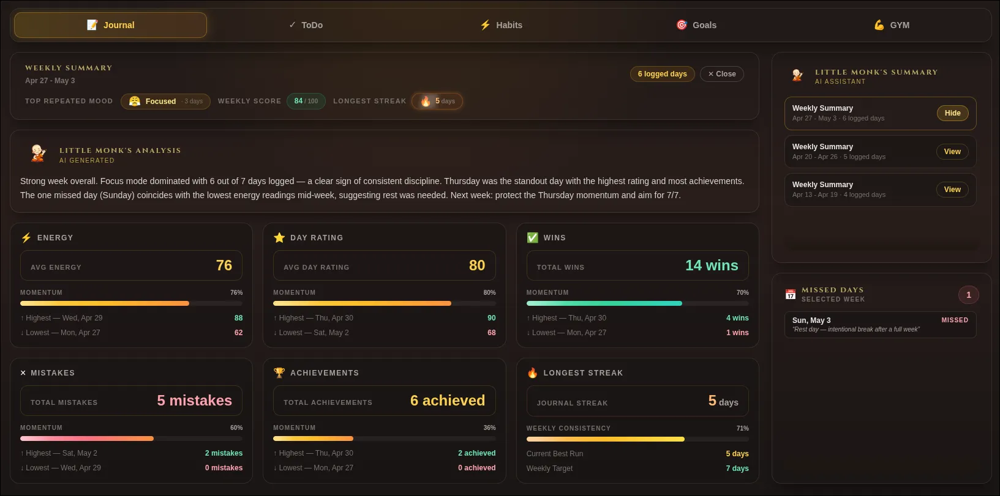 |
| Analysis | 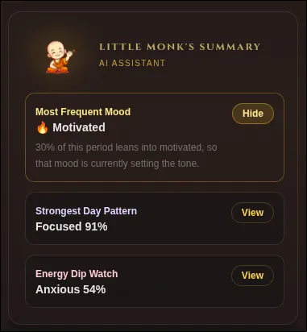 |
| Analysis Detail | 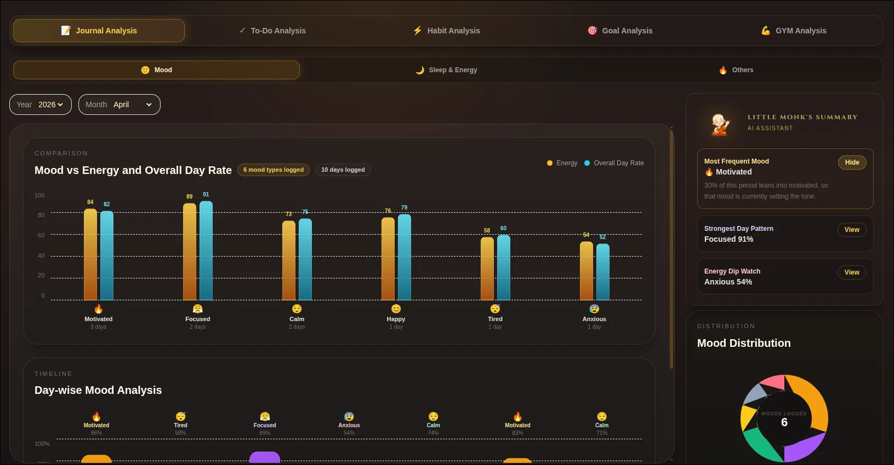 |
| AI Guru |  |
| AI Guru Chat | 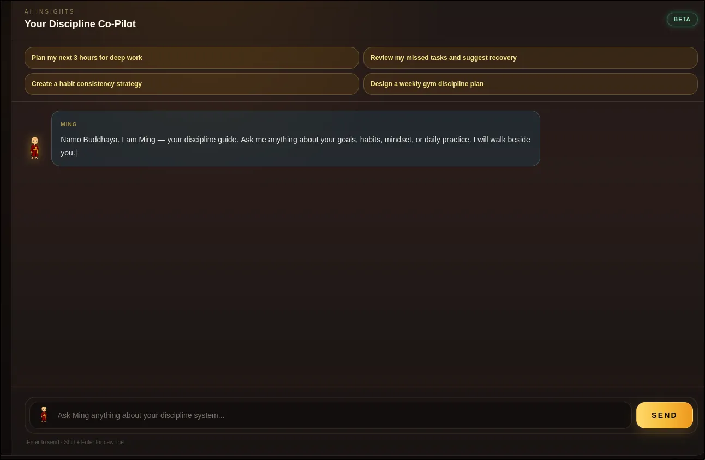 |

## 🛠️ Tech Stack

| Layer | Technologies | Purpose |
| --- | --- | --- |
| Frontend | React, Vite, React Router | Single-page dashboard, routing, and client app build pipeline |
| Styling & UI | Tailwind CSS, Framer Motion, Fontsource | Responsive layouts, motion, and custom typography |
| Data & API Client | Axios, Clerk React | Authenticated API requests and frontend session handling |
| Visualizations | React Calendar Heatmap, Three.js, Vanta | Activity heatmaps and interactive landing visuals |
| Backend | Node.js, Express | REST API, feature routing, middleware, and server runtime |
| Database | MongoDB, Mongoose | User-scoped persistence, schemas, relationships, and indexes |
| Authentication | Clerk React, Clerk Express | Google login, protected routes, token verification, and user sync |
| AI & Rate Limiting | Groq SDK, Arcjet | AI summaries, AI Guru responses, and write/AI action protection |
| Backend Utilities | dotenv, CORS | Environment configuration and cross-origin API access |

### Development Tools

- ESLint for frontend linting.
- Nodemon for backend development reloads.
- Vercel SPA rewrite config for frontend deployment.

## ⚙️ Installation

Clone the repository:

```bash
git clone https://github.com/debarghya131/MonkMode.git
cd MonkMode
```

Install frontend dependencies:

```bash
cd client
npm install
```

Install backend dependencies:

```bash
cd ../server
npm install
```

Create environment files:

```bash
cp client/.env.example client/.env
cp server/.env.example server/.env
```

Run the backend:

```bash
cd server
npm run dev
```

Run the frontend in another terminal:

```bash
cd client
npm run dev
```

Default local URLs:

- Frontend: `http://localhost:5173`
- Backend: `http://localhost:5000`

## 🔐 Environment Variables

### Client

```env
VITE_CLERK_PUBLISHABLE_KEY=pk_test_or_pk_live_key
VITE_API_URL=http://localhost:5000/api
```

### Server

```env
NODE_ENV=development
PORT=5000
MONGO_URI=mongodb_connection_string
API_KEY=groq_api_key
GROQ_MODEL=openai/gpt-oss-120b
CLERK_SECRET_KEY=clerk_secret_key
CLERK_PUBLISHABLE_KEY=clerk_publishable_key
CORS_ORIGINS=http://localhost:5173
APP_TIMEZONE=Asia/Kolkata
AI_TIMEOUT_MS=15000
ARCJET_KEY=optional_arcjet_key
ARCJET_MODE=LIVE
```

The backend also supports configurable rate-limit variables for AI chat, weekly AI summaries, journal saves, todo writes, habit writes, goal writes, and gym-related writes. See `server/.env.example` for the full list.

### Local and deployed database separation

The same cluster can hold both databases. Every backend connection explicitly
selects its database, overriding any database path in `MONGO_URI`:

| Backend environment | Database | Purpose |
| --- | --- | --- |
| `development` (default) or `test` | `test` | Localhost activity and development data |
| `production` | `MonkMode` | Live deployed users |

`npm run dev` forces development mode. On your **deployed backend**, set
`NODE_ENV=production`, keep `MONGO_URI` in the hosting provider's secret settings,
and use `npm start` (or `npm run start:production`). Production needs its own
Clerk live keys and production `CORS_ORIGINS`. Build the deployed client with
`VITE_API_URL=https://your-backend-domain/api`; localhost should use
`VITE_API_URL=http://localhost:5000/api`. Database selection happens on the
backend, not from the browser's hostname.

Optional `MONGO_DB_NAME` must match the selected database exactly; conflicting
values fail startup rather than silently mixing records. `MonkMode` is the exact
database name, not `monkmode`. Unsupported `NODE_ENV` values also fail startup.
Use separate database users restricted to the appropriate database where possible.

To make the empty live database appear in Compass before deployment, from
`server/` run:

```bash
NODE_ENV=production npm run db:init
NODE_ENV=production npm run db:init -- --apply
```

This creates only an empty `users` collection if absent. The normal backend
startup initializes model indexes and other collections. Existing `test` records
stay in `test`: nothing is copied, moved, or deleted. The new live database starts
empty; any previously deployed records in `test` will not appear in `MonkMode`
without a separately planned data migration. Refresh your Compass connection to
see the databases after initialization.

Retention migration and goal backfill commands use the same environment mapping.
Prefix them with `NODE_ENV=production` only when deliberately maintaining live
data; otherwise they target `test`. Development seed/diagnostic scripts refuse
production. `npm test` uses stubs and does not connect to either database.

### Dashboard correctness and existing-database upgrade

Demo mode uses sample data only and does not call protected dashboard APIs. For
signed-in users, Monk Streak is calculated from saved journal, on-time task and
scheduled habit completion histories. Yesterday's streak remains visible while
today is unfinished; a genuinely missed day breaks it. All backend calendars use
`APP_TIMEZONE` (default `Asia/Kolkata`), independent of the hosting machine's zone.

The individual ToDo/Habit header streaks and section consistency summaries also
use retained schedules and completion history, including archived/soft-deleted
items within their eligible dates. Removing an item does not erase a historical
miss or completed day. Days without scheduled items are not completed streak
days. Today's completion percentages still use today's active schedules; empty
sections contribute zero to the three-section average, not automatic credit.

Header statistics show `—` while unavailable, rather than fabricated zeros or a
Beginner level. Failed or malformed responses show **Retry stats**; a failed
refresh preserves same-account, same-day values with a visible warning. Account
changes hide previous values immediately and abort pending reads. Latest-request
guards prevent stale responses; app-day rollover refreshes within 30 seconds,
with additional refresh on focus and Journal/ToDo/Habit changes. Demo values stay
local and never call this endpoint. The response includes `serverNow` for clock
alignment; older valid responses without it use the returned timezone only.
Redeploy frontend and backend together for these fixes. No database migration,
record changes or environment-secret changes are needed; historical records
already hard-deleted or expired cannot be recovered by this code change.

Habit completions, goal progress, todo activity and workout-plan logs no longer
expire. Existing databases may still contain their old 30-day TTL indexes:
changing schemas alone does **not** remove them. From
`server/`, inspect the migration first, then explicitly apply it:

```bash
npm run migrate:activity-retention
npm run migrate:activity-retention -- --apply
```

The migration removes only the four listed activity-history TTL indexes and
recreates only their non-expiring date indexes. Soft-deleted measurement cleanup is unchanged.
It never deletes records. Already expired records cannot be recovered by this
migration; restoration requires an existing database backup. Goal completion and
progress-update events are retained beyond the recent 200-entry activity feed.
To reconstruct missing events for still-completed subgoals with a saved completion
timestamp, the existing `npm run backfill:goal-heatmap` command is available. It
cannot reconstruct deleted subgoals or unknown historical completion timestamps.

Normal tracking defaults are 1,000 daily writes each for habits, todos and goals,
100 for journal saves/custom fields, and 200 for exercise progress and workout/diet
updates. AI and photo-upload limits remain restricted. Explicit deployment
environment values override these defaults; replace old portfolio quota values
with the values in `server/.env.example` if unrestricted daily tracking is desired.
Configuration is loaded before routes and formatters initialize.

Run backend regressions from `server/` with `npm test`; frontend checks from
`client/` are `npm run lint` and `npm run build`. Regression tests use isolated
model stubs and never connect to a database or call paid APIs.

### Journal reliability

Deploy the updated client and backend together. The editor reads today's entry
with `/journal?today=true` and uses the backend's calendar date/timezone rather
than the browser's local day. Saves let the backend select today's date. An entry
that was saved successfully remains successful even if statistics or reusable
field-template refresh fails. Initial loading failures block editing and offer a
retry, protecting an existing entry from accidental replacement.

Past entries load in pages of 14 with **Load older entries** and retry support.
Journal form/history state resets when the signed-in account changes. Demo mode
uses read-only samples, with sample consistency calculated from those sample
dates rather than real-user storage.

Missed days exclude unfinished today and dates before account creation, and use
the application's timezone. Reasons require a valid missed past day and at most
1,000 characters; the default daily reason-write limit is 100 (deployment settings
can override it). Failures retain the typed reason and offer retries. These fixes
do not copy, rewrite, or delete existing journal records. `npm test` includes the
Journal calendar, validation, user-scope and client-date utility regressions.

### Overview and Journal production checks

Deploy both the frontend and backend to activate these fixes. Overview validates
each summary and heatmap before displaying it. Failed or malformed responses show
unavailable values (`—`) and a retry, rather than invented zero activity. Refresh
failures retain last-loaded values with a warning; account changes abort requests
and clear the previous account's data. Reads refresh on focus, feature updates,
and app-day rollover (checked every 30 seconds). Heatmaps include January 1 and
preserve calendar dates across browser timezones, with keyboard-accessible cells.

Journal validates today's entries, summary, templates, paginated history and
missed-day responses. Unknown historical energy/rating values remain unknown;
recorded zeros are preserved. The wizard sends `expectedDayKey` and
`expectedUpdatedAt` with saves: a changed day or stale revision returns `409`
instead of overwriting newer work. The revision check is atomic; a null revision
means create-only. Guard fields are optional for older clients, so deploy the
updated wizard as well as the backend. Existing date-only records can be adopted
on an explicit same-day edit without inserting a duplicate.

Unconfirmed saves require a reload before retrying. Successful saves remain
successful when secondary statistics/template requests fail. Reusable custom
field templates synchronize after submission, not while adding/removing draft
fields. No new environment variables or database migration are required.
`server/tests/overviewJournalHardening.test.js` covers these guards, owner
isolation, legacy records, validation, and calendar/DST handling. Automated
fixtures and read-only database checks do not replace a signed-in smoke test
after deploying to Vercel and Render.

### Todo reliability (Today, Upcoming, Schedule and Important)

Deploy the client and backend together: the client now loads account preferences
from `/todos/preferences`. Custom categories and starred categories are saved on
the signed-in user's document, not in shared browser storage. Health and Bill &
Payment remain important by default; other default categories can be unstarred.
Old shared browser preferences are left untouched but are not automatically
imported because they cannot be attributed safely to a particular account.
Re-star any desired browser-only custom categories once in Schedule.

The four tabs share one task snapshot and the backend timezone/server clock.
Today updates missed status as time passes; Upcoming derives its six dates from
the same schedules instead of issuing six duplicate task queries. Focus, task
updates, 15-second app-day checks and background refresh keep data current. Task,
summary, category-setting, activity-log and write responses are validated before
displaying or accepting them. Failed loads/actions show
errors and retries without pretending the task list is empty. Account changes
clear task, editor, category and request state. Demo samples stay read-only and
never call protected Todo APIs.

Repeating end dates are inclusive, and deferred times/weekdays use their actual
application-calendar effective dates. Future completion dates/times and new
backdated tasks are rejected. Completion uses an explicit status, with per-task
request locks and no whole-list rollback. Schedule disables repeat submissions,
retains failed form drafts and supports calendar previews by hover, focus or tap.
Opening Schedule no longer writes synthetic "ended" audit records.

Reads no longer persist due time/weekday changes. They project those changes for
the requested calendar day; actual mutations materialize due changes only in
their final save, after validation. This avoids read/write races during parallel
dashboard refreshes. Rescheduling an unstarted task into the past or an elapsed
time is rejected. Repeating an explicit completion request preserves the original
completion time and late flag rather than replacing them after its deadline.

The client sends `expectedUpdatedAt` for task edits, status changes, deletion and
restoration. The backend's atomic save checks both owner and revision and advances
the revision even for writes in the same millisecond. An editor retains the
revision it originally opened, even if a background read loads a newer task.
Conflicts and unconfirmed writes require reloading before another attempt;
Schedule retains the draft until the user explicitly replaces it by reloading.
Legacy callers without a revision remain compatible but are not stale-edit
protected. Deploy both sides to enable that protection in the UI.

Failed category-setting writes keep the local draft across background reads;
Retry resubmits that draft. Limits include built-in categories (100 total names,
80 characters each), so saved settings remain safe to load and resave. Activity
log limits and manually submitted date/time/action values are validated; linked
task IDs must belong to the signed-in account. Database failures return safe
messages without internal connection details.

If an audit log fails after a task write, the response reports success with an
activity-log warning rather than encouraging a duplicate retry. Deletion remains
recoverable for 48 hours, including through Restore in Archive if a deletion log
is missing. These changes require no record-rewriting database migration.
`npm test` includes isolated Todo regressions; frontend checks are `npm run lint`
and `npm run build`.

### Habit reliability (Today, Create Habit and Track Your Habit)

Deploy the frontend and backend together. Habit consistency now publishes the
application timezone, calendar date and server clock, including for empty accounts.
All three Habit tabs use this clock rather than the browser's timezone. Timestamp
dates are converted to app-calendar days instead of slicing UTC; end dates remain
inclusive, and deferred time/weekday edits show their actual effective dates.

Done/Undo and Important actions wait for server confirmation, protect repeat clicks,
and show persistent errors on failure. Completion requests include the displayed
day so crossing midnight cannot accidentally update another day's completion.
Important writes can set an explicit boolean, making retries idempotent.

List/history loading failures have visible retries instead of false empty states.
Tracking refreshes on focus, habit updates, day rollover and periodically; failed
month changes never show the previous month under the new heading. Create retains
failed drafts, disables inputs during saves, and updates from canonical responses.
Deletion is recoverable for 48 hours through logs or Restore in Archive.

Habit state resets when the authenticated account or demo mode changes. Custom
categories are browser-local but account-scoped under new v2 storage keys. Old
shared v1 categories are deliberately not imported because their owner is unknown;
re-add any custom categories once. Demo does not write category storage or call
protected Habit APIs, and all three tabs use the same six read-only sample habits
with no future completion ticks.

These changes need no data migration or database-record rewrites. `npm test` includes
isolated Habit regressions; frontend checks are `npm run lint` and `npm run build`.

Habit lists, tracking, history years, statistics and save acknowledgements are
validated before reaching UI state. Malformed successful responses are treated as
unconfirmed changes, not successful saves. Reads have timeouts and cancel older
requests; failed refreshes retain the last confirmed snapshot. Uncertain writes
block further changes until an explicit successful reload. Create/Edit keep the
draft; their reload button clearly warns that it replaces the draft.

Edits, deletion, restoration and Important updates send `expectedUpdatedAt`.
The backend atomically checks ownership and revision, returns `409` on conflicts,
and advances timestamps even for same-millisecond changes. Editors retain their
original revision across background refreshes. Legacy callers without a revision
remain compatible but do not receive stale-edit protection. Deploy both sides.

Habit GET endpoints no longer save deferred changes or append automatic ended
logs. Effective time/day changes are resolved for the relevant calendar date;
the next explicit edit can materialize due changes. New habits cannot be backdated,
started dates cannot be cleared, and fixed 7/21-day schedules have inclusive end
dates enforced by the backend. Typed completion acknowledgements include the
habit ID and day; undo removes retained duplicate completions for that day only.
Tracking ignores future/invalid dates and gives retained day keys precedence over
timestamps. Database failures return safe messages rather than internal details.

Read-only checks of `test` and `MonkMode`, unauthenticated deployed endpoint checks,
and isolated desktop/mobile browser fixtures do not replace a signed-in deployed
smoke test after redeployment. No production records are changed by these checks.

### Goal reliability (My Goals, Create Goal and Progress)

Deploy the frontend and backend together. Goal summary responses now include the
app timezone and server clock. All three tabs use one account-isolated snapshot,
including the same read-only demo records. Deadline dates remain inclusive and
statuses recalculate at app midnight, independently of the browser's timezone.

Loading failures show Retry instead of an empty list. Refresh failures retain the
last loaded goals; activity-log failures do not hide the goal list. Saves apply
canonical responses immediately, protect repeat clicks, and preserve failed drafts.
Deleted goals can be restored from Archive within the existing 48-hour window even
when the activity feed is unavailable. Focus, day rollover and periodic refreshes
keep My Goals and Progress current.

Goal lists, summaries, activity rows and save confirmations are validated before
entering UI state. A timeout, conflicting edit, server failure or malformed save
response blocks further writes until an explicit successful reload. The reload
button warns that it replaces open drafts; background refreshes cannot unlock an
uncertain write. Editors retain their original revision across background reads.
Edits, Important changes, subgoal changes, deletion and restoration send
`expectedUpdatedAt`; saves atomically check the account and stored revision and
return `409` on concurrent changes. Legacy callers without a revision remain
compatible but cannot detect edits made before their request started.

Goal GETs no longer save automatic ended events. Deadline-derived archival stays
read-only. New goals default to the app's current day and cannot be backdated;
started dates cannot be cleared or rescheduled. Deadline changes must contain all
retained milestone deadlines. Invalid calendar dates, oversized text and invalid
progress numbers are rejected. Legacy goals with no start date use their retained
creation day in the editor. Numeric progress cannot overwrite milestone-derived
progress. Repeated deletion does not reset the original 48-hour restore window.

Important writes accept an explicit boolean for idempotent retries. Subgoal
completion uses the same milestone-based rule as the goal summary. A secondary
progress-audit failure returns a successful save with a warning, not a false save
failure; the embedded Goal activity remains saved. Numeric edits and milestone
additions also record changed progress. Database failures return safe messages,
not private database details. No historical data is rewritten or repaired by
these changes, and no migration is required. Goal regressions run with database
stubs under `npm test`.

Read-only checks of `test` and `MonkMode`, unauthenticated deployed endpoint checks,
and isolated desktop/mobile browser fixtures do not replace a signed-in deployed
smoke test after redeployment. Production records are not changed by these checks.

### Gym reliability (all seven sections)

Deploy the frontend and backend together. All Gym tabs share an
account-isolated workout/diet snapshot and the app timezone/server clock. The
protected `/gym/clock` endpoint verifies the clock independently of measurement
or gallery queries before the initial plan snapshot is made editable. Future
workouts stay out of Today, end dates are inclusive, and invalid calendar dates
are rejected. Initial load failures show Retry; refresh failures retain saved
plans. Tab selections are reflected in the URL.

Progress and plan saves only apply confirmed server responses. Failed saves keep
their forms open, and shared write guards prevent repeated submissions. Progress
writes from Today include an app-day check, reject future days, and recover
concurrent unique-record upserts. Multi-day workout copies retain successful days
and retry only failed ones; server-side copies are idempotent. History-write
failures are shown separately from successful workout saves, and an unacknowledged
delete-history entry does not enable a local undo.

Lists and nested rows for workouts, diet plans, measurements, exercise progress,
the custom library, gallery and workout history are validated before UI state is
published. Save confirmations must match the requested record and values;
deletions confirm the deleted ID. A conflicting, interrupted, timed-out or
unconfirmed write blocks further writes until a successful explicit reload.
`Reload Gym (replaces drafts)` warns before replacing open drafts and the current
account's diet draft cache. Background reads cannot unlock an uncertain save.
Resource refreshes do not clear save/history warnings. Confirmed plan changes
queue a shared snapshot refresh so overlapping activations and diet changes stay
consistent between tabs. Read failures are scoped to the affected screen and
successful retries clear those read errors. Add Workout exposes a separate
retry for custom suggestions/history and retains previously loaded suggestions.

Workout, diet and measurement edits retain and send their original
`expectedUpdatedAt` revision across background refreshes; diet draft caches also
retain it. Activation, deletion and measurement restoration check the revision
inside the account-fenced transaction. Exercise-progress edits include their
saved timestamp and use an atomic revision filter. Same-millisecond edits advance
the timestamp. Legacy callers remain compatible, but requests without a revision
cannot detect earlier edits. Cached diet edits without a saved revision require
an explicit reload before submission.

Workout mixed exercise fields, weekdays, text lengths and bounded numeric fields
are checked before saving. Planned rep ranges such as `8-12` remain supported;
actual progress requires numeric reps or valid drop-set counts such as `8+2`.
Partial numeric strings, objects, booleans and out-of-range values are rejected
instead of silently parsed, truncated or clamped. Nutrition values are typed and
bounded. Internal database errors are not returned to the browser. These changes
do not rewrite retained history or modify environment configuration.

Diet drafts and custom workout options use account-specific v2 storage keys.
Unknown-owner legacy caches are not imported or deleted. Demo mode neither reads
private drafts nor calls protected Gym APIs; Today and Diet Chart use the same
sample plans and macros.

Workout/diet plan, measurement, gallery and custom-library writes now require MongoDB transactions: **use MongoDB Atlas,
a replica set, or a sharded cluster, not a standalone MongoDB server**. An
account-scoped User version fence serializes concurrent plan mutations; target
activation, overlap deactivation and the response snapshot commit or roll back
together. Editing an active workout also reconciles its new weekdays. Explicit
activation booleans allow safe retries. No manual migration or historical rewrite
is required; the version field is populated on subsequent authorized writes.

The Gym regressions use isolated in-memory database stubs under `npm test`,
not live Atlas writes. Browser fixtures intercept all API requests. These checks
do not verify a deployed database's transaction support; validate the deployment
against a non-production replica-set database before release.

The October 11, 2026 review passed 624 automated tests, frontend lint/build and
122 desktop/mobile browser fixture checks. Read-only checks of `test` and
`MonkMode` validated owned Gym responses and the measurement/exercise-progress
unique indexes. Live health, authentication rejection and frontend-origin CORS
checks also passed. No deployed writes were tested; signed-in smoke tests and
transaction verification are still required after redeploying both services.

Measurements, Progress, Workout Library and Gallery also use tab-scoped,
abortable requests, explicit loading errors/Retry, last-good-data retention and
the shared write lock. Progress reads only server history for authenticated
accounts: unknown-owner measurement, workout, library and exercise-progress
browser caches are not merged. Demo measurement history is shared by both
measurement views and no longer stored in those legacy keys. Same-name exercises
with different IDs retain separate workout trends.

A measurement check-in may contain just the fields the user actually measures;
values must be positive finite decimals up to 1000 in the displayed unit. Dates
cannot be changed by update. Captured app-day checks prevent a midnight draft
from being silently submitted as today's data. Deleted measurements must be
restored, not overwritten; repeated delete requests do not restart their 48-hour
restore window, and restore is retry-safe. The existing deletedAt TTL is unchanged.

Library save failures keep the modal and draft open. Custom-exercise creation is
account-fenced and case-insensitive duplicate retries return the existing record.
Gallery uploads accept up to 6 JPG/PNG/WEBP images per request, 2 MB each; each
check-in is capped at 12 photos and 14 MiB of encoded image data to stay below
MongoDB's document limit. Base64 and image file signatures are checked; this is
not a full image decoder or malware scanner. Identical image bytes in one
check-in are deduplicated for retry safety. Failed uploads retain the chosen files
in memory with Retry; confirmed responses update the gallery without depending
on a second successful GET. Photo deletion requires confirmation and is permanent.

Gallery daily upload-attempt default is now 8 and measurement write-attempt
default is 60; short-window throttles remain. **Existing explicit deployment
values override these defaults**: review `GYM_GALLERY_RATE_LIMIT_DAILY_MAX` and
`GYM_MEASUREMENT_RATE_LIMIT_DAILY_MAX` when deploying. Values of 1 and 2 can
prevent retries after transient failures. No live environment variables, records
or indexes were changed by these fixes. Gallery still stores base64 in MongoDB;
large-scale photo hosting should use private object storage with authorized
access and paginated metadata rather than unbounded base64 history reads.

### Weekly Report — Journal reliability

Journal reports use Monday–Sunday weeks in `APP_TIMEZONE`. The picker lists the
last 12 completed weeks that contain owned journal entries. A single detail
response supplies both statistics and missed days. Missing days exclude unfinished
today, future days and dates before account creation; existing owned history is
retained even if it predates imported account metadata.

Consistency is logged days divided by eligible days, independently of the longest
consecutive run: six of seven days is **86%**, not five-day-streak/7 (71%). Blank
list fields do not inflate totals. Unrecorded energy/rating metrics display “—”,
not a fabricated 50. The weekly score is available only with recorded ratings,
and combines 45% consistency, 45% average rating and a capped streak bonus.
Count-card progress labels show actual days with wins/achievements or without
mistakes; they do not imply arbitrary targets. Demo reports use the same calculator
over isolated sample entries and label their text as sample analysis.

`GET /api/weekly-report/journal/ai-summary?week=YYYY-MM-DD` reads saved analysis
only: opening a week neither generates AI text nor consumes generation quota.
The Generate/Regenerate button uses an authenticated, rate-limited `POST` to the
same endpoint. Legacy explicit `GET ?regenerate=true` remains limited for
compatibility. Existing cached summaries without the optional `sourceHash` field
remain readable but are marked stale; regeneration refreshes them on demand.
No migration or deletion of saved analysis is needed.

Cache fingerprints track report metrics and missed-day reasons. Failed generation
preserves the last displayed analysis, while failed cache persistence returns the
generated text with a warning. Concurrent generation is coalesced **within one
server process**; unique cache indexes prevent duplicate documents, not duplicate
provider calls across multiple instances. Daily quota counts generation attempts,
including failures. The prompt sends aggregate statistics and missed-day reasons,
not raw journal narratives; AI output still needs user judgment.

Loading failures have explicit Retry states. Requests have timeouts and are
cancelled when changing weeks, accounts or tabs. Demo navigation never calls the
protected Journal report endpoints or reads private browser caches. Deploy the
updated frontend and backend together for the cache-only GET / generation POST
contract. Local regression and browser fixtures do not validate live Groq,
production credentials, indexes or multi-instance rate limiting.

### Weekly Report — ToDo reliability

ToDo's picker, detailed report and AI context share one occurrence calculator.
The picker shows the last 12 completed Monday–Sunday weeks in `APP_TIMEZONE`
with at least one scheduled task. One-time tasks do not require a `dayStates`
record to be counted. Soft-deleted/ended tasks retain their earlier history;
deletion stops inferred occurrences, while saved deletion-day outcomes remain
visible. Future dates are excluded, and unfinished tasks today remain pending
until their scheduled time passes. Past pending occurrences count as missed.

Totals reconcile across categories, priorities, daily breakdowns and timing
buckets. Timing means **scheduled wall-clock time**, not the time of completion:
midnight–6 AM and unspecified/invalid times are included. Stored deferred weekday
and time changes use their app-calendar effective day, with inclusive end dates.
Important categories use account preferences plus the required Health and
Bill & Payment defaults, not another browser's custom categories.

Consistency means days with at least one completion divided by days containing
scheduled occurrences; unscheduled days are not penalized. Active-day streaks
require consecutive calendar days with a completion and are **not Monk Streaks**.
Late completions remain completed and are separately counted. The score combines
70% task completion rate and 30% active-day consistency. The collapsed missed-task
list shows up to 20 occurrences and states when additional rows are omitted;
all occurrences still contribute to totals. Demo weeks use isolated sample tasks
and this same calculator, with no pending tasks invented in finished weeks.

ToDo AI uses cache-only `GET /api/weekly-report/todos/ai-summary?week=YYYY-MM-DD`
and explicit, authenticated, rate-limited `POST` generation. Legacy explicit
`GET ?regenerate=true` remains rate-limited. Opening reports does not spend AI
generation allowance. Old caches remain readable and are marked stale until
regenerated with an optional `sourceHash`; no cache migration/deletion is needed.
Provider failures preserve displayed analysis; cache-save failures return valid
generated text with a warning. Only aggregate facts are sent to the provider,
not task descriptions or missed-task titles. Category names are treated as data.
Same-snapshot generation is coalesced within one process, not across instances.
Generation attempts, including failures, still count toward configured quotas.

Requests have timeouts, Retry states and cancellation on week/account/tab changes.
Demo filters and navigation remain usable without protected ToDo report requests
or private browser caches. Deploy frontend and backend together for the new AI
GET/POST contract. No live records, indexes or environment values were changed.

Historical limitation: existing ToDo records do not contain an immutable schedule
version ledger. Reports preserve explicit past outcomes and use the retained
schedule/deferred fields; they cannot reconstruct older recurrence, category or
time values already overwritten by previous edits. Recovering such information
requires a retained snapshot/backup. Local tests use database/provider stubs and
browser fixtures, not live Groq calls or production database writes.

### Weekly Report — Habits reliability

- The week picker, detailed report and AI context use one scheduled-check-in calculation.
  The picker shows the last 12 completed app-calendar weeks, including all-missed weeks.
  Invalid or future week requests fail before record reads or provider calls.
- Records are scoped to the authenticated user's habits; completion logs are read only
  for those habit IDs. Deleted and ended habits retain earlier report history.
  Deletion-day completions remain visible, while canceled check-ins and days after
  deletion do not become missed. Without a saved deletion date, only recorded completions
  are retained for a legacy deleted habit.
- Daily, selected weekdays, weekends, legacy weekly schedules and saved challenge end
  dates use the app timezone, inclusive start/end days and pending schedule changes.
  Unfinished habits today remain pending for the whole app day, matching Habit Today
  and monthly analysis; reminder times are not deadlines. Future days are not missed.
  Legacy logs without a day key use their app-calendar date. Duplicate logs use the
  latest available timestamp and ID, including explicit undone completions.
- Header, category, priority, daily and per-habit totals count **check-ins**, not
  “habits with a nonzero streak.” Consistency means active days / scheduled days;
  weekly score is 70% completion rate + 30% consistency. The best within-week run
  counts consecutive scheduled completions for one habit (skipping unscheduled days).
  The per-habit ending run is also scoped to that week; neither is a lifetime streak
  nor the all-sections Monk Streak. Pending today preserves the ending run until the
  app day ends without completion.
- Missing time-of-day metadata is labeled Unspecified. Missed-check-in details show
  the first 20 rows, with the full count and all occurrences retained in aggregate totals.
  Demo reports derive from sample habits and completion logs; filters, week selection,
  close and missed details remain usable without protected API reads or writes.
- `GET /api/weekly-report/habits/ai-summary` reads cached analysis only, without
  consuming generation quota. Explicit `POST` generates analysis; legacy
  `GET ?regenerate=true` remains rate-limited. The optional cache source hash marks
  old or changed summaries stale. Generation sends aggregate statistics, not private
  habit titles or notes. Failed generation preserves saved text; failed persistence
  returns usable generated text with a warning. Same-process concurrent requests
  coalesce; this is not a distributed multi-instance generation lock. Existing
  generation quotas still count attempts, including failures and forced regeneration.
- Frontend list/detail/AI failures have retries. Changing the week or account cancels
  stale display updates; account-keyed report components prevent private report reuse.
  Deploy frontend and backend together for cache-only reads and explicit generation.
  No environment, index or live-database migration is needed for the optional hash.
- Historical limit: the existing habit schema has no immutable per-occurrence schedule
  or category snapshots. Earlier schedule/time/category edits that overwrote old fields
  cannot be reconstructed exactly. Unscheduled completions are excluded under the
  retained schedule, and already-expired or hard-deleted history needs a backup.
  Regression tests stub MongoDB and the AI provider; they do not verify live credentials,
  provider availability or deployed infrastructure.

### Weekly Report — Goals reliability

- The picker, detail and AI context share one report calculation. The picker contains
  the last 12 completed app-calendar weeks with eligible goals, including numeric-only
  goals and weeks without recorded activity. Invalid or future weeks fail before reads.
- Goals and numeric progress logs are authenticated-account scoped; logs are restricted
  to those owned goal IDs. Deleted and archived goals retain relevant historical weeks.
  Goals created or started after the snapshot are excluded; a deletion during a week
  stops the goal's snapshot and recorded activity at its deletion day.
- Reports distinguish an **as-of progress snapshot** from **activity during the week**.
  Numeric snapshots use stable saved values, prior progress logs or the next log's
  previous value. They do not reuse today's value for every earlier week.
  Embedded progress events cover secondary audit failures where possible.
- Milestone progress uses milestone counts, not the default numeric target of 100.
  Later-created milestones are excluded from older denominators. Recorded completion
  events survive later reopening or deletion; current completedAt values provide a
  fallback for legacy completions. A milestone counts at most once per goal per week,
  even if completed, reopened and completed again. These are recorded distinct
  completions, not net completed milestones at the end of the week.
- Retained reopen events can reconstruct earlier milestone states. Missing reopen
  history, later milestone deletions, known later metadata edits, missing audit history
  or undated completions produce unavailable values where reconstruction is unsafe.
  Unknown progress is null, not zero; it is excluded from averages and pace comparisons.
  Milestone totals also exclude goals with unknown historical milestone counts.
  If all retained milestones were added later, the earlier numeric/milestone mode is
  unavailable rather than assumed to be an empty milestone goal with zero progress.
- Numeric goals can be completed without milestones. Completion uses the actual
  target/all-milestone condition, not a percentage rounded to 100. Expected progress
  is linear calendar pace over inclusive start/deadline days, not a prediction.
  Goals without schedules are labeled No schedule; unavailable history has a separate
  risk bucket. All risk buckets reconcile with the reviewed goal count.
  Score is 60% average known progress + 40% average known pace fulfillment;
  unscheduled goals use their recorded progress for that component, without a free
  on-track bonus. No known progress means an unavailable score, not a fabricated zero.
- Demo reports derive from sample goals, milestones and numeric logs, including
  numeric-only, unscheduled and unavailable-history examples. View/hide, week,
  priority/type and risk filters work without protected report API reads or writes.
- AI summary GET is cache-only and does not consume generation quota. Explicit POST
  generates; legacy GET with regenerate=true is still rate-limited. An optional source
  hash marks stale text. Provider context contains aggregate statistics, not private
  goal/milestone titles or descriptions. Failed generation preserves previous text;
  cache persistence failure returns the usable analysis with a warning.
  Same-process duplicate generation requests coalesce, but this is not a distributed
  lock. Existing quotas count generation attempts, including failed attempts.
- List/detail/AI failures remain visible with retry controls. Changing weeks or
  accounts aborts stale display updates. Deploy frontend and backend together for the
  new cache-only/explicit-generation flow; no live-data migration is needed for the
  optional cache hash.
- Historical limits remain explicit: the existing schema has no immutable snapshots
  of goal targets, deadlines, milestone membership or reopen/deletion state. Metadata
  or events already overwritten/trimmed cannot be fully reconstructed; partial history
  uses retained definitions and recorded evidence, not a guaranteed original snapshot.
  Numeric log dates can also have been manually backdated by older flows. Missing
  hard-deleted or expired records require a backup. No live database writes, environment
  changes or provider calls are needed by the regression tests; deployed credentials
  and infrastructure still require separate verification.

### Weekly Report — GYM reliability

- The picker, detail and AI context share one calculation for app-calendar Monday
  through Sunday. The last 12 completed weeks include workout, measurement-only
  and photo-only activity. Invalid/future weeks fail before protected reads.
- Logged days measure activity coverage, not prescribed workout-plan adherence.
  Coverage uses seven days for completed weeks and elapsed days for drafts, never
  a hard-coded six-day denominator. The compatibility weeklyScore field is this
  activity coverage, with no bonus for simply having an exercise comparison.
- Exercise/day duplicates keep the latest retained entry. Comparisons match stable
  exercise IDs, not titles, and use the most recent retained pre-week log. Cardio,
  zero-load, unchanged and decreased-load entries remain visible. The UI shows
  baseline/current dates and missing values rather than claiming strength gains.
- Average logged time sums recorded exercise minutes over days with positive time
  data. It is not measured elapsed session duration. Estimated external-load volume
  uses recorded sets/reps, complete rep breakdowns (including drop-set rep totals)
  and last-set values where present; unknown inputs are excluded. Earlier-set loads
  still assume the saved common weight because the schema has no per-set weights.
  The UI displays time/volume coverage and labels total volume, not an average.
- Measurement comparisons use each field's latest known earlier reading and all
  supported measurement fields. First readings remain visible without invented
  baselines. Deleted, invalid and future readings are excluded; numeric changes
  are neutral, not inherently beneficial or harmful.
- Gallery timestamps are assigned by the app timezone, not a blanket 12-hour shift.
  All retained images per day are counted and accessible, including Sunday. The
  photo dialog supports keyboard navigation, Escape, focus containment and body
  scroll restoration; changing weeks/accounts closes stale viewers. Picker and AI
  reads use image metadata, not private image blobs or URLs.
- Nutrition is explicitly a **current macro-plan reference**, deduplicated by
  configured weekday and averaged per known metric. Units, zero values and decimals
  are preserved. Current plans are not historical intake or weekly adherence and
  are excluded from the AI facts/cache hash; no dated intake ledger exists.
- Demo weeks derive from sample logs, measurements and photos using the same
  calculator. Week/filter/photo controls do not call protected APIs or write data.
  Real account/week switches abort stale requests; list/detail/AI errors offer Retry.
- AI GET reads cached text only. Explicit POST and legacy GET regenerate=true use
  existing generation-attempt quotas. An optional sourceHash marks legacy/stale text;
  provider input contains statistics, not exercise names, notes, measurement values
  or photos. Failed regeneration preserves text, storage failure returns a warning,
  and same-process concurrent generation coalesces (not a distributed lock).
- Deploy frontend/backend together. No environment, index or live-data migration is
  required for the optional cache hash. Retained logs/measurements can be edited or
  deleted; reports are not immutable historical snapshots. Expired/hard-deleted data
  requires a backup. Tests use database/provider stubs and do not verify deployed
  infrastructure, live credentials or provider availability.

### AI Guru — chat and Insights reliability

- Ask Ming and Insights share one owner-scoped calculator across Journal, ToDo,
  Habits, Goals and Gym. Seven/30-day scopes include today and exactly 7/30 app
  calendar days. All Time starts at retained evidence; pathological legacy ranges
  are capped at 100 years with a visible note.
- Task outcomes come from recurring occurrences/day states, not created/ended
  audit actions. Habits use scheduled occurrences and last-write completion/undo
  state. Retained archived/deleted definitions preserve historical evidence.
  Missing denominators/scores remain unknown rather than becoming 0% or 50.
- Goal completion is current numeric/milestone state, not a count of goals achieved
  this period. Update and milestone events are deduplicated. Workout days require
  numeric activity; blank placeholders, duplicate exercise/day entries and future
  dates do not inflate totals. Measurements count valid distinct check-in days.
- Insights observations and suggestions are explicitly rule-based, not generated
  AI or medical advice. Retained schedules/history can be edited or deleted; these
  totals are not immutable snapshots and missing logs cannot prove health outcomes.
- Quick prompts populate the composer for review. Explicit Send shares the message,
  up to 10 recent messages (20,000-character aggregate limit), and aggregate app
  statistics with Groq. Automatic context excludes private journal text, task/goal/
  exercise titles, notes and photos. Text users explicitly enter is still shared.
  Messages are limited to 2,000 characters; no conversation database or browser
  storage has been added.
- Duplicate sends are blocked in the UI. Failed requests remain separate from
  model replies and can be retried/edited without duplicating the user message or
  sending error text as conversation history. Clear chat, navigation and account
  changes cancel pending chat; scope changes ignore stale Insights responses.
- Provider timeouts abort the request (no automatic SDK retries). Invalid inputs,
  missing credentials, upstream failures, quotas and empty replies return visible
  errors rather than fabricated successful advice. Existing authenticated POST
  chat quotas still count attempts; retries may consume another request. Local
  quota fallback is per server process, not a distributed production limit.
- Demo chat is a clearly labeled scripted sample; demo Insights use isolated
  sample records and the same calculator. Only its local composer bypasses demo
  text-entry blocking. No protected Insights/chat requests, AI billing, persistence
  or real-account writes occur in demo mode.
- Desktop/mobile checks cover chat, Insights, retries, duplicate clicks, stale
  responses, account changes and long replies. Reduced-motion/mobile screens skip
  repeating decorative motion; replies are readable immediately.
- Ming and weekly summaries share `GROQ_MODEL`, defaulting to
  `openai/gpt-oss-120b`. Groq retired `llama-3.3-70b-versatile` for developer/free
  accounts on August 16, 2026 ([provider notice](https://console.groq.com/docs/deprecations)).
  The replacement reserves completion tokens for reasoning and final text, uses
  low reasoning effort and excludes reasoning content. Other configured models
  do not receive GPT-OSS-only parameters. There are no automatic paid retries or
  model fallbacks.
- Provider credential, permission and model/request failures return safe
  configuration errors with `retryable: false`; Edit/Clear remain available.
  Quota and temporary failures remain retryable. Provider diagnostics and secrets
  are never returned to the browser. Insights validates nested data and period
  boundaries; invalid replies and object-valued errors show usable error states.
- Redeploy client/server together. No database migration is required. Optionally
  set `GROQ_MODEL=openai/gpt-oss-120b` on Render (or omit it to use the default);
  replace any explicit retired-model override. Real chat still needs a valid Groq
  `API_KEY`, model permissions, available provider quota and network access.
  Tests stub chat completions; a read-only model-catalog check confirmed the
  replacement was listed for the local key, not a successful live chat or Render
  configuration. Secrets, production records and deployment were not changed.

### Analysis — Journal: Mood, Sleep & Energy, Others

- All three tabs share one authenticated monthly read and one canonical calculator.
  Calendar month/year selections persist across tabs; filters/account changes abort
  stale requests. Failed or malformed responses show Retry rather than empty success.
  The server publishes the authoritative app day/timezone and rejects future periods
  and malformed parameters before reading records.
- Canonical day keys determine the month; legacy timestamps use the application
  timezone. Duplicate days keep the latest update, future/invalid days are excluded,
  all 20 supported mood names normalize case, and missing scores remain unknown
  rather than being replaced with 50. Mood percentages use mood-logged days; averages
  show metric-specific sample counts and do not establish causes or health outcomes.
- Mood timelines remain chronological across the complete month, including days
  without entries. Energy is a self-reported /100 score, not mood intensity. Mood
  distribution distinguishes logged days from distinct mood types.
- Sleep duration is inferred from valid bedtime/wakeup pairs (positive and at most
  18 hours); it is not measured sleep quality. Circular clock averages handle midnight
  and return unknown for opposing times. Missing/invalid pairs remain gaps, not
  invented baselines. Duration labels round in minutes without producing “5h 60m.”
- Sleep comparisons use distinct left-hour/right-/100 axes. Month blocks cover
  days 1–7, 8–14, 15–21, 22–28 and remaining days; they are labeled as blocks, not
  Monday–Sunday weeks. Full-month energy extremes do not change with block selection.
- Reflection counts exclude empty/non-string items. Repeated mistake/distraction
  tags match case-insensitively on at least two distinct days, without counting the
  same tag twice in one entry. Missing days are unknown, not zero-win days.
- Missed logs exclude future dates, unfinished today and pre-account days. Retained
  imported entries can establish an earlier tracking start. With no account-date
  evidence or entries, no missed history is invented. Streaks are within-month runs,
  not lifetime or Monk Streak; consecutive missing days end a run only once.
- Composite month-block scores reuse the weekly-report formula (45% coverage,
  45% average rating, up to 10 streak points), include the final partial block and
  leave blocks with missing ratings unknown. These are not calendar-week reports.
- Calculated summaries are labeled as such, not AI-generated. Summary View/Hide
  controls, keyboard/touch chart values, native horizontally scrollable charts,
  readable data tables, empty states and desktop/mobile layouts are supported.
  Charts render directly without long decorative drawing delays.
- Demo tabs share isolated sample records through the same calculator, without
  protected API requests, provider calls, persistence or real-account writes.
- Deploy frontend/backend together. No database/environment migration is needed.
  Tests use database stubs and mocked browser APIs; live production data/deployment
  have not been verified or changed. Retained records can be edited or deleted;
  analysis is not an immutable historical snapshot.

### Analysis — ToDo: completion, category/priority, score & streak

- All three tabs share one authenticated monthly resource, year/month filters and
  occurrence calculator. Account/filter changes abort stale requests; failed or
  malformed nested responses show Retry, not empty success. Task-update events,
  window focus and a one-minute refresh keep overdue/pending outcomes current.
  Clock/day boundaries use the server's application timezone; future months and
  invalid parameters are rejected before database reads.
- Monthly analysis reuses the ToDo Weekly Report occurrence decisions: one-time,
  daily, custom weekdays and weekend schedules, effective time/day changes,
  retained historical states, legacy anchors and deletion-day evidence. Deleted
  tasks do not generate later occurrences, and future states do not count.
- Completed, missed and pending totals remain separate across all charts and
  reconcile by category, priority, weekday, time slot and month block. Percentages
  are task-weighted; zero-completion groups are valid, but unscheduled groups have
  unknown rates. A recurring task counts once per scheduled occurrence.
- Time analysis groups by scheduled time, not actual completion hour or work
  duration. Midnight–6AM and unspecified-time buckets are included; unspecified
  times cannot win the strongest scheduled-slot insight.
- Important categories use Health, Bill & Payment and custom starred preferences.
  Arbitrary category names and invalid legacy priorities cannot affect object
  prototypes or break totals. Unknown priorities use the weekly-report fallback.
- Procrastination detection is explicitly a possible signal: recorded late flags
  remain completed, not missed. Timing-known completion evidence is the lateness
  denominator; legacy completions without timing evidence are not assumed on time.
  Counts are grouped by scheduled occurrence date, not inferred completion date;
  these facts do not establish intent, causes or a clinical assessment.
- The product activity score uses the weekly formula: 70% task completion rate +
  30% active-day consistency (days with a completion / scheduled days). No-task
  groups have no score. Month blocks include days 29–31 where applicable and are
  labeled as blocks, not Monday–Sunday calendar weeks; current results are provisional.
- Activity streaks require at least one completed task on consecutive calendar days
  within the selected month. Past no-completion days, including unscheduled days,
  break runs; unfinished today/future days do not. Breaks count run-ending transitions,
  not every inactive day. Old-month runs are not current or cross-module Monk Streaks.
- All tabs use one isolated demo dataset and the same calculator; unsupported demo
  months show no data rather than another month's sample. No protected requests,
  persistence, provider calls or real-account writes occur in demo analysis.
- Summaries are calculated, not AI-generated. Expandable View/Hide controls, exact
  keyboard/touch chart values, readable tables, whole-number count ticks and mobile
  horizontal chart scrolling are supported without decorative drawing delays.
- Deploy frontend/backend together. No database/environment migration is required.
  Database-stubbed regressions and mocked desktop/mobile browser checks do not
  verify live production data or deployment. Historical schedules/category edits
  are not immutable audit snapshots; expired or unavailable records cannot be
  reconstructed by these charts. Analysis reads minimal fields and performs no writes.

### Analysis — Habits: completion, category/priority/time, streak & score

- All three tabs share one owner-authenticated monthly resource and persistent
  year/month filters. Filter/account changes abort stale requests; failed or
  malformed nested responses show Retry rather than empty success. Habit-update
  events, focus and a one-minute refresh keep current-day outcomes fresh. Clock
  boundaries use the server app timezone; future months and invalid parameters
  are rejected before reading database records.
- Monthly analysis uses the same schedule/log decisions as Habit Weekly Report:
  daily, weekly, weekend and selected weekdays, effective weekday changes,
  creation/start/end boundaries, archived/deleted history and completed deletion-day
  evidence. Future and unscheduled logs do not create occurrences.
- Canonical log day keys determine the date; missing/empty-key legacy timestamps
  use the app timezone. Latest duplicate logs win deterministically, including
  false undo records. Logs are queried only for IDs returned by the owner-scoped
  Habit query; accounts without habits do not query logs.
- Completed, missed and pending totals reconcile across habit IDs, calendar days,
  weekdays, categories, priorities, time-of-day groups and month blocks. Today's
  unfinished habits stay pending until the app day ends, regardless of reminder
  time. Unscheduled/future dates are not missed. Rates are occurrence-weighted;
  zero-completion groups are valid, but empty groups have unknown rates/scores.
- Duplicate titles never merge different habits. Same-name habits keep distinct
  IDs and numbered labels; duplicate documents retain the latest update. Invalid
  legacy priorities use the weekly-report Medium fallback, and arbitrary category
  strings cannot affect object prototypes.
- Time-of-day analysis uses configured Morning/Afternoon/Evening/Night assignments,
  not actual check-in hours or work duration. Missing/invalid assignments stay in
  an explicit Unspecified group that reconciles totals and cannot win the strongest
  assigned-time insight. Reminder hours are not used to invent an assignment.
- Individual habit streaks count consecutive completed scheduled occurrences,
  skipping unscheduled days. A missed occurrence ends a run once; pending today
  does not break it. Longest run, ending run, break lengths and current month-local
  run are distinct; old-month and ended/deleted runs are not labeled current.
- Full-completion calendar runs are a separate metric: each day must have at least
  one scheduled habit and all expected check-ins completed. Past partial/no-habit
  days break this run, while unfinished today/future days do not. Neither metric
  claims lifetime carry or equality to the cross-module navbar Monk Streak.
- The product score matches Habit Weekly Report, including rounding: 70% check-in
  completion rate + 30% active-day consistency (days with a completion / scheduled
  days). Month blocks include remaining days 29–31 and are not calendar weeks;
  no-occurrence blocks are unknown and current-month results are provisional.
- All tabs share one isolated demo dataset through the same calculator. Unsupported
  demo months show no data instead of another month's sample; no protected requests,
  persistence, provider calls or real-account writes occur.
- Calculated summaries are labeled as such, not AI-generated. Expandable View/Hide
  controls, keyboard/touch values, readable data tables, whole-number streak/count
  ticks and native mobile chart scrolling are supported without drawing delays.
- Deploy frontend/backend together. No database/environment migration is needed.
  Minimal projections exclude notes/activity logs; analysis performs no writes.
  Database-stubbed regressions and mocked desktop/mobile checks do not verify live
  production deployment or data. Retained schedule/category edits are not immutable
  historical snapshots, and unavailable history cannot be reconstructed.

### Gym analysis: shared monthly data

All four Gym Analysis tabs use the authenticated `GET /api/gym/analysis?year=YYYY&month=M` endpoint and one account-keyed frontend resource. Year/month filters persist across tabs. Requests are aborted on filter/account changes; loading, empty and retryable failure states are distinct. Gym updates, focus and app-day rollover refresh real-user data. Demo samples remain local and never call protected APIs or write records.

- Workout Performance counts distinct logged dates and exercise IDs, preserves unknown volume/time as gaps, and includes unrecognized body groups as Other. Volume uses the same recorded sets/reps, final-set overrides and rep-breakdown calculation as weekly reports. It is an external-load estimate, not session duration, training quality or muscle growth.
- Strength Progress selects exercises by stable ID, distinguishes duplicate names, and charts only the selected month's readings in one unit at a time. Comparisons use the latest retained pre-month record, otherwise the first entry within the month. Missing/zero load baselines never produce invented percentage gains or personal records.
- Body Measurements excludes deleted/future/invalid readings and compares each field with its own dated, positive baseline. Kilograms and centimetres remain separate. Signed changes are neutral; no diagnosis, ideal weight or BMI is inferred.
- Nutrition & Consistency uses elapsed calendar dates, including today's provisional activity, without hard-coded rest days. The final partial month block is included. Current active weekday macro plans are a separate reference; the app has no dated intake data, so historical nutrition and adherence are not measurable. Each nutrient uses its own valid configured-weekday denominator; zero is valid.

The endpoint returns app timezone/clock metadata, strict nested monthly data, minimal projected records and no private exercise notes or gallery images. Exercise baselines are grouped server-side to avoid returning lifetime exercise history. Existing measurements are read-only; no database migration is required. Deploy frontend and backend together because the monthly analysis response now serves all four tabs. Charts expose keyboard/touch values and data tables; mobile navigation supports Escape and reduced motion.

### Goal analysis: checkpoint progress, activity and deadlines

Both Goal Analysis tabs share the authenticated `GET /api/goals/analysis?year=YYYY&month=M` resource. Year/month and chart filters persist across tabs. Account changes cancel stale requests and reset the resource; goal updates, focus and app-day rollover refresh real-user data. Loading, retryable failure and empty-account states remain distinct. Demo data uses local raw fixtures and the same calculator, without protected API reads, provider calls or writes.

- Goal Progress Analysis reconstructs the selected checkpoint using the weekly report's retained numeric snapshots and milestone history. Numeric goals use value / positive target; milestone goals use known completed / total counts. Unavailable history stays unknown and is excluded from averages. Rounded 100% is not proof of completion. Stable IDs distinguish duplicate names, and data tables preserve full titles even when chart labels are shortened.
- Milestone completion check-ins are distinct per milestone and app-calendar day. A duplicate audit event and `completedAt` count once; recompletion on a different date remains another check-in, not another distinct milestone. Check-ins are historical activity, not net currently-completed milestone state. Edited or missing milestone deadline history is not classified as late/on-time.
- Activity consistency measures dates with recorded updates against each goal's eligible created/start/deletion window. Activity score measures the share of eligible goals with a recorded update. Progress/pace score uses the existing weekly heuristic: 60% mean known progress plus 40% mean capped progress-to-linear-calendar-pace ratio; goals without a usable schedule use progress in that pace term. These three values are not interchangeable or forecasts. Chart filters affect goal charts, while explicitly labeled summary figures cover the full period.
- Deadline differences are signed app-calendar days relative to the selected checkpoint (or a retained deletion date), not today's date for a historical month. Overdue, due-today, upcoming, completed, deleted and unavailable history stay distinct. Unknown completion does not prove a goal is overdue and incomplete. Calendar blocks include the final partial fifth block; future scores are gaps rather than zero.

The owner-scoped read includes retained deletions and minimal projected goal fields and numeric audit data; private descriptions and raw activity records are not returned. Removed milestones, later metadata edits and trimmed history cannot always be reconstructed; visible history notes explain that limitation. Shared date memoization avoids repeating timezone conversion throughout monthly reconstruction. Charts have keyboard/touch readouts and data tables; mobile navigation supports Escape and reduced motion. Deploy frontend and backend together for the new response contract; no database migration or live data changes are required.

### Analysis retest hardening and rollout

- Journal Analysis validates all nested calendar, entry, mood, week, weekday,
  extrema, reflection and clock values before rendering. Malformed responses
  show Retry instead of crashing; invalid error-body clocks cannot change the
  selected month, and non-string error messages are not rendered as React children.
- CORS keeps the existing production allowlist and development localhost rules.
  Denied origins now receive safe `403` JSON without an allowed-origin header;
  authorized preflight remains `204`. Unrelated errors are not swallowed.
- Habits declare the non-unique `{ userId: 1, createdAt: -1 }` index used by
  owner-scoped monthly queries. The additive index command does not synchronize
  or drop existing indexes, reassign orphan records, or copy/delete data.

Deploy the frontend to Vercel and backend to Render to activate these code fixes.
For an existing database, inspect the index dry run first from `server/`:

```bash
# Development target: test
npm run db:index:habits
npm run db:index:habits -- --apply

# Production target: MonkMode; use the intended production connection/environment
NODE_ENV=production npm run db:index:habits
NODE_ENV=production npm run db:index:habits -- --apply
```

The command prints its database target, is a dry run unless `--apply` is supplied,
and treats an existing compatible index as a no-op. Name conflicts fail without
dropping indexes. Deployment with Mongoose auto-indexing enabled also creates the
declared index; this command supports explicit rollout when auto-indexing is off.
Code tests and browser fixtures do not replace authenticated live-account checks
with retained production activity. Old orphaned `test` records require a separate
ownership/cleanup decision and are not reassigned by this fix.

### Weekly Report response hardening

Journal, ToDo, Habits, Goals and Gym validate summary rows, nested report metrics,
daily calendars and AI text before storing API responses in UI state. Malformed
payloads show a retryable error rather than crashing. Unknown historical values
remain `null`, empty reports remain valid, and rejected AI regeneration responses
do not replace previously loaded analysis. Object-valued HTTP errors use a safe
text fallback. Cache reads remain GET-only; generation still requires an explicit
user action and the existing backend limits.

The general `/api/weekly-report/weeks` list uses the same `APP_TIMEZONE` calendar
as report calculations, including local Monday midnight, year and DST boundaries.
Redeploy the frontend and backend to activate these changes; this Weekly Report
fix needs no database migration or data writes. Regression coverage is in
`server/tests/weeklyReportHardeningRegression.test.js`; authenticated live checks
with populated reports are still needed after deployment.

## 🧩 Challenges Faced

- Designing one dashboard that connects journal, todo, habits, goals, gym, analytics, and weekly reports without mixing data boundaries.
- Handling recurring todos and habits across different days, time changes, and missed states.
- Keeping heatmap and streak logic consistent across modules.
- Moving authentication to Clerk while keeping existing user data mapped by email.
- Creating demo mode without allowing real writes.
- Generating AI summaries while controlling cost and abuse risk.
- Managing large feature pages with many visual states and screenshots.
- Handling timezone-sensitive day boundaries.

## ✅ Solutions Implemented

- Split the backend into route, controller, model, middleware, and utility layers.
- Used `userId` on user-owned documents to isolate each user's data.
- Added activity logs for todos, habits, goals, and workout plans.
- Added weekly summary collections to cache AI-generated summaries.
- Used Clerk middleware on protected backend routes.
- Added an Axios token provider that attaches Clerk tokens automatically.
- Added route-level rate limiters with Arcjet support and a local fallback.
- Added demo-mode state in localStorage and demo datasets in the client.
- Added lazy-loaded React routes to reduce the initial bundle pressure.
- Added Mongoose indexes and TTL indexes for faster queries and temporary log cleanup.

## 🧪 Testing

Run the backend goal utility test:

```bash
cd server
npm run test:goals
```

Run a production frontend build:

```bash
cd client
npm run build
```

Current verified checks:

- `npm run test:goals` passed.
- `npm run build` passed.

## ⚡ Optimization

- React route-level lazy loading with `Suspense`.
- Vite production builds.
- Mongoose indexes for frequent user/date queries.
- Cached AI weekly summaries to avoid repeated generation.
- `Promise.all` used for parallel backend data fetching.
- Local UI state and memoized derived data in heavy dashboard screens.
- WebP assets for dashboard screenshots and visual content.
- TTL indexes for temporary logs and cleanup.

## 🛡️ Security

- Clerk handles authentication and user identity.
- Protected API routes require a valid Clerk-authenticated user.
- Backend maps Clerk users to MongoDB users by Clerk ID or normalized email.
- CORS allowlist is configurable by environment.
- Environment files are ignored by Git.
- API requests attach bearer tokens through an Axios interceptor.
- Mongoose schemas validate enums, lengths, dates, and time formats.
- Rate limiters protect AI, write-heavy, and upload-related routes.
- Arcjet can be enabled in production, with local rate limiting as fallback.

## 🔮 Future Improvements

- Add a deployed live demo link.
- Add CI/CD workflow for lint, build, and tests.
- Expand automated tests for controllers, routes, and frontend flows.
- Add API documentation.
- Add a dedicated screenshot section with more polished preview images.
- Move uploaded images to cloud object storage.
- Add export options for reports and analytics.
- Add more accessibility and keyboard navigation checks.
- Add stronger validation and sanitization for rich user inputs.

## 📚 Learnings

- Building a modular full-stack dashboard with React and Express.
- Designing MongoDB schemas for activity tracking and analytics.
- Integrating Clerk authentication into both frontend and backend.
- Creating AI-assisted summaries from real user activity data.
- Handling rate limits for public portfolio-style apps.
- Building demo mode without exposing real write behavior.
- Improving performance through lazy loading, indexes, caching, and parallel queries.

## 👨‍💻 Author Details

<p align="left">
  
</p>

**Debarghya Bandyopadhyay**

- Computer Science engineering student and developer from Kolkata.

### Be My Friend

I always like to make new friends. Follow me on:

[](https://portfolio.debarghya.org)

[](https://www.linkedin.com/in/debarghya-bandyopadhyay-953b02400?utm_source=share_via&utm_content=profile&utm_medium=member_android)

[](https://x.com/debarghya131)

[](https://github.com/debarghya131)

[](mailto:debarghyabandyopadhyay191@gmail.com)
